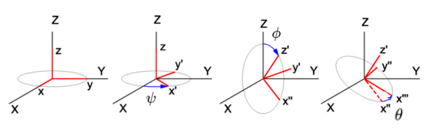

# 3D 變換实例

参考资料 [3D 變換數學 (四元数)](https://hkdickyko.github.io/%E6%95%B8%E5%AD%B8/3d)

# 矩陣

## 平移變換

$$ T_{(x,y,z)} = \begin{bmatrix}
 1 & 0 & 0 & x_t \\
 0 & 1 & 0 & y_t \\
 0 & 0 & 1 & z_t \\
 0 & 0 & 0 & 1 \\
\end{bmatrix} $$

## 旋轉變換

### XY 平面旋轉

$$ yaw = R_z(\psi) = \begin{bmatrix}
 cos\psi & -sin\psi & 0 & 0 \\
 sin\psi & cos\psi & 0 & 0 \\
 0 & 0 & 1 & 0 \\
 0 & 0 & 0 & 1 \\
\end{bmatrix} $$

### ZX 平面旋轉

$$ pitch = R_y(\phi) = \begin{bmatrix}
 cos\phi & 0 & sin\phi & 0 \\
 0 & 1 & 0 & 0 \\
 -sin\phi & 0 & cos\phi & 0 \\
 0 & 0 & 0 & 1 \\
\end{bmatrix} $$

### YZ 平面旋轉

$$ roll = R_x(\theta) = \begin{bmatrix}
 1 & 0 & 0 & 0 \\
 0 & cos\theta & -sin\theta & 0 \\
 0 & sin\theta & cos\theta & 0 \\
 0 & 0 & 0 & 1 \\
\end{bmatrix} $$

### 三轴旋轉

$$
\small 
R_{zyx}(\psi,\phi,\theta)=
\begin{bmatrix}
 cos(\phi)cos(\psi)  & sin(\theta)sin(\phi)cos(\psi)-cos(\theta)sin(\psi) & cos(\theta)sin(\phi)cos(\psi)+sin(\theta)sin(\psi) & 0 \\
 cos(\phi)sin(\psi)  & sin(\theta)sin(\phi)sin(\psi)+cos(\theta)cos(\psi)& cos(\theta)sin(\phi)sin(\psi)-sin(\theta)cos(\psi) & 0 \\
-sin(\phi) & sin(\theta)cos(\phi) & cos(\theta)cos(\phi) & 0 \\
 0 & 0 & 0 & 1 \\
\end{bmatrix}
$$

## 四元数

[四元数简介](https://hkdickyko.github.io/%E6%95%B8%E5%AD%B8/Quaternions)

內容为旋转 θ 量的四元数

$$
q = [cos \frac{θ}{2}, x sin \frac{θ}{2},y sin \frac{θ}{2},z sin \frac{θ}{2}]
$$

### 由 2 向量 (v, u) 找四元教

**Dot Product**

$$
dot_{v, u} = \sum_{i=0}^{n} v_i\cdot u_i 
$$

**Cross Product** 

$$
C_{v,u} = \begin{bmatrix} C_x \\ C_y \\ C_z \end{bmatrix} = \begin{bmatrix}
v_y \cdot u_z - v_z \cdot u_y \\
v_z \cdot u_x - v_x \cdot u_z \\
v_x \cdot u_y - v_y \cdot u_x
\end{bmatrix}
$$

**Normalize** 归一化

$$
q = w + a i + b j + c k \\
q = \frac {q}{\sqrt{w^2 + a^2 + b^2 + c^2}}
$$

四元数计算

$$
q_w = dot_{v,u} + \sqrt{dot_{v,u} \cdot  dot_{v,u} + dot_{q_v,q_v}}，q_{xyz} = C_{v, u}
$$

$$
q = \left [\frac{q_w}{l}, \frac{q_x}{l}, \frac{q_y}{l}, \frac{q_z}{l} \right ] ， l = \sqrt{q_w^2 + q_x^2 + q_y^2 + q_z^2}
$$

## 四元数转欧拉角

$$
\begin{bmatrix} \varphi \\ \theta \\ \psi \end{bmatrix} ＝ \begin{bmatrix}
atan2(2(wx+yz), 1-2(x^2 + y^2)\\
arcsin(2(wy-xz)) \\
atan2(2(wz+xy), 1-2(y^2+z^2))
\end{bmatrix} ， \begin{cases} \varphi：绕&x&轴旋转角度； \\ \theta：绕&y&轴旋转角度； \\ \psi：绕&z&轴旋转角度。 \end{cases}
\\
\\
atan2(y,x) = \begin{cases}
arctan \frac{y}{x} \\
arctan \frac{y}{x} + \pi \\
arctan \frac{y}{x} - \pi \\
+\frac {\pi} {2} \\
-\frac {\pi} {2} \\
undefined
\end{cases}， \begin{matrix}
x > 0; \\
y \geqslant 0, x < 0; \\
y < 0 , x < 0; \\
y > 0 , x = 0; \\
y < 0 , x = 0; \\
y = 0, x = 0。
\end{matrix}
$$

## 3D 直线

$$
x = x_1 + t \cdot (x_2 - x_1) \\
y = y_1 + t \cdot (y_2 - y_1) \\
z = z_1 + t \cdot (z_2 - z_1)
$$

## 计算欧拉角 

$$
\psi = yaw = arctan2 \left (y, x \right )
$$

$$
\phi = pitch = arctan2 \left (z, a \right ) = arctan2 \left (z, \sqrt{x^2 + y^2} \right )
$$

$$
\theta = roll = arctan2 \left ( \frac {cos(\psi)}{sin(\psi)sin(\phi)} \right )
$$

## 3D 矩阵转换

如将多个矩阵组合起来，每个矩阵都编码一个变换，这就是在不同空间之间变换向量的方法。接下来将创建一个组合了旋转和平移、平移旋转的变换矩阵，并创建了用于在不同坐标系之间变换的变换矩阵。

先将特定的空间点转移到点 $[0,0,0]$，假设最初的点为 $ x_t, y_t, z_t $。再 **Z** 轴旋转 $\psi$ 度。然后回到原来为位置。即相等于这件物件在指定位置 $ x_t, y_t, z_t。相对于 $ **Z** 轴旋转 $\psi$ 度。

$$ 
\begin{bmatrix}
 1 & 0 & 0 & x_t \\
 0 & 1 & 0 & y_t \\
 0 & 0 & 1 & z_t \\
 0 & 0 & 0 & 1 
\end{bmatrix} \cdot \begin{bmatrix}
 cos\psi & -sin\psi & 0 & 0 \\
 sin\psi & cos\psi & 0 & 0 \\
 0 & 0 & 1 & 0 \\
 0 & 0 & 0 & 1 
\end{bmatrix} \cdot \begin{bmatrix}
 1 & 0 & 0 & -x_t \\
 0 & 1 & 0 & -y_t \\
 0 & 0 & 1 & - z_t \\
 0 & 0 & 0 & 1 
\end{bmatrix} $$

$$
\begin{bmatrix} x_1 \\ y_1 \\ z_1 \\ 1 \end{bmatrix} = (T \cdot R \cdot -T) \cdot \begin{bmatrix} x_0 \\ y_0 \\ z_0 \\ 1 \end{bmatrix}
$$

根据以上形式。可发现。先计算的部分比较接近要计算的点坐标。计算公式是由右至左叠加。即计：
 - 计算公式是 由右向左是计算公式顺序。
 - 计算矩阵是 由左至右是矩阵乘法顺序。

