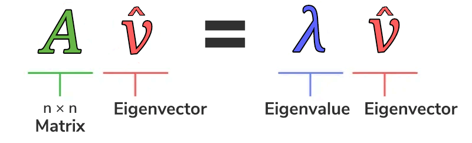

# 特征值与特征向量

特征值和特征向量在线性代数中是核心概念。 特征值(Eigenvalues) 是一个标量，当一个矩阵乘以其对应的 特征向量 (Eigenvectors) 时，结果是该特征向量的倍数。 简单来说，就是找到一个向量，使得矩阵作用在该向量上，只改变向量的长度，而不改变其方向。 

如果存在一个非零的向量 $\hat{v}$，使得 $\hat{v}$ 被 $A$ 作用之后 (也就是 $A \cdot \hat{v}$)，其结果会是 $\hat{v}$ 的简单常数倍 ( $\lambda$ )，也就是：$A \cdot \hat{v} = \lambda \cdot \hat{v}$，则称 $\hat{v}$ 为 $A$ 的特征向量，$\lambda$ 为 $A$ 的特征值。

这边也可以看出为什么要规定 $\hat{v}$ 为一个非零向量，因为如果 $\hat{v}$ 为零向量，则 

$$
A \cdot \hat{v} = \lambda \cdot \hat{v}
$$ 

将恒成立。特征向量及特征值有一个在几何上的重要解释：在特征值为实数的情况下，画一条通过原点的特征向量，则在这个直线上的任何向量被 $A$ 作用后，所得到的结果仍然会在这条直线上。將公式 **1** 進行改寫：

$$
A \cdot \hat{v} - \lambda \cdot \hat{v}= 0 \\
A \cdot \hat{v} - \lambda \cdot I \cdot \hat{v} = 0 
$$

(其中 $I$ 為單位矩陣，為了方便計算之用)

$$
(A - \lambda \cdot I) \cdot \hat{v} = 0
$$

$$
\left (\begin{bmatrix}A\end{bmatrix} - \lambda \cdot \begin{bmatrix}
 1 & 0 & 0\\
 0 & 1 & 0\\
 0 & 0 & 1\\
\end{bmatrix} \right) \cdot \begin{bmatrix}\hat{v}_x \\ \hat{v}_y \\ \hat{v}_z \end{bmatrix}=0
$$

$$
\begin{bmatrix}A\end{bmatrix} \cdot \begin{bmatrix}\hat{v}_x \\ \hat{v}_y \\ \hat{v}_z \end{bmatrix} = \lambda \cdot \begin{bmatrix}\hat{v}_x \\ \hat{v}_y \\ \hat{v}_z \end{bmatrix}
$$

# 特征空间

特徵空間（Eigenspace）是指與某個特定特徵值相關的所有特徵向量（eigenvectors）的集合，加上零向量。 換句話說，它是由對應於相同特徵值的特徵向量和原點組成的向量空間。

要找到矩阵的特征空间，必须遵循以下步骤：

 - 找出给定方阵的所有特征值
 - 为每个特征值找到对应的特征向量
 - 取所有特征向量的集合。这样形成的集合称为以下向量的特征空间

## 对角矩阵

特征值和特征向量用于查找对角矩阵。对角矩阵可以写成：

$$
A = X \cdot D \cdot X^{-1}
$$

其中，
 - A 为原矩阵
 - X 为特征向量构成的矩阵
 - D 为对角矩阵，其对角元素为 A 的特征值
 - X-1 为矩阵 X 的逆

# 计算例子

## 特征值

求解了 $A$ 的特征值和特征向量 

$$
 A= \begin{bmatrix}
 2 & 2 & 2\\
 2 & 2 & 2\\
 2 & 2 & 2\\
\end{bmatrix}
$$

$$
\begin{bmatrix}
 2 & 2 & 2\\
 2 & 2 & 2\\
 2 & 2 & 2\\
\end{bmatrix} -\lambda \cdot \begin{bmatrix}
 1 & 0 & 0\\
 0 & 1 & 0\\
 0 & 0 & 1\\
\end{bmatrix} = \begin{bmatrix}
 2 - \lambda & 2 & 2\\
 2 & 2 - \lambda & 2\\
 2 & 2 & 2 - \lambda\\
\end{bmatrix}= \begin{bmatrix}
 0 & 0 & 0\\
 0 & 0 & 0\\
 0 & 0 & 0\\
\end{bmatrix}
$$

简化上面的行列式得到

$$
 (2-λ)(λ^2) + 2λ^2 + 2λ^2 = 0 \\
 ⇒ (-λ^3) + 6λ^2 = 0 \\
 ⇒ λ^2(6 - λ) = 0 \\
 ⇒ \lambda_1 = 0, \lambda_2 = 0, \lambda_3 = 6
$$

## 特征向量

當 $\lambda_1 = \lambda_2 = 0$

$$
\begin{bmatrix}
 2 - \lambda & 2 & 2\\
 2 & 2 - \lambda & 2\\
 2 & 2 & 2 - \lambda\\
\end{bmatrix} \cdot \begin{bmatrix}v_x \\ v_y \\ v_z \end{bmatrix} = 0 =  \begin{bmatrix}
 2 & 2 & 2\\
 2 & 2 & 2\\
 2 & 2 & 2\\
\end{bmatrix}\cdot \begin{bmatrix}v_x \\ v_y \\ v_z \end{bmatrix}
$$

计算的特征向量为

$$
\begin{bmatrix}-1 \\ 1 \\ 0 \end{bmatrix} or \begin{bmatrix}-1 \\ 0 \\ 1 \end{bmatrix}
$$

當 $\lambda_3 = 6$

$$
\begin{bmatrix}
 2 - \lambda & 2 & 2\\
 2 & 2 - \lambda & 2\\
 2 & 2 & 2 - \lambda\\
\end{bmatrix} \cdot \begin{bmatrix}v_x \\ v_y \\ v_z \end{bmatrix} = 0 =  \begin{bmatrix}
 -4 & 2 & 2\\
 2 & -4 & 2\\
 2 & 2 & -4\\
\end{bmatrix}\cdot \begin{bmatrix}v_x \\ v_y \\ v_z \end{bmatrix}
$$

计算的特征向量为

$$
\begin{bmatrix}1 \\ 1 \\ 1 \end{bmatrix}
$$

## 特征空间

这样形成的特征空间 

$$
\begin{bmatrix}
 \lambda_1 & 0 & 0\\
 0 & \lambda_2 & 0\\
 0 & 0 & \lambda_3\\
\end{bmatrix}
$$

$$
\begin{bmatrix}-1 \\ 1 \\ 0 \end{bmatrix}， \begin{bmatrix}-1 \\ 0 \\ 1 \end{bmatrix}，
\begin{bmatrix}1 \\ 1 \\ 1 \end{bmatrix}
$$

## 对角矩阵

$$
A = X \cdot D \cdot X^{-1}
$$

$$
X = \begin{bmatrix}
-1 & -1 & 1 \\ 
1 & 0 & 1 \\
0 & 1 & 1 
\end{bmatrix}
$$

$$
D = \begin{bmatrix}
0 & 0 & 0 \\ 
0 & 0 & 0 \\
0 & 0 & 6 
\end{bmatrix}
$$

$$
X^{-1} = \begin{bmatrix}
\frac{-1}{3} & \frac{2}{3} & \frac{-1}{3} \\ 
\frac{-1}{3} & \frac{-1}{3} & \frac{2}{3} \\
\frac{1}{3} & \frac{1}{3} & \frac{1}{3} 
\end{bmatrix}
$$

$$
\begin{bmatrix}
-1 & -1 & 1 \\ 
1 & 0 & 1 \\
0 & 1 & 1 
\end{bmatrix} \cdot
\begin{bmatrix}
0 & 0 & 0 \\ 
0 & 0 & 0 \\
0 & 0 & 6 
\end{bmatrix} \cdot
\begin{bmatrix}
\frac{-1}{3} & \frac{2}{3} & \frac{-1}{3} \\ 
\frac{-1}{3} & \frac{-1}{3} & \frac{2}{3} \\
\frac{1}{3} & \frac{1}{3} & \frac{1}{3} 
\end{bmatrix} = \begin{bmatrix}
 2 & 2 & 2\\
 2 & 2 & 2\\
 2 & 2 & 2\\
\end{bmatrix}
$$

# 物理意义

特征值和特征向量表达了一个线性变换的特征。在物理意义上，一个高维空间的线性变换可以想象是在对一个向量在各个主要方向（特征向量）上进行了不同程度（特征值）的变换，特征向量之间是线性无关的。

　　换句话说，对于任何一个 **n** 阶方矩阵，都可以找到使得经过 **n** 阶方阵变换的主要方向（特征向量）+ 各个方向的拉伸大小（特征值）。即求特征向量，就是把矩阵 **A** 所代表的空间进行正交分解，使得 **A** 的向量集合可以表示为每个向量 **a** 在各个特征向量上的投影长度。通常求特征值和特征向量即为求出这个矩阵能使哪些向量只发生拉伸，而方向不发生变化，观察其发生拉伸的程度。这样做的意义在于，看清一个矩阵在哪些方面能产生最大的**分散度**（scatter），减少重叠，意味着更多的信息被保留下来。　

## 应用例子

在振动分析中，振型和特征向量本质上是同一概念；它们表示结构在其固有频率下振动时的相对位移模式。特征向量是特征值问题的数学解，这些解应用于振动系统时，对应于不同的振型。

以下是更详细的解释：

振型：振型描述结构在特定固有频率下振动时位移的空间分布。每个振型对应一个特定的固有频率，它显示了结构不同部分在振动过程中的相对运动。

特征向量：在振动分析中，特征向量是特征值问题的解，在求解振动系统的固有频率和振型时经常会遇到。每个特征向量对应一个特定的特征值，该**特征值**表示固有频率的平方。

联系：对应于特定固有频率的**特征向量**就是该频率的振型。换句话说，特征向量定义了结构在该特定模式下振动时每个点的相对位移（振幅和相位）。

简单来说：想象一根吉他弦。它的固有频率（就像你能弹奏的不同音符）就是特征值。相应的振动模式（琴弦如何上下移动）就是振型，也就是特征向量。　

[互联网上的相关解说](https://lpsa.swarthmore.edu/MtrxVibe/Anims/VibrationAnimations.html)