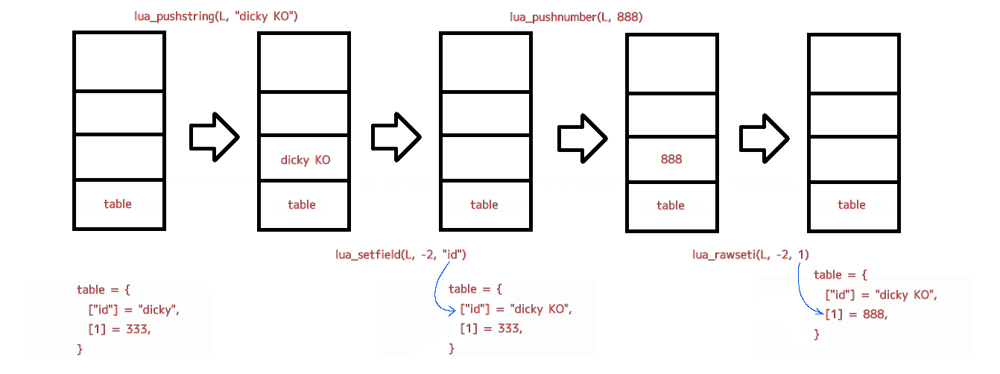

<style>
  table {
    width: 100%
    }
  td {
    vertical-align: center;
    text-align: center;
  }
  td.left {
    vertical-align: center;
    text-align: left;
  }  
  table.inputT{
    margin: 10px;
    width: auto;
    margin-left: auto;
    margin-right: auto;
    border: none;
  }
  input{
    text-align: center;
    padding: 0px 10px;
  }
  iframe{
    width: 100%;
    display: block;
    border-style:none;
  }
</style>

# Lua

Lua 是一种编程语言，而 luac 是 Lua 编译器。Lua 代码以人类可读的文本格式编写，而 luac 将该代码转换为 Lua 解释器可以执行的二进制格式（字节码）。优点如下：

 - lua 是一个免费、小巧、简单、强大、高效、轻量级的嵌入式的脚本语言，lua 当前的发行版本一般小於300k
 - 它是用 C 语言开发的项目，所以可以在大部分的操作系统上运行
 - lua 是目前速度最快的脚本语言，既可以提升语言的灵活性还可以最大限度的保留速度
 - 其语法非常简单，没有特例
 - lua 还可以作为 C 的 API 来使用

## Luac

它将 lua 源码文件，生成为二进制 01 编码的程序，这样做的好处如下：
 - 安全
 - 机器识别速度快。原来读 lua 文件要经过一遍语义分析等，现在省掉了中间几个步骤。


## LuaJIT

LuaJIT 已经在多个领域广泛应用，特别是在游戏领域，更是在很多地方替代了以前的 lua 源码或者 luac 字节码。不仅 LuaJIT 在一定程度上带来了效率的提高，而且对于逆向工程师来说，其逆向难度也大大增加，暂时还没办法将其转化为可读性强的 lua 源码。

# Lua 与 C 通信函数介绍

Lua 和 C 通信的主要方法是通过一个虚拟栈来完成，lua 提供了 C API 对栈进行操作。几乎所有的 API 调用都是对栈上的值进行操作，所有 C 与 Lua 之间的数据交换也都通过这个栈来完成。另外，也可以使用栈来保存临时变量。
　　C API 是一个 C 代码与 Lua 进行交互的函数集。由以下部分组成:
 - 读写 Lua 全局变量的函数
 - 调用 Lua 函数的函数
 - 运行 Lua 代码片断的函数
 - 注册 C 函数然后可以在 Lua 中被调用的函数

Lua 以一个严格的 LIFO 规则（后进先出；即是始终存取栈顶）来操作栈：　


 - C 调用 Lua 时，返回结果只会改变栈顶部分
 - 编写 C 代码比较自由，可以查询栈上的任何元素，在任何一个位置插入和删除元素

在调用 C API 时有几个重要的头文件，这几个头文件都是 lua 源代码，可以直接下载使用：

 - lua.h：基础函数库，对栈的基本操作都在里面实现，lua_前缀
 - lauxlib.h：辅助库，luaL_前缀，利用 lua.h 实现的更高层的抽象
 - lualib.h：为了保持Lua的苗条，所有的标准库以单独的包提供，如果不需要就可以不使用它们。
    - 头文件 lualib.h 定义了打开这些库的函数。例如调用 luaopen_io，以创建 io table 并注册 I/O 函数（io.read,io.write 等等）到 Lua 环境中。

## 常用辅助函数


### 创建及调用方法

```c
// 创建一个新环境 (新的 Lua 状态)
lua_State *luaL_newstate(void);
// 打开指定状态机中的所有 Lua 标准库。如：print, pcall
void luaL_openlibs(lua_State *L);

// nargs 为输入参数数量，nresults 为返回值数量，不处理错误
void lua_call(lua_State *L, int nargs, int nresults) : 
// 与 lua_call 一样，区别在多了一个错误处理索引
int lua_pcall(lua_State *L, int nargs, int nresults, int errfunc) : 
```

 - lua_call 及 lua_pcall 的 nargs 表示输入参数数量，nresults 表示返回值的数量。errfunc 是异常处理函数在栈中的位置，如果填写 0 的话，出错时，lua_pcall 会把错误信息直接放在栈顶。lua_pcall 的返回值表示是否出错，返回 **0** 则表示一切运行正常。

例子：lua_pcall(L, 2, 1, 0) 的意思是调用一个函数，它的输入参数有 **2** 个，返回值有 **1** 个，如果程序出错的话，麻烦把错误信息放栈顶。

### 文件加载

```c
// 将一个字符串加载为  Lua  代码块
int luaL_loadstring(lua_State *L, const char *s); 
// 把一个文件加载为  Lua  代码块
int luaL_loadfile(lua_State *L, const char *filename);
int luaL_loadfilex(lua_State *L, const char *filename, const char *mode);
int luaL_loadbuffer(lua_State *L, const char *buff, size_t sz, const char *name);
int luaL_loadbufferx(lua_State *L, const char *buff, size_t sz, const char *name, const char *mode);
```
 - luaL_loadstring 是读取字符串
 - luaL_loadfile是 从文件中读取
 - luaL_loadbuffer 是加载一段数据，并且给个命名，用于 debug
 - 返回值不为 0 的话，表示加载出错

这三个函数最终都是调用了 lua_load 进行代码编译，并将编译后的代码放与栈顶。上述的函数只是完成程序文本的加载，编译，只有在执行之后才能变成虚拟机中的变量和函数。由于代码已经在栈顶，也没有需要传入的参数。因此只需要随后调用 lua_pcall(L, 0, LUA_MULTRET, 0) 即可。这里的 LUA_MULTRET 表示多个返回值。Lua 会帮自动处理这些返回值。

## 常用的基础函数 

### 压入栈

 - lua_push*** 压某类型元素入棧。例子如下：

```c
// 将空值压入栈
void lua_pushnil(lua_State *L);
// 把相关值压入栈
void lua_pushboolean(lua_State *L, int bool);
void lua_pushnumber(lua_State *L, double n);
void lua_pushlstring(lua_State *L, const char *s, size_t length);
// 将指针 s 指向的零结尾的字符串压栈。在函数返回后，可以释放或立刻重用
void lua_pushstring(lua_State *L, const char *s);
```

### 检查元素

检查一个元素能否被转换成指定的类型。

 - lua_is*** 检查变量是不是某个类型，index 指示变量的顺序，栈顶为-1。正常返回 1，否则 0。例子如下：

```c
// 检查当索引的值是 nil
int lua_isnil(lua_State *L, int index);
// 检查当索引值是一个数字，或可转数字的字符串
int lua_isnumber(lua_State *L, int index);
// 检查当索引值是一个字符串或是一个数字
int lua_isstring(lua_State *L, int index);
// 检查当索引值是一张表
int lua_istable(lua_State *L, int index);
// 检查当索引值是一个布尔量
int lua_isboolean(lua_State *L, int index);
// 检查当索引值是一个函数
int lua_isfunction(lua_State *L, int index);
```

### 栈中获得值

从栈中获得值。即使给定的元素类型不正确，调用这些函数也没问题。

 - lua_to*** 获取栈中的变量，然后转换为某个指定的类型，并返回。例子如下：

```c
int lua_toboolean(lua_State *L, int index);
double lua_tonumber(lua_State *L, int index);
const char * lua_tostring(lua_State *L, int index);
```

Lua_tostring 函数返回一个指向字符串的内部拷贝的指针。像一个 **const**。只要这个指针对应的值还在栈内，Lua 会保证这个指针一直有效。当一个 C 函数返回后，Lua会清理它的栈，所以，有一个原则：永远不要将指向 Lua 字符串的指针保存到访问它的外部函数中。

### 检查

```c
// 返回字符串的实际长度
size_t lua_strlen(lua_State *L, int index);
// 检查栈空间。默认有 20 个空闲的记录，lua.h 中的 LUA_MINSTACK 宏定义了这个常量
int lua_checkstack(lua_State *L, int sz);
// 返回栈中元素的类型
int lua_type(lua_State *L, int idx);
// 返回 type 对应的名字字符串，参数为lua_type 返回的类型
const char* lua_typename(lua_State *L, int tp);
// 返回参数 arg 是否 lua_type 类型的值
void luaL_checktype(lua_State *L, int arg, int t);
```

在 lua.h 头文件中，每种 lua_type 类型都被定义为一个常量：   
 - LUA_TNIL
 - LUA_TBOOLEAN
 - LUA_TNUMBER
 - LUA_TSTRING
 - LUA_TTABLE
 - LUA_TFUNCTION
 - LUA_TUSERDATA
 - LUA_TTHREAD

### 栈元素操作

```c
// 返回栈中元素个数，也是栈顶元素的索引
int lua_gettop(lua_State *L);
// 设置栈顶元素的索引，相当于设置栈的大小
// 如栈顶高于新的栈顶，顶部的值被丢弃
// 否则會压入相应个数的 nil 到栈上
// lua_settop(L,0) 相等于清空栈
void lua_settop(lua_State *L, int index);
// 宏定义，弹出 n 个元素
#define lua_pop(L,n) lua_settop(L, -(n)-1);
// 压入栈上指定索引的一个抟贝到栈顶，等于拷贝 index 处的元素到栈顶
void lua_pushvalue(lua_State *L, int index);
// 移除指定索引的元素，并将其上面所有的元素下移来填补这个位置的空白
void lua_remove(lua_State *L, int index);
// 移动栈顶元素到指定索引的位置，并将这个索引位置上面的元素全部上移
void lua_insert(lua_State *L, int index);
// 从栈顶弹出元素值并将其设置到指定索引位置，没有任何移动操作
void lua_replace(lua_State *L, int index);
// 向 lua 注册名字为 name 的 f 方法。相当于
// #define lua_register(L,n,f) (lua_pushcfunction(L, f), lua_setglobal(L, n))
void lua_register(lua_State *L, const char *name, lua_CFunction f);
```

### 栈设置变量

```c
// (获取全局变量 name 的值)，并压入栈顶
void lua_getglobal(lua_State *L, const char *name);
// 弹出栈顶，并将值(设置为全局变量 name 的值)
void lua_setglobal(lua_State *L, const char *name); 
// (获取变量名 k 的值)，并压入栈顶元素，会触发 __index 方法
void lua_getfield(lua_State *L, int index, const char *k);
// (设置变量名 k 的值)，并弹出栈顶元素，会触发 __newindex 方法
void lua_setfield(lua_State *L, int index, const char *k);
```
**读出及设置 lua 的全域值**


 - table 为 lua 的表，而 value 为 C 生成在 lua 的全域变量，lua_getglobal 可以读 Lua 的
任何数据类型

### 表

```c
// 创建一个 narr 行 nrec 列的表並压入栈
void lua_createtable(lua_State *L, int narr, int nrec);
// lua_newtable 相等于lua_createtable(L, 0,0) 
void lua_newtable(lua_State *L);

// 读出 index 表的值到栈顶，调用会触发 __index 方法 
void lua_gettable(lua_State *L, int index);
// 从栈顶值设置 index 表的值，调用会触发 __newindex 方法
void lua_settable(lua_State *L, int index) : 
// 与 gettable 一样，但调用的是原始索引方法,不会触发 __index 方法
void lua_rawget(lua_State *L, int index);
// 与 settable 一样，但调用的是原始索引方法,不会触发 __newindex 方法
void lua_rawset(lua_State *L, int index);
// 压入 t[n] 值，t 为索引 index 的表，n 为参数 n，调用的索引方法是原始的
void lua_rawgeti(lua_State *L, int index, int n);
// 设置 t[n]=v，t 为索引 index 的表，v 为栈顶值，n 为参数 n，并弹出栈顶元素。调用的索引方法为原始的
void lua_rawseti(lua_State *L, int index, int n);

// 压入索引 index 的值的 metatable，如果索引 index 的值有 metatable 则返回非 0，否则返回0并不压入任何元素
int lua_getmetatable(lua_State *L, int index);
// 弹出栈顶，并将其设置为索引 index 值的 metatable
int lua_setmetatable(lua_State *L, int index);
```

**读出及设置 lua 表的值**


 - **读出 Lua 表的值到栈顶** lua_gettable(L, -2)
 - **从栈顶值设置 Lua 表的值**  lua_settable(L, -3)


```c
lua_setfield(L, -2, "id");
lua_rawseti(L, -2, 1);
```

方法 lua_setfield 和 lua_rawseti 功能相同，都是将栈内对应索引的值弹出，然后根据参数的 key 赋值到栈底的表内，二者区别是一个处理 key 为字符的情况，一个处理 key 为整型的情况



 - lua_setfield 将索引为 -2 表的值，赋值给栈底表内 key 为 "id" 的值
 - lua_rawseti 将索引为 -2 表的值，赋值给栈底表内 key 为 1 的值

# Lua 编程

## Lua 指令编码格式

Lua 虚拟机指令可以分为五类，分别对应五种编码模式，大部分指令编码格式都是 iABC 模式。

|版本|格式名称|操作数|格式位数|操作码位数|
|:---:|:---:|:---:|:---:|:---:|
|5.3|iABC|3|9，9，8|6|
|5.3|iABx|2|18，8|6|
|5.3|iAsBx|2|18，8|6|
|5.3|iAx|1|26|6|
|5.4|iABC|3|8，8，8|7|
|5.4|iABx|2|17,，8|7|
|5.4|iAsBx|2|17，8|7|
|5.4|iAx|1|25|7|
|5.4|isJ|1|25|7|

编码名解释
 - i 应该是指令 (instruction)
 - A、B、C 是三个参数的基本名称 (无符号整数)
 - x (例如 B<font color="#FF1000">x</font>) 是扩展 (extended) 表示该参数的长度会被扩展
 - s (例如 <font color="#FF1000">s</font>Bx) 是符号 (signed) 表示该参应为有符号整数

Lua 5.3 操作码占用低 <font color="#FF1000">6</font> 位，其余高 28 位可以编码 1 到 3 个参数（以及一个标志位）。因此 Lua 5.3 指令集最多只能包含 **64** 条指令，定义了 **47** 条。

Lua 5.4 虚拟机指令集改动较大，增加了许多新的指令，因 6 比特操作码不够用，所以改为 <font color="#FF1000">7</font> 位，其余 27 位可以编码 1 到 3 个参数（以及一个标志位）。因此 Lua 5.4 指令集最多只能包含 **128** 条指令，定义了 **83** 条。


## 元表 与 元方法

Lua 中，**元表**（metatable）是一种特殊的表，用于定义表的行为，而 **元方法** (metamethod) 是定义在元表中的特殊函数，用于重载或改变特定操作的行为。它允许自定义的元方法来改变表的行为，实现更加灵活和强大的功能。通过元表和元方法，可以实现运算符重载、索引操作的自定义、以及其他各种高级特性。

**元表**（Metatable）

 - 概念：元表可以看作是其他表的“属性”，它定义了当对该表执行特定操作时应该如何处理。
 - 作用：通过元表，可以改变Lua中表的默认行为，例如算术运算、索引、函数调用等。
 - 设置：setmetatable(table, metatable) 函数用于将一个元表关联到一个表上。
 - 获取：getmetatable(table) 函数可以获取一个表的元表。


**元方法**（Metamethod）

 - 概念：元方法是定义在元表中的函数，用于处理特定操作。
 - 命名: 元方法通常以双下划线"__" 开头。
 - 作用：当对一个表执行特定操作时，如果该表有元表，并且元表中定义了相应的元方法，那么 Lua 就会调用这个元方法来处理该操作。 

常用元方法:

|方法名称|用途|
|:---:|:---|
|__add|用于重载加法运算符 +|
|__sub|用于重载减法运算符 -|
|__mul|用于重载乘法运算符 *| 
|__div|用于重载除法运算符 /| 
|__unm|用于重载一元负号运算符 -|
|__concat|用于重载字符串连接运算符 ... |
|__eq|用于重载等于运算符 ==|
|__lt|用于重载小于运算符 <|
|__le|用于重载小于等于运算符 <=|
|__index|用于重载表的索引操作，当访问表中不存在的键时调用|
|__newindex|用于重载表的赋值操作，当对表中不存在的键进行赋值时调用|
|__call|用于重载函数调用操作，当对一个值进行函数调用时调用|
|__tostring|用于重载 tostring 函数，当将一个值转换为字符串时调用|

元表及元方法示例：

```lua
local myTable = {}
local myMetatable = {
  __index = function(table, key)
    print("访问不存在的键:", key)
    return nil
  end,
  __add = function(a, b)
    print("执行加法运算:", a, b)
    return a + b
  end
}

setmetatable(myTable, myMetatable)

myTable[1] = 10
print(myTable[1])       
-- 输出: 10
print(myTable[2])       
-- 输出: nil  (触发__index)

local result = myTable + 5  
-- 触发__add
print(result)           
-- 输出: 15
```

### rawset 与 rawget

rawset/rawget：对 “原始的” 表进行直接的赋值/取值操作。raw 方法就是忽略 table 对应的 metatable，绕过 metatable 的行为约束，强制对原始表进行一次原始的操作，也就是一次不考虑元表的简单更新。另外，一次原始的操作其实并不会加速代码执行的速度，效率一样。

当操作table时，如果有以下需求：

 - rawget(table, key)：访问时，不想从 __index 对应的元方法中查询值。
 - rawset(table, key, value)：更新时，不想执行 __newindex 对应的元方法

在 __newindex 元方法中，设置 table 的 key /value 时，不想陷入死循环，可以考虑使用 raw 方法。

## Lua 数据类型

|数据类型|	描述|
|:---:|:---|
|nil|	这个最简单，只有值nil属于该类，表示一个无效值（在条件表达式中相当于false）|
|boolean	|包含两个值：false和true|
|number|	表示双精度类型的实浮点数|
|string|	字符串由一对双引号或单引号来表示|
|function|由 C 或 Lua 编写的函数|
|table|	其实是一个 **关联数组**（associative arrays），数组的索引可以是数字、字符串或表类型。table 的创建是通过 **构造表达式** 来完成，最简单构造表达式是 {}，用来创建一个空表|
|userdata|	表示任意存储在变量中的 C 数据结构|
|thread|	表示执行的独立线路，用于执行协同程序|


## Lua 的保留关键字

保留关键字不能作为常量或变量或其他用户自定义标示符：

### 变量
 - <font color="#B600FF">local</font>
    - 显式声明为局部变量
 - <font color="#B600FF">nil</font>
    - 表示一个无效值(在条件表达式中相当于false)。

### 逻辑
 - <font color="#B600FF">and</font>
 - <font color="#B600FF">or</font>
 - <font color="#B600FF">not</font>
 - <font color="#B600FF">true</font>
 - <font color="#B600FF">false</font>

### 迭代器
 - <font color="#FF002F">for</font> expr <font color="#B600FF">in</font>
 - <font color="#FF002F">do</font>
 - <font color="#FF002F">end</font>

```lua
for k, v in pairs(t) do
    print(k, v)
end
```
### 循环
 
 - <font color="#B600FF">if</font>
    - <font color="#B600FF">then</font>
    - <font color="#B600FF">elseif</font> 
    - <font color="#B600FF">else</font>
 -  <font color="#FF002F">end</font>

```lua
if(a == 10) then
  print("a 的值为 10")
  elseif(a == 20) then  
    print("a 的值为 20")
    else
      print("没有匹配 a 的值")
end
```
 - <font color="#B600FF">until</font>
    - <font color="#B600FF">repeat</font>
 - 重复执行循环，直到指定的条件为真时为止

```lua
repeat
  print("a的值为:", a)
  a = a + 1
until( a > 15 )
```

 - <font color="#B600FF">while</font>  
    - <font color="#FF002F">do</font>
    - <font color="#FF002F">end</font>
 - 在条件为 true 时，让程序重复地执行某些语句。执行语句前会先检查条件是否为 true

```lua
while(a < 20) do
  print("a 的值为:", a)
  a = a + 1
end
```

 - <font color="#FF002F">for</font>
   -  <font color="#FF002F">do</font>
   -  <font color="#FF002F">end</font>

重复执行指定语句，重复次数可在 for 语句中控制

```lua
for i=10,1,-1 do
  print(i)
end
```

### 中断

 - <font color="#B600FF">break</font>：退出当前循环或语句，并开始脚本执行紧接着的语句

```lua
while(a < 20) do
  print("a 的值为:", a)
  a = a + 1
  if(a > 15) then
  --[ 使用 break 语句终止循环 --]
    break
  end
end
```

 - <font color="#B600FF">goto</font>：将程序的控制点转移到一个标签处

```lua
for i=1, 3 do
  if i <= 2 then
    print(i, "yes continue")
      goto continue
  end
  print(i, " no continue")
::continue::
  print([[i'm end]])
end
```

### 函数

 - <font color="#B600FF">function</font>：由 C 或 Lua 编写的函数
 - <font color="#B600FF">return</font>

```lua
function maximum (a)
  local mi = 1     -- 最大值索引
  local m = a[mi]  -- 最大值
  for i,val in ipairs(a) do
    if val > m then
      mi = i
      m = val
    end
  end
  return m, mi
end
```

## 协同程序(coroutine)

Lua 协程提供了一种在单线程执行中协作执行多任务的机制。它们本质上是可以在特定点暂停和恢复的函数，从而允许灵活的控制流和非抢占式并发的实现。

|方法|描述|
|:---:|:---|
|coroutine.create()|创建并返回 coroutine，参数是一个函数和 resume 配合使用|
|coroutine.resume()|重启 coroutine，和 create 配合使用|
|coroutine.yield()|挂起 coroutine，将 coroutine 设置为挂起状态和 resume 配合使用|
|coroutine.status()|查看 coroutine 的状态。注：coroutine 的状态有三种：**dead**，**suspended**，**running**|
|coroutine.wrap()|创建 coroutine，返回一个函数，一旦你调用这个函数，就进入 coroutine，和 create 功能重复|
|coroutine.running()|返回正在跑的 coroutine，使用时就是返回一个 coroutine 的线程号|

**示例如下**:

```lua
local function print_recipe()
  print "mix 1 tbsp sugar, 1 tsp vanilla extract, 1 egg yolk, 1/2 cup heavy cream"
  coroutine.yield()
  print "bake at 300f (150c) for 30 mins. cool down before chilling in fridge"
  coroutine.yield()
  print "top custard with sugar, heat sugar with torch"
end

local co = coroutine.create(print_recipe)
while coroutine.resume(co) do
  print "okay..."
end
print "yay! I made creme brulee!"
```

### 线程和协同程序区别

线程与协同程序的主要区别在于，一个具有多个线程的程序可以同时运行几个线程，而协同程序却需要彼此协作的运行。

在任一指定时刻只有 **一个协同程序** 在运行，并且这个正在运行的协同程序只有在明确的被要求挂起的时候才会被挂起。

协同程序有点类似同步的多线程，在等待同一个线程锁的几个线程有点类似协同。

主要区别归纳如下：

 - 调度方式：线程通常由操作系统的调度器进行抢占式调度，操作系统会在不同线程之间切换执行权。而协同程序是非抢占式调度的，它们由程序员显式地控制执行权的转移。
 - 并发性：线程是并发执行的，多个线程可以同时运行在多个处理器核心上，或者通过时间片轮转在单个核心上切换执行。协同程序则是协作式的，只有一个协同程序处于运行状态，其他协同程序必须等待当前协同程序主动放弃执行权。
 - 内存占用：线程通常需要独立的堆栈和上下文环境，因此线程的创建和销毁会带来额外的开销。而协同程序可以共享相同的堆栈和上下文，因此创建和销毁协同程序的开销较小。
 - 数据共享：线程之间可以共享内存空间，但需要注意线程安全性和同步问题。协同程序通常通过参数传递和返回值来进行数据共享，不同协同程序之间的数据隔离性较好。
 - 调试和错误处理：线程通常在调试和错误处理方面更复杂，因为多个线程之间的交互和并发执行可能导致难以调试的问题。协同程序则在调试和错误处理方面相对简单，因为它们是由程序员显式地控制执行流程的。

总体而言，线程适用于需要并发执行的场景，例如在多核处理器上利用并行性加快任务的执行速度。而协同程序适用于需要协作和协调的场景，例如状态机、事件驱动编程或协作式任务处理。选择使用线程还是协同程序取决于具体的应用需求和编程模型。

## UserData

UserData：又有名 Full User Data，全量级的用户数据。通常是一块内存区域，可用于转换为特殊的数据结构，UserData 内部数据的解析与设置由使用者自己进行实现，Lua 并没有能力处理这份二进制内存，Lua 只负责这块内存区域的内存引用与管理回收。

LightUserData: 轻量级用户数据，相比于上面的FullUserData，它是轻量的，它只是一个指针，在 C 语言中对应的类型为 void*，占4或 8 个字节，Lua 不会管理这个指针的内存，全由使用者自己管理。

| |	full userdata|	light userdata|
|:---:|:---|:---|
|定义|	用户自定义数据	|一种表示C指针的值（即void *），因为是一个值，所以不用创建|
|使用|	需要显式的创建一块儿内存，该段内存由Lua的垃圾回收器管理，使用者无需关心。|	存储在栈上，它所使用的内存空间不由Lua的垃圾回收器管理，所以使用者需要关心其内存使用|
|创建	|没有进行参数合法性检查<br/>void *lua_newuserdata(lua_State *L, size_t size);<br/>有参数合法性检查<br/>void *luaL_checkudata (lua_State *L, int arg, const char *tname);|void lua_pushlightuserdata(lua_State *L, void *p);|
|其他	|可以指定其 ”metatable” 和 "metamethods”	|不能指定其 ”metatable” 和 ”metamethods”|


**总结如下**：

 - LightUserData 在 C 语言中进行内存分配与管理，Lua 只存储一个指针值
 - UserData 若对象的内存在 Lua 中分配与管理

**示例如下**:

假设需要将值存入到 key 为 “3D" 的注册表，下面便是展示如何将值存入到注册表中。

```c
lua_State *L = luaL_newstate();
const char *key = "3D";
lua_pushstring(L, "Dicky KO");
lua_setfield(L, LUA_REGISTRYINDEX, key);
lua_getfield(L, LUA_REGISTRYINDEX, key);
printf("content: %s\n", lua_tostring(L, -1));
lua_close(L);
```

 - LUA_REGISTRYINDEX 为 C-API 都可以接收这个伪索引

### 为了避免冲突，Lua 提供了一套引用系统

|函数|描述|
|:---:|:---|
|luaL_ref|会将栈顶的一个值弹出，作为 value，然后分配一个唯一的整型数作为 key ，以 “注册表[key]=value” 的形式保存，最后将整型数 key 返回，后续的更新、获取和移除都使用该返回的 key 进行操作|
|luaL_unref|释放 value 和 key ，会将 key 回收，后续 luaL_ref 可以重新利用回收的 key ，同时清空 value |

 - int (luaL_ref)(lua_State *L, int t);
 - void (luaL_unref)(lua_State *L, int t, int ref);

```lua
lua_State *L = luaL_newstate();
lua_pushstring(L, "Dicky KO");
int ref = luaL_ref(L, LUA_REGISTRYINDEX);
lua_setfield(L, LUA_REGISTRYINDEX, ref);
lua_getfield(L, LUA_REGISTRYINDEX, key);
printf("content: %s\n", lua_tostring(L, -1));
luaL_unref(L, LUA_REGISTRYINDEX, ref);
lua_close(L);
```

### 预定义的引用

注册表中有两个预定义的引用：
 - LUA_RIDX_MAINTHREAD 指向 Lua 状态本身，也就是主线程。
 - LUA_RIDX_GLOBALS 指向全局变量。


# 虚拟栈

Lua 通过一个 “虚拟栈”（Lua State）与 C 程序进行数据交互。当操作这个栈时，每次操作的都是栈的顶部。而 Lua 的 C API 则有更多的控制权，可非常灵活地操纵这个栈的任意位置。

C 调用 lua：
 - C 获取全局表中的 lua 变量或函数，然后把数据放入栈中，lua 再去栈中取数据，然后返回数据对应的值到栈顶，再由栈顶返回 C。

lua 调用 C：
 - 先将 C 的函数注册到 lua 解释器中，然后 lua 再去调用它们。

## 索引 index


 - 绝对索引是从 **1** 开始由栈底到栈顶依次增长
 - 相对索引是从 **-1** 开始由栈顶到栈底依次递减
 - 上图栈的容量为 7，栈顶绝对索引为 5
    - 有效索引范围为：[1, 5]
    - 可接受索引范围为：[1, 7]
 - Lua 虚拟机指令索引是从 **0** 开始，而 Lua API 的栈是绝对索引从 **1** 开始，因此计算是要 +1

# C 与 Lua 交互应用

## C 直接调用 Lua 代码

```c
#include <stdio.h>
#include <string.h>
#include "lua.h"
#include "lauxlib.h"
#include "lualib.h"

int main(void){
  char buff[256];
  int error;
  // 打开 Lua 创建一个新环境(新的 Lua 状态)
  lua_State *L = luaL_newstate();
  // 打开标准库
  luaL_openlibs(L);   
  // 接收用户输入 lua 代码, 并编译解析
  while(fgets(buff,sizeof(buff),stdin)!=NULL){
    // luaL_loadbuffer 编译 Lua 代码(没有错误则压入栈)，lua_pcall 执行
    error = luaL_loadbuffer(L,buff,strlen(buff),"line")||lua_pcall(L,0,0,0);
    if(error){
      // 执行或编译错误 lua_tostring 打印错误信息
      fprintf(stderr,"%s\n",lua_tostring(L,-1));
      // 从栈中弹出错误消息
      lua_pop(L,1);  
    }
  }
  lua_close(L);//关闭 lua 状态
  return 0;
}
```

### 编译代码

```sh
gcc -lm -g -o testlua testlua.c /usr/local/lib/liblua.a -ldl
```

### GCC 常用参数

|参数	|功能|
|:---|:---|
|-c|编译但不连结，只产生 .o 档|
|-o <font color="#FF1000">filename</font>|<font color="#FF1000">filename</font> 为指定输出档名|
|-l<font color="#FF1000">library</font>|指定连结的函式库， lib<font color="#FF1000">library</font> 为加载函式库名称。注意是小寫 **L**。|
|-I|增加 include 头文件档案的搜寻路径。注意是大寫 **i**。|
|-L|增加 library 函式库档案的搜寻路径|
|-W<font color="#FF1000">all</font>|	显示所有的警告讯息|
|-O[0-3]|指定优化级别，其中 0 表示无优化，3 表示积极优化|
|-g|编入除错资讯 (使用 GDB 除错时用)|
|-ansi|只支持 ANSI 标准的 C 语法。 这一选项将禁止 GNU C 的某些特色 例如 asm 或 typeof 关键词|
|-shared|创建一个共享库（动态链接库），通常用于生成 .so 文件|
|-fPIC|生成位置无关代码 (Position-Independent Code)，这是编译共享库时必需的参数|

用 **-l** 参数将库加入。库命名是一致的，一般为 libxxx.so，或 libxxx.a，libxxx.la，那么要链接某个库就用 -lxxx，去掉头 lib 及 "." 后面的 so，la，a 等即可。 因为数学函数位于 libm.so 库文件中（通常在 /lib 目录下），-lm 选项告诉编译器，程序中用到的数学函数要到这个库文件里找。同时，常见的库链接方法为： 

数学库
 - -lc 是关联到 libc
 - -lm 是关联到 libm
 - -lz 是关联到 libz
 - -ldl 是关联到 libdl

用 **-ldl**，是显式加载动态库的动态函数库。基本定义在 IEEE Std 1003.1-2001, <dlfcn.h>。动态库的相关部分如下：

```c
#include <dlfcn.h>
  dlopen();
  dlclose();
  dlerror(); 
  dlsym();
```

## Lua 调用 C 函数库

将包含 C 函数的代码生成库文件，如 Linux.的so，或 Windows 的 DLL，同时拷贝到 Lua 代码所在的当前目录，或者是 LUA_CPATH 环境变量所指向的目录，以便于 Lua 解析器可以正确定位库文件。

例子 lutil.c 包含了所有 Lua 可调用的 C 库。见如下 C 语言代码和关键性注释：


```c
#include <lua.h>
#include <lauxlib.h>
#include <string.h>
#include <stdlib.h>

// 被 lua 调用的 C 接口的唯一函数原型：
// typedef int (*lua_CFunction) (lua_State* L);
static int lnum_add(lua_State* L)
{
  // 利用 lua_tonumber 获取参数
  double a = lua_tonumber(L, 1);  
  double b = lua_tonumber(L, 2);
  // 把返回值入栈
  lua_pushnumber(L, a + b);
  // 返回的参数个数   
  return 1;   
}

static int lnum_square(lua_State* L)
{
  double n = lua_tonumber(L, 1);
  lua_pushnumber(L, n*n);
  return 1;
}

// luaL_Reg 第一个字段为字符串，用于通知 Lua 函数名称
// 结构体数组最后一个元素是两个 NULL 用于提示数组完结
int luaopen_dylib_util(lua_State* L)
{
  luaL_checkversion(L);
  luaL_Reg lst[] = 
  {
    {"num_add", lnum_add},
    {"num_square", lnum_square},
    {NULL, NULL},
  };
  luaL_newlib(L, lst);
  return 1;
}
```

## 引用指定包方法 luaopen_***

这个函数名有个命名规则，前缀为 luaopen，后面就是 lua 中 require 的字符串（将 '_' 转换成 '.' 再转换成文件路径 '/')
 - 在 C 文件中为 '_'
 - 在 lua 文件中为 '.'
 - 在实际文件寻找路径为 '/'
 
当执行到 require "dylib.util" 时， lua 解析文件路径为 dylib/util.so 文件中寻找并执行函数名为 luaopen_dylib_util 的函数。找不到则报错。

gcc 编译指令如下：

```sh
gcc -g -o util.so --shared lutil.c -I/usr/include/lua5.2 -L/usr/local/bin -llua5.2 -fPIC
```

Lua 代码如下：

```lua
-- 指定包 package 名称
local util = require "dylib.util"
-- 在调用时，必须是 package.function
print(util.num_add(2, 3))
print(util.num_square(6))
```