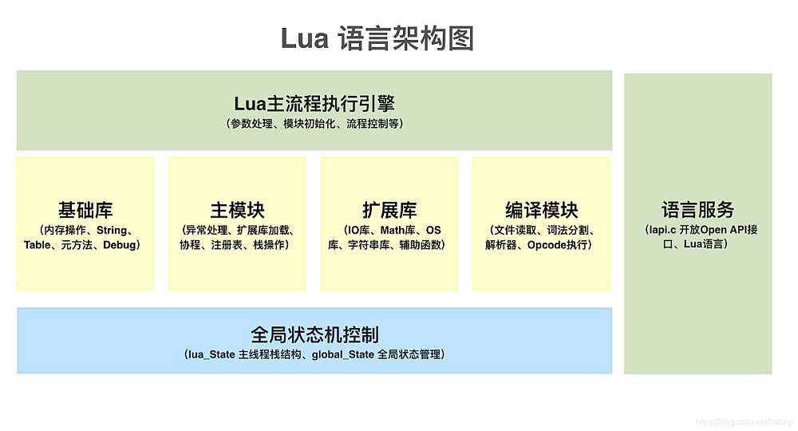
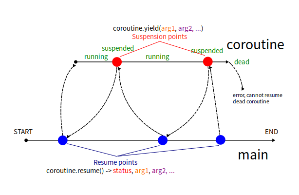

<style>
  table {
    width: 100%
    }
  td {
    vertical-align: center;
    text-align: center;
  }
  td.left {
    vertical-align: center;
    text-align: left;
  }  
  table.inputT{
    margin: 10px;
    width: auto;
    margin-left: auto;
    margin-right: auto;
    border: none;
  }
  input{
    text-align: center;
    padding: 0px 10px;
  }
  iframe{
    width: 100%;
    display: block;
    border-style:none;
  }
</style>

# Lua 代码结构



## 虚拟机核心功能部分

|文件|作用|
|:---:|:---:|
|lua.c|lua 的可执行入口 main 函数|
|lapi.c	|C 语言接口|
|ldebug.c|Debug 接口 |
|ldo.c|函数调用以及栈管理 |
|lfunc.c |函数原型及闭包管理 |
|lgc.c|垃圾回收机制|
|lmem.c |内存管理接口|
|lobject.c|对象操作函数|
|lopcodes.c|虚拟机字节码定义|
|lstate.c|全局状态机 管理全局信息|
|lstring.c|字符串池 |
|ltable.c|表类型的相关操作 |
|ltm.c|元方法 |
|lvm.c|虚拟机 |
|lzio.c |输入流接口|


## 源代码解析和预编译

|文件	|作用|
|:---:|:---:|
|lcode.c	|代码生成器 |
|ldump.c|序列化预编译的 Lua 字节码 |
|llex.c|词法分析器 |
|lparser.c|解析器|
|lundump.c|还原预编译的字节码|

## 内置的库

|文件|作用|
|:---:|:---:|
|lauxlib.c|库编写用到的辅助函数库 |
|lbaselib.c|基础库 |
|ldblib.c|Debug 库 |
|linit.c|内嵌库的初始化 |
|liolib.c|IO 库 |
|lmathlib.c|数学库 |
|loadlib.c|动态扩展库管理 |
|loslib.c|OS 库 |
|lstrlib.c|字符串库 |
|ltablib.c|表处理库|


要编写一个 main.c，在main.c 中需要加入 lua.h、lualib.h、lauxlib.h 头文件。程序主要是建立一个 Lua 的栈，然后在栈上设置数据，继续从栈上获取数据和出栈操作，最后关闭栈。


要将 main.c 文件编译成二进制可执行文件。其中编译参数中，需要带上 -l lua，将 lua 库作为静态库编译到的工程中去。 **-llua  -lm -ldl** ：加载 lua库、数据库和 dl 库等。


# Lua 的扩展库

编写有三种方式：

## 注册方式扩展

注册方式在主体语言里面编写扩展函数，然后通过 lua_register 方式，注册到 Lua 全局注册表中
扩展库编写
  - 注册方式示例，在 C 语言中，定义一个 my_func 函数，入参为 lua_State *L，函数内容将一个数字加上100。然后调用 lua_register 函数，将 my_func 函数注册到 Lua 栈的全局注册表中。当 Lua 语言中，遇到这个注册的 C 语言全局函数的时候，就会执行该函数。


```c
#include <stdio.h>
#include <stdlib.h>
#include <math.h>
#include <lua.h>
#include <lualib.h>
#include <lauxlib.h>

// 自定义一个 Lua 扩展函数
static int my_func(lua_State *L){
  int d = lual_checkinteger(L, 1);
  lua_pushinteger(L, d + 100); 
  return 1;
}
  
int main(){
// 初始化一个栈
  lua_State *L = luaL_newstate();
  luaL_openlibs(L);

// 注册函数
  lua_register(L, "my_func", my_func);
// 文件加载方式
  luaL_loadfile(L, "test.lua");
  int size = lua_gettop(L);
  printf("加载文件后，栈个数:%i\n", size);
// 执行文件  
  lua_pcall(L, 0, 0, 0);
// 关闭栈
  lua_close(L);
return 0;
}
```

lua 脚本

```lua
print("luaL_loadfile: 执行文件加载的 Lua 脚本！");
print("自定义函数调用：" .. my_func(100));
```

编译并执行

```sh
$ gcc main.c -o main -l lua
$ ./main
加载文件后，栈个数：1
luaL_loadfile：执行文件加载的 Lua 脚本！
自定义函数调用：200
```

## 静态库加载

按照 Lua 语言本身的扩展库设计方式进行编写动态库加载方式

  - 编写一个独立的扩展库文件，需要包含三个维度内容：
    - 扩展函数：自定义一个扩展函数，为lua_State 对象，函数如果要获取外部参数，则从 Lua 的栈上获取。扩展函数默认返回 1，则执行成功。
    - 配置数组：主要定义函数名称和扩展库中函数的映射关系。函数名称即为 Lua 语言中可以回调的函数。
    - 模块配置：定义一个以 luaopen_* 开头的函数，内部调用 luaL_newlib 函数实现模块的初始化。一般 Lua 中使用：模块名称.函数名称。

```c
#define lmylib_c
#define LUA_LIB

#include <stdio.h>
#include <stdlib.h>
#include <math.h>
#include <stdarg.h>
#include <lua.h>
#include <lualib.h>
#include <lauxlib.h>

#include <lprefix.h>

static int add(lua_State *L){
  int d =  luaL_checkinteger(L, 1);
  lua_pushinteger(L, d + 100);
  return 1;
}

static const struct luaL_Reg mylibi[] = {
  {"add", add},
  {NULL, NULL}
}

extern int luaopen_mylibi(lua_State* L){
  luaL_newlib(L, mylibi);
  return 1;
}
```

添加了模块后，需要修改 Lua 的其它两个文件：

 - lualib.h 文件：添加 LUA_MYLIBNAME 和 LUAMOD_API
 - linit.c 文件：添加 {LUA_MYLIBNAME, luaopen_mylib}


标准的扩展库，需要将扩展库直接编译进 Lua 源码里面，并且需要修改 lualib.h 和 linit.c 文件，对于集群线上大批量部署 Lua 语言，会造成巨大的困难。
因此这方法不建议使用。所以不再详细介绍。


## 动态库加载

将扩展库编译成 **.so** 的动态库，Lua 语言中通过 **require** 方式动态加载库文件。

Lua 可以通过 require 方式动态加载扩展库，所以可以将扩展库编译成 **.so** 的文件，就可以实现动态加载方式。

动态库和静态库的区别：

 - 静态库：在程序编译时会被连接到目标代码中，程序运行时将不再需要该静态库。
 - 动态库：在程序编译时并不会被连接到目标代码中，而是在程序运行是才被载入，因此在程序运行时还需要动态库存在。


```c
#include <stdio.h>
#include <stdlib.h>
#include <math.h>
#include <stdarg.h>

#include <lua.h>
#include <lualib.h>
#include <lauxlib.h>

int luaopen_mylibi(lua_State *L);

static int add(lua_State *L){
  int d =  luaL_checkinteger(L, 1);
  lua_pushinteger(L, d + 100);
  return 1;
}

static const struct luaL_Reg mylibi[] = {
  {"add", add},
  {NULL, NULL}
}

extern int luaopen_mylibi(lua_State* L){
  luaL_newlib(L, mylibi);
  return 1;
}
```

lua 脚本

```lua
-- 动态加载 mylibi
local mylibi = require("mylibi"); 
-- 调用 mylibi.add 函数
print(mylibi.add(1024));
```

编译并执行

```sh
$ gcc mylibi.c -fPIC -shared -o mylibi.so
$ ./main
栈个数：2
加载文件后，栈个数：3
luaL_loadfile:执行文件加载的Lua脚本！
自定义函数调用：1124
```

注意：Linux 系统下的 **so** 编译文件。编译完成后，mylibi.so 和 Lua 执行脚本同一个目录下。


# 协同程序 Coroutines

Lua 中的协程是特殊的线程，拥有自己的作用域、堆栈和指令指针。协程可以在主线程中同时运行。另一个重要声明是协程共享全局变量。所有协程都存储在 Lua 内置的协程表中。

协程并非真正并行，Lua 是一门严格的单线程语言。协程会执行函数一段时间，然后返回到调用点（保持相同状态）。使用协程，可以修改（在某些情况下还可以简化）代码的行为，使其更加清晰易读。

协程可能有 4 种状态：

|状态|解释|
|:---:|:---|
|挂起 (Suspended)|协程刚创建或退出后的状态|
|运行 (Running)|协程正在执行时的状态|
|正常 (Normal)|协程成功完成执行后的状态|
|死亡 (Dead)|协程遇到错误或无法恢复时的状态|




# LuaRocks

LuaRocks 是类似 npm、pip 这样的套件管理工具，你可以在上头找到近 4000 个已经写好的模组。在 Linux 上只需要将其解压缩于可执行路径底下即可。

[LuaRocks 发布下载内部位置](https://luarocks.github.io/luarocks/releases/)

## 搜寻套件

```sh
$ luarocks search json
###############
# ......
# lua-json
#   0.1.3-1 (rockspec) - https://luarocks.org
#   0.1.3-1 (src) - https://luarocks.org
# ......
###############
```

## 下载 / 安装套件

```sh
$ luarocks install lua-json
```

## 套件使用

在模组化提过 require 与 package.path 有关。其实，还与 package.cpath 有关。这两个变数都可以透过环境变数 LUA_PATH 和 LUA_CPATH 来调整。

LuaRocks 提供的半自动化处理的工具：

```sh
$ luarocks path --bin
```

或是直接使用：

```sh
eval $(luarocks path --bin)
```

## 导入库 lua 到脚本例子

### 轉換成JSON字串

```lua
local json = require 'json'

-- 轉換成 JSON 字串
object = {
    field = "name"
}
array = {9, 8, 7, 6, 5}

json.encode(object) --> {"field":"name"}
json.encode(array) --> [9,8,7,6,5]
```

### JSON字串轉換為物件

```lua
arr = json.decode "[9,8,7,6,5,4]"
for i, v in ipairs(arr) do
  print(i, v) -- 與JS不同的是，Lua 陣列從 1 開始
end

obj = json.decode [[{
    "key": "value"
  }]]

for k, v in pairs(obj) do
  print(k, v) --> "key"	"value"
end
```

# 第三方 lua 函式庫

LuaRocks 不是每樣科學東西都有超多函式庫可以用，但可以讓 lua 跟其他語言的科學函式庫溝通。像是 lua-matrix 就蠻讚。

## 数学函式庫

[Lua 实现的矩阵和矩阵运算](https://github.com/davidm/lua-matrix)

[Lua 的一个小型 3D 数学库](https://github.com/bjornbytes/maf)

[Lua 的 Cirno's 数学库](https://github.com/excessive/cpml)

[线性代数的 Eigen 库](https://github.com/devurandom/lua-eigen)

[Lua base64 编码器/解码器](https://github.com/iskolbin/lbase64)


## 互联网应用函式庫

[Lua 的 HTTP 库](https://github.com/daurnimator/lua-http)

[Lua 的 JSON 库](https://github.com/rxi/json.lua)

[Lua XOR 加密](https://github.com/ganlvtech/lua-simple-encrypt)


## 免费的在线游戏引擎

[Lua 的 3D 引擎](https://github.com/jonasgeiler/3d-soft-engine-lua)

[microStudio 在线游戏引擎](https://microstudio.dev/)

## ESP32 的 Lua 组件 

[Lua 作为 ESP32 的组件](https://developer.espressif.com/blog/using-lua-as-esp-idf-component-with-esp32/)


# CMake 编译 Lua

在原档案目录下增建一个目录名称为 **build**， CMake 创建的所有内容都放置在这目录中，它會助于分离源文件和 CMake 创建的文件。我先寻找 CMake 版本号。

```sh
$ cmake --version
```

在原档案目录下创建一个名为 **CMakeLists.txt** 的文件，这是 CMake 配置文件。它包含用于构建程序的指令，以下例子为最简单的 CMakeLists.txt 文件。

```
cmake_minimum_required(VERSION 4.1.1)

# 製作档案後的名称
project (lua_prog)
# 製作档案名称列表
file(GLOB SRC_LIST src/*.c)
# 用已获取的档案序列，寻找档案目录并储存到参数 FILE_DIRECTORY 內
list(GET SRC_LIST 0 FIRST_ITEM)
get_filename_component(FILE_DIRECTORY ${FIRST_ITEM} DIRECTORY)

## --- 编译 lua 程式库档案程序部份 ---
# 编译静态程式库，预先移除 lua 及 luac 执行档案程序
list(APPEND LIB_LIST ${SRC_LIST}) 
list(REMOVE_ITEM LIB_LIST ${FILE_DIRECTORY}/lua.c ${FILE_DIRECTORY}/luac.c)
# 编译静态程式库
add_library(lua STATIC ${LIB_LIST})
# 编译动态程式库
add_library(lua_so SHARED ${LIB_LIST})
# 更改编译动态程式库档案名称，因 CMake 不能重複制作档案名称
set_property(TARGET lua_so PROPERTY OUTPUT_NAME lua)

## --- 编译 lua 执行档案程序部份 ---
# 编译 lua 程式库，预先移除 luac.c 执行档案程序
list(APPEND LUA_LIST ${SRC_LIST}) 
list(REMOVE_ITEM LUA_LIST ${FILE_DIRECTORY}/luac.c)
# 编译 lua 执行档案程序
add_executable(lua_exe ${LUA_LIST}) 
# 加载外部连接编程式库， m 为数学程式库
target_link_libraries(lua_exe PRIVATE m)
# 更改编译档案名称，因 CMake 不能重複制作档案名称
set_property(TARGET lua_exe PROPERTY OUTPUT_NAME lua)

## --- 编译 luac 执行档案程序部份 ---
# 编译 luac 程式库，预先移除 lua.c 执行档案程序
list(APPEND LUAC_LIST ${SRC_LIST}) 
list(REMOVE_ITEM LUAC_LIST ${FILE_DIRECTORY}/lua.c)
# 编译 luac 执行档案程序
add_executable(luac ${LUAC_LIST})
# 加载外部连接编程式库， m 为数学程式库
target_link_libraries(luac PRIVATE m)
```

CMakeLists.txt 文件包含一组指令和说明，用于描述项目的源文件和目标。以上 CMakeLists.txt 文件为例。必须有以下部份：

**必须功能**

 - **cmake_minimun_required** 开头，指定了处理该项目所需的 CMake 最低版本。
 - **project** 指定传递给 cmake 命令的项目名称。
 - **add_executable** 添加一个可执行文件目标，该目标由指定的源文件构建。
- **add_library** 添加一个动态或静态程式库的文件目标，该目标由指定的源文件构建。


**辅助功能**

 - **target_link_libraries** 用于加载外部的 程式库。
 - **file** 可不使用，因只是将所有 C 的源文件档案变成一个序列。
 - **list** 可不使用，因只是修改 C 的源文件档案序列内容。
 - **set_property** 更改编译档案名称，因 cmake 不能重複制作档案名称。

注: **#** 为註解，以上脚本储存在 build 目录下

用以下步骤製作，所需要文件。

```sh
$ cd build
$ cmake ..
$ make
```

# 最基本从 C 程序中调用 lua 脚本

```c 
#include <lauxlib.h>
#include <lua.h>
#include <lualib.h>
#include <stdio.h>
#include <stdlib.h>

int main() {
  int status, result;
  lua_State *L;
  // 创建的 lua 虚拟机
  L = luaL_newstate();
  // 加载 lua 所需程序库
  luaL_openlibs(L);
  // 加载 lua 脚本档案
  status = luaL_loadfile(L, "main.lua");
  if (status) {
    fprintf(stderr, "档案不存在: %s\n", lua_tostring(L, -1));
    exit(1);
  }
  // 执行加载的 lua 档案
  result = lua_pcall(L, 0, LUA_MULTRET, 0);
  if (result) {
    fprintf(stderr, "脚本执行错误: %s\n", lua_tostring(L, -1));
    exit(1);
  }
  // 关闭 lua 档案
  lua_close(L);
  // 返回 0 值为正常结束
  return 0;
}
```

**注解**: 
 - main.lua 是需要在 lua 计算的的程序。是每次载入程序是动态载入。

用以下步骤製作，所需要文件。

```sh
$ gcc -I ../lua-5.4.8/src -L . luabasic.c -o luabasic -l lua -l m
```

**注解**: 

 - -I 为编译时需要引人的头文件路径
 - -L 为引入的程序庫路径， <font color="#FF1000">.</font> 是代表在当前目录下
 - -o 是设定编译后执行档案的名称
 - -l 为引人的程序庫名称，即 lib<font color="#FF1000">lua</font> 及 lib<font color="#FF1000">m</font>

# Lua C API

以下所有的 lua 代码档案名称为 main.lua。C 程式只是列出代码片段。详细请参考前文。

## C 访问 Lua 变量

**Lua** 部份代码

```lua
data = 99;
```

**C** 部份代码片段

```c
if (luaL_dofile(L, "main.lua") == LUA_OK) {
  // 将 data 放入堆栈 (设置部分)
  lua_getglobal(L, "data"); 
  // data 位于堆栈顶部，使用 -1 (读取部份)
  lua_Number data_in_c = lua_tonumber(L, -1); 
  // 收到带有值的 lua data
  printf("%lf", data_in_c);
} else {
  printf("错误");
}
```

## C 将变量传递给 Lua

**C** 部份代码片段

```c
int data = 199;
// 将 data 推送到堆栈
lua_pushnumber(L, data); 
// 将堆栈顶部的值赋给一个变量 data
lua_setglobal(L, "data"); 
if (luaL_dofile(L, "main.lua") == LUA_OK) {
  printf("数据存入 lua 档案");
} else {
  printf("错误");
}
```

**Lua** 部份代码

```lua
print("[Lua] 输入数值 data 为 : " .. data )
```

## 访问 Lua 函数

**Lua** 部份代码

```lua
function add_2_numbers(value_1, value_2)
  print("[Lua] 输入两数值:：" .. value_1 .. " + " .. value_2 .. " = " .. value_1+value_2)
  return value_1 + value_2
end
```

**C** 部份代码片段

```c
if (luaL_dofile(L, "main.lua") == LUA_OK) {
  // 获取堆栈上的函数
  lua_getglobal(L, "add_2_numbers"); 
  if (lua_isfunction(L, -1)) { 
    // 设置第一个函数参数
    lua_pushnumber(L, 55); 
    // 设置第二个函数参数
    lua_pushnumber(L, 17); 
    // 將刚刚设置的参数推送到 Lua 堆栈
    const int arguments_count = 2 ; 
    // 函数返回 0 个值
    const int return_count = 1; 
    // 现在调用函数
    lua_pcall(L, arguments_count, return_count, 0); 
    // 读取栈顶输出结果
    lua_Number result = lua_tonumber(L, -1);
    printf("%lf", result);
  } else {
    printf("找不到函数。");
  }
} else {  
  printf("错误");
}        
```

## 从 Lua 调用 C 函数

**C** 部份代码片段

```c
int multiply_2_numbers(lua_State* L) {   
  // 函数参数位于 lua 堆栈上，最后一个参数位于顶部
  lua_Number arg_2 = lua_tonumber(L, -1);
  lua_Number arg_1 = lua_tonumber(L, -2); 
  // 计算结果
  lua_Number result = arg_2 * arg_1;  
  // 将结果推回堆栈
  lua_pushnumber(L, result);
  // 返回 1 因代表正确完成计算
  return 1;
}

// 公开函数，其操作与变量相同
lua_pushcfunction(L, multiply_2_numbers);
lua_setglobal(L, "multiply_2_numbers");
if (luaL_dofile(L, "main.lua") == LUA_OK) {
  printf("执行 lua 档案函数。")
} else {  
  printf("错误");
}    
```

**Lua** 部份代码

```lua
result = multiply_2_numbers(3,4)
print("[Lua] 调用 multiply_2_numbers(..) 并且结果是：" .. result)
```

## 访问 Lua 中的结构体（用户自订数据）

**Lua** 部份代码

```lua
data = create_data()
print("[Lua] 创建 userdata data") 
```

**C** 部份代码片段

```c
// any struct defined to pass to lua
struct Data {
  int m_x;
  int m_y;
};

// 在函数内部我们创建了 newuserdata 並反回值
int create_data(lua_State* L) {
  Data* data = static_cast<Foo*>(lua_newuserdata(L, sizeof(Data)));
  data->m_x = 0;
  data->m_y = 0;
  return 1;
}

// 在执行脚本前，将创建函数推送到 lua 堆栈并分配它以使其可调用
lua_pushcfunction(L, create_data);
lua_setglobal(L, "create_data");
if (luaL_dofile(L, "main.lua") == LUA_OK) {
  printf("执行 lua 档案函数。")
} else {
  printf("错误");
}
```

## 在 C 中读取 Lua 表 (table)

**Lua** 部份代码

```lua
data = {
  data_number = 1,
  bar_number = 2,
  data_string = "data",
  bar_string = "bar"
}
```

**C** 部份代码片段

```c
if (luaL_dofile(L, "main.lua") == LUA_OK)  {
  // 在堆栈上获取全局结构 data
  lua_getglobal(L, "data"); 
  // 验证它是否是表
  if (lua_istable(L, -1))  {
    // 获取字段 data_number，表位于堆栈顶部
    lua_getfield(L, -1, "data_number"); 
    auto data_v = lua_tonumber(L, -1); 
    // 栈顶为刚读的值。现表格位于 -2，从表中访问 bar_number
    lua_getfield(L, -2, "bar_number"); 
    auto bar_v = lua_tonumber(L, -1); 
    // 栈顶为刚读的值。现表格位于 -3，从表中访问 data_string
    lua_getfield(L, -3, "data_string"); 
    auto data_str = lua_tostring(L, -1); 
    // 栈顶为刚读的值。现表格位于 -4，从表中访问 bar_string    
    lua_getfield(L, -4, "bar_string"); 
    auto bar_str = lua_tostring(L, -1); 
    printf("%lf, %lf, %s, %s", data_v, bar_v, data_str, bar_str)
  } else { 
    printf("这不是表")
  }
} else {  
  printf("错误");
}    
```

## 在 C 中读取 Lua 数组 (array)

**Lua** 部份代码

```lua
data = {11, 22, 33}
```

**C** 部份代码片段

```c
if (luaL_dofile(L, "main.lua") == LUA_OK) {
  lua_getglobal(L, "data");
  // data 顶部，用 -1 访问，用 1 访问表中的 data[1]
  lua_rawgeti(L, -1, 1); 
  // data[1] 现在位于堆栈顶部
  auto first = lua_tonumber(L, -1); 
  // 栈顶为刚读的值。用 -2 访问表，用 2 访问表中的 data[2]  
  lua_rawgeti(L, -2, 2); 
  // data[2] 现在位于堆栈顶部
  auto second = lua_tonumber(L, -1); 
  // 栈顶为刚读的值。用 -3 访问表，用 3 访问表中的 data[3]
  lua_rawgeti(L, -3, 3); 
  // data[3] 现在位于堆栈顶部
  auto third = lua_tonumber(L, -1);
  pintf("%lf, %lf, %lf,", first, second, third);
} else {  
  printf("错误");
}    
```

## 在 C 中读取 Lua 表数组 (table array) - 方法 <font color="#FF1000">1</font>


**Lua** 部份代码

```lua
data = {
  [1] = { 
    bar = 123,
    baz = "baz",
  },
  [2] = { 
    bar = 456,
    baz = "another baz",
  }
}
```

**C** 部份代码片段

```c 
if (luaL_dofile(L, "main.lua") == LUA_OK) {
// 在堆栈上获取全局结构 data
  lua_getglobal(L, "data"); 
  // 验证它是否是表
  if (lua_istable(L, -1))  {
    // 推送 1 来访问第一个元素，data 现位于 -2
    lua_pushnumber(L, 1); 
    // 栈顶为刚压入的值。堆栈表索引变为 -2，索引是顶部的数值 1
    lua_gettable(L, -2); 
    // 验证它是否是表
    if (lua_istable(L, -1)) {
      // 像以上例子读取数据
      lua_getfield(L, -1, "bar"); 
      auto bar = lua_tonumber(L, -1);
      lua_getfield(L, -2, "baz");
      auto baz = lua_tostring(L, -1);
      printf("%lf, %s", bar , barz); 
    } else {
      luaL_error(L, "Error: %s\n", lua_tostring(L, -1));
    }
    // 推送想要读取的下一个数组索引      
    lua_pushnumber(L, 2); 
    // 同时推送了另外四个值，表格位于前 5 位
    lua_gettable(L, -5); 
    if (lua_istable(L, -1)) {
      lua_getfield(L, -1, "bar");
      auto bar = lua_tonumber(L, -1);
      lua_getfield(L, -2, "baz");
      auto baz = lua_tostring(L, -1);
      printf("%lf, %s", bar , barz);
     } else {
      printf("这不是表");
    }
  } else {
    printf("这不是表");
  }
} else {  
  printf("错误"); 
}
```

## 在 C 中读取 Lua 表数组 (table array) - 方法 <font color="#FF1000">2</font>

**C** 部份代码片段

```c
if (luaL_dofile(L, "./scripts/example_11_reading_lua_tablearray_alternative.lua") == LUA_OK) {
    std::cout << "[C] Executed example_11_reading_lua_tablearray_alternative.lua\n";
    lua_getglobal(L, "foo"); // get the global table array foo on top of the stack
    if (lua_istable(L, -1)) { // verify it is a table
        lua_getfield(L, -1, "foo_1"); // get the first element by name
        if (lua_istable(L, -1)) {  // verify it is a table 
            lua_getfield(L, -1, "bar"); // get the values like in the examples before
            auto bar = lua_tonumber(L, -1);
            lua_getfield(L, -2, "baz");
            auto baz = lua_tostring(L, -1);
        
            std::cout << "[C] foo.foo_1.bar = " << bar << '\n' <<
                        "[C] foo.foo_1.baz = " << baz << '\n' ;
        }
        lua_getfield(L, -4, "foo_2"); // meanwhile the table itself is on top-4
        if (lua_istable(L, -1)) {  // and the same again 
            lua_getfield(L, -1, "bar");
            auto bar = lua_tonumber(L, -1);
            lua_getfield(L, -2, "baz");
            auto baz = lua_tostring(L, -1);
        
            std::cout << "[C] foo.foo_2.bar = " << bar << '\n' <<
                        "[C] foo.foo_2.baz = " << baz << '\n' ;
        }
    }
} else {
  printf("错误");
}
```