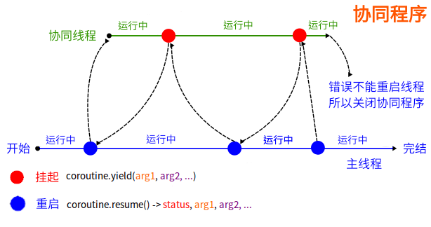

<style>
  table {
    width: 100%
    }
  td {
    vertical-align: center;
    text-align: center;
  }
  td.left {
    vertical-align: center;
    text-align: left;
  }  
  table.inputT{
    margin: 10px;
    width: auto;
    margin-left: auto;
    margin-right: auto;
    border: none;
  }
  input{
    text-align: center;
    padding: 0px 10px;
  }
  iframe{
    width: 100%;
    display: block;
    border-style:none;
  }
</style>

# Lua 代码结构


## 虚拟机核心功能部分

|文件|作用|
|:---:|:---:|
|lua.c|lua 的可执行入口 main 函数|
|lapi.c	|C 语言接口|
|ldebug.c|Debug 接口 |
|ldo.c|函数调用以及栈管理 |
|lfunc.c |函数原型及闭包管理 |
|lgc.c|垃圾回收机制|
|lmem.c |内存管理接口|
|lobject.c|对象操作函数|
|lopcodes.c|虚拟机字节码定义|
|lstate.c|全局状态机 管理全局信息|
|lstring.c|字符串池 |
|ltable.c|表类型的相关操作 |
|ltm.c|元方法 |
|lvm.c|虚拟机 |
|lzio.c |输入流接口|


## 源代码解析和预编译

|文件	|作用|
|:---:|:---:|
|lcode.c	|代码生成器 |
|ldump.c|序列化预编译的 Lua 字节码 |
|llex.c|词法分析器 |
|lparser.c|解析器|
|lundump.c|还原预编译的字节码|

## 内置的库

|文件|作用|
|:---:|:---:|
|lauxlib.c|库编写用到的辅助函数库 |
|lbaselib.c|基础库 |
|ldblib.c|Debug 库 |
|linit.c|内嵌库的初始化 |
|liolib.c|IO 库 |
|lmathlib.c|数学库 |
|loadlib.c|动态扩展库管理 |
|loslib.c|OS 库 |
|lstrlib.c|字符串库 |
|ltablib.c|表处理库|


要编写一个 main.c，在main.c 中需要加入 lua.h、lualib.h、lauxlib.h 头文件。程序主要是建立一个 Lua 的栈，然后在栈上设置数据，继续从栈上获取数据和出栈操作，最后关闭栈。


要将 main.c 文件编译成二进制可执行文件。其中编译参数中，需要带上 -l lua，将 lua 库作为静态库编译到的工程中去。 **-llua  -lm -ldl** ：加载 lua库、数据库和 dl 库等。


# Lua 的扩展库

编写有三种方式：

## 注册方式扩展

注册方式在主体语言里面编写扩展函数，然后通过 lua_register 方式，注册到 Lua 全局注册表中
扩展库编写
  - 注册方式示例，在 C 语言中，定义一个 my_func 函数，入参为 lua_State *L，函数内容将一个数字加上100。然后调用 lua_register 函数，将 my_func 函数注册到 Lua 栈的全局注册表中。当 Lua 语言中，遇到这个注册的 C 语言全局函数的时候，就会执行该函数。


```c
#include <stdio.h>
#include <stdlib.h>
#include <math.h>
#include <lua.h>
#include <lualib.h>
#include <lauxlib.h>

// 自定义一个 Lua 扩展函数
static int my_func(lua_State *L){
  int d = lual_checkinteger(L, 1);
  lua_pushinteger(L, d + 100); 
  return 1;
}
  
int main(){
// 初始化一个栈
  lua_State *L = luaL_newstate();
  luaL_openlibs(L);

// 注册函数
  lua_register(L, "my_func", my_func);
// 文件加载方式
  luaL_loadfile(L, "test.lua");
  int size = lua_gettop(L);
  printf("加载文件后，栈个数:%i\n", size);
// 执行文件  
  lua_pcall(L, 0, 0, 0);
// 关闭栈
  lua_close(L);
return 0;
}
```

lua 脚本

```lua
print("luaL_loadfile: 执行文件加载的 Lua 脚本！");
print("自定义函数调用：" .. my_func(100));
```

编译并执行

```sh
$ gcc main.c -o main -l lua
$ ./main
加载文件后，栈个数：1
luaL_loadfile：执行文件加载的 Lua 脚本！
自定义函数调用：200
```

## 静态库加载

按照 Lua 语言本身的扩展库设计方式进行编写动态库加载方式

  - 编写一个独立的扩展库文件，需要包含三个维度内容：
    - 扩展函数：自定义一个扩展函数，为lua_State 对象，函数如果要获取外部参数，则从 Lua 的栈上获取。扩展函数默认返回 1，则执行成功。
    - 配置数组：主要定义函数名称和扩展库中函数的映射关系。函数名称即为 Lua 语言中可以回调的函数。
    - 模块配置：定义一个以 luaopen_* 开头的函数，内部调用 luaL_newlib 函数实现模块的初始化。一般 Lua 中使用：模块名称.函数名称。

```c
#define lmylib_c
#define LUA_LIB

#include <stdio.h>
#include <stdlib.h>
#include <math.h>
#include <stdarg.h>
#include <lua.h>
#include <lualib.h>
#include <lauxlib.h>

#include <lprefix.h>

static int add(lua_State *L){
  int d =  luaL_checkinteger(L, 1);
  lua_pushinteger(L, d + 100);
  return 1;
}

static const struct luaL_Reg mylibi[] = {
  {"add", add},
  {NULL, NULL}
}

extern int luaopen_mylibi(lua_State* L){
  luaL_newlib(L, mylibi);
  return 1;
}
```

添加了模块后，需要修改 Lua 的其它两个文件：

 - lualib.h 文件：添加 LUA_MYLIBNAME 和 LUAMOD_API
 - linit.c 文件：添加 {LUA_MYLIBNAME, luaopen_mylib}


标准的扩展库，需要将扩展库直接编译进 Lua 源码里面，并且需要修改 lualib.h 和 linit.c 文件，对于集群线上大批量部署 Lua 语言，会造成巨大的困难。
因此这方法不建议使用。所以不再详细介绍。


## 动态库加载

将扩展库编译成 **.so** 的动态库，Lua 语言中通过 **require** 方式动态加载库文件。

Lua 可以通过 require 方式动态加载扩展库，所以可以将扩展库编译成 **.so** 的文件，就可以实现动态加载方式。

动态库和静态库的区别：

 - 静态库：在程序编译时会被连接到目标代码中，程序运行时将不再需要该静态库。
 - 动态库：在程序编译时并不会被连接到目标代码中，而是在程序运行是才被载入，因此在程序运行时还需要动态库存在。


```c
#include <stdio.h>
#include <stdlib.h>
#include <math.h>
#include <stdarg.h>

#include <lua.h>
#include <lualib.h>
#include <lauxlib.h>

int luaopen_mylibi(lua_State *L);

static int add(lua_State *L){
  int d =  luaL_checkinteger(L, 1);
  lua_pushinteger(L, d + 100);
  return 1;
}

static const struct luaL_Reg mylibi[] = {
  {"add", add},
  {NULL, NULL}
}

extern int luaopen_mylibi(lua_State* L){
  luaL_newlib(L, mylibi);
  return 1;
}
```

lua 脚本

```lua
-- 动态加载 mylibi
local mylibi = require("mylibi"); 
-- 调用 mylibi.add 函数
print(mylibi.add(1024));
```

编译并执行

```sh
$ gcc mylibi.c -fPIC -shared -o mylibi.so
$ ./main
栈个数：2
加载文件后，栈个数：3
luaL_loadfile:执行文件加载的Lua脚本！
自定义函数调用：1124
```

注意：Linux 系统下的 **so** 编译文件。编译完成后，mylibi.so 和 Lua 执行脚本同一个目录下。


# 协同程序 Coroutines

Lua 中的协程是特殊的线程，拥有自己的作用域、堆栈和指令指针。协程可以在主线程中同时运行。另一个重要声明是协程共享全局变量。所有协程都存储在 Lua 内置的协程表中。

协程并非真正并行，Lua 是一门严格的单线程语言。协程会执行函数一段时间，然后返回到调用点（保持相同状态）。使用协程，可以修改（在某些情况下还可以简化）代码的行为，使其更加清晰易读。

协程可能有 4 种状态：

|状态|解释|
|:---:|:---|
|挂起 (Suspended)|协程刚创建或退出后的状态|
|运行 (Running)|协程正在执行时的状态|
|正常 (Normal)|协程成功完成执行后的状态|
|死亡 (Dead)|协程遇到错误或无法恢复时的状态|




# LuaRocks

LuaRocks 是类似 npm、pip 这样的套件管理工具，你可以在上头找到近 4000 个已经写好的模组。在 Linux 上只需要将其解压缩于可执行路径底下即可。

[LuaRocks 发布下载内部位置](https://luarocks.github.io/luarocks/releases/)

## 搜寻套件

```sh
$ luarocks search json
###############
# ......
# lua-json
#   0.1.3-1 (rockspec) - https://luarocks.org
#   0.1.3-1 (src) - https://luarocks.org
# ......
###############
```

## 下载 / 安装套件

```sh
$ luarocks install lua-json
```

## 套件使用

在模组化提过 require 与 package.path 有关。其实，还与 package.cpath 有关。这两个变数都可以透过环境变数 LUA_PATH 和 LUA_CPATH 来调整。

LuaRocks 提供的半自动化处理的工具：

```sh
$ luarocks path --bin
```

或是直接使用：

```sh
eval $(luarocks path --bin)
```

## 导入库 lua 到脚本例子

### 轉換成JSON字串

```lua
local json = require 'json'

-- 轉換成 JSON 字串
object = {
    field = "name"
}
array = {9, 8, 7, 6, 5}

json.encode(object) --> {"field":"name"}
json.encode(array) --> [9,8,7,6,5]
```

### JSON字串轉換為物件

```lua
arr = json.decode "[9,8,7,6,5,4]"
for i, v in ipairs(arr) do
  print(i, v) -- 與JS不同的是，Lua 陣列從 1 開始
end

obj = json.decode [[{
    "key": "value"
  }]]

for k, v in pairs(obj) do
  print(k, v) --> "key"	"value"
end
```
## 元表 (metatables)

在 Lua 中，元表是一种强大的机制，允许自定义值（尤其是表和用户数据）在某些操作下的行为。它们充当与值关联的“隐藏表”，包含称为“元方法”的特殊键，这些键定义了对值执行特定操作时应如何表现。

以下是 Lua 元表的关键方面：

 - 自定义操作 (Customizing Operations)：
    - 元表可以重新定义标准 Lua 运算符和函数如何处理特定值。这包括算术运算（例如，__add 用于 +，__sub 用于 -）、比较运算（例如，__eq 用于 ==）、索引（__index 用于表查找，__newindex 用于表赋值）以及其他行为，例如字符串转换 (__tostring)。

 - 元方法 (Metamethods)：
    - 元方法是存储在元表中与特定操作对应的函数或值。例如，如果某个表的元表中有一个包含 __add 元方法的元表，则在尝试对该表执行加法运算时将调用此函数。

 - setmetatable 和 getmetatable：
    - setmetatable(value, metatable) 函数用于将元表赋值给某个值。
    - getmetatable(value) 函数用于检索与该值关联的元表。 

 - 继承与面向对象编程 (Inheritance and Object-Oriented Programming)：
    - 元表是 Lua 中实现面向对象编程范式的基础，它通过 __index 元方法实现类似继承的行为。当在表中找不到某个键时，Lua 会检查其元表的 __index 字段。如果 __index 是一个表，Lua 会在该表中查找该键；如果它是一个函数，则会调用该函数来处理查找。

 - 灵活性和强大功能 (Flexibility and Power)：
    - 元表提供了高度的灵活性，使开发者能够创建自定义数据类型、重载运算符、实现对象模型，并以各种创造性的方式扩展 Lua 的核心功能。


### 元表可覆盖函数

|覆盖函数名称|解释|公式符号|
|:---:|:---:|:---:|
|__eq|Equality|a == b|
|__le |  Less than | a < b|
|__ge | Greater than | a > b|
|__add | Addition | a + b|
|__sub | Subtraction | a - b|
|__mul | Multiplication | a * b|
|__div | Division | a / b|
|__pow | Exponentation | a ^ b|
|__unm | Negation | -a|
|__mod | Modulus | a % b|
|__concat | Concatenation | a .. b|
|__metatable | Metatable | getmetatable(a)|
|__call | Call | table() |
|__index | Indexing | table.x \| table['x']|
|__newindex | New Index | table.x = 'abc'|
|__mode | Weak References | mt.__mode = 'k'|
|__tostring | String Conversion | tostring(a)|

注：以上这些都称为元方法，它们都以 <font color="#FF1000">__</font> 开头。


# 第三方 lua 函式庫

LuaRocks 不是每樣科學東西都有超多函式庫可以用，但可以讓 lua 跟其他語言的科學函式庫溝通。像是 lua-matrix 就蠻讚。

## 数学函式庫

[Lua 实现的矩阵和矩阵运算](https://github.com/davidm/lua-matrix)

[Lua 的一个小型 3D 数学库](https://github.com/bjornbytes/maf)

[Lua 的 Cirno's 数学库](https://github.com/excessive/cpml)

[线性代数的 Eigen 库](https://github.com/devurandom/lua-eigen)

[Lua base64 编码器/解码器](https://github.com/iskolbin/lbase64)


## 互联网应用函式庫

[Lua 的 HTTP 库](https://github.com/daurnimator/lua-http)

[Lua 的 JSON 库](https://github.com/rxi/json.lua)

[Lua XOR 加密](https://github.com/ganlvtech/lua-simple-encrypt)


## 免费的在线游戏引擎

[Lua 的 3D 引擎](https://github.com/jonasgeiler/3d-soft-engine-lua)

[microStudio 在线游戏引擎](https://microstudio.dev/)

## ESP32 的 Lua 组件 

[Lua 作为 ESP32 的组件](https://developer.espressif.com/blog/using-lua-as-esp-idf-component-with-esp32/)