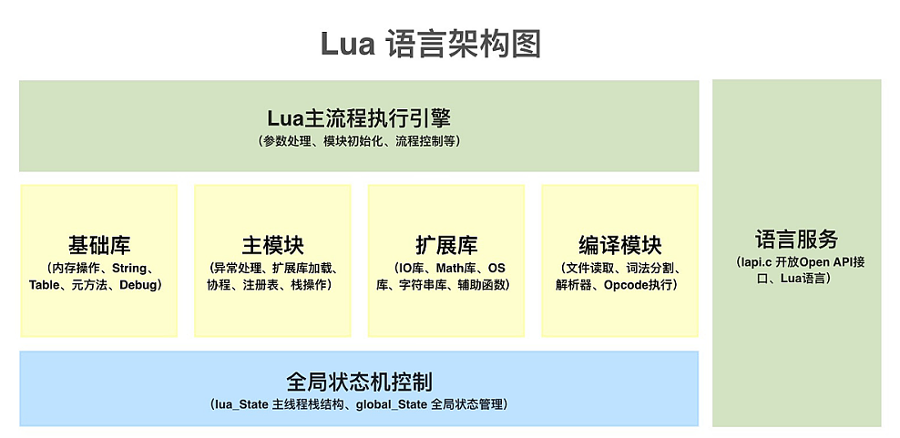

# Lua 代码结构

## 虚拟机核心功能部分

|文件|作用|
|:---:|:---:|
|lua.c|lua的可执行入口 main函数|
|lapi.c	|C语言接口|
|ldebug.c|Debug 接口 |
|ldo.c|函数调用以及栈管理 |
|lfunc.c |函数原型及闭包管理 |
|lgc.c|垃圾回收机制|
|lmem.c |内存管理接口|
|lobject.c|对象操作函数|
|lopcodes.c|虚拟机字节码定义|
|lstate.c|全局状态机 管理全局信息|
|lstring.c|字符串池 |
|ltable.c|表类型的相关操作 |
|ltm.c|元方法 |
|lvm.c|虚拟机 |
|lzio.c |输入流接口|

## 源代码解析和预编译

|文件	|作用|
|:---:|:---:|
|lcode.c	|代码生成器 |
|ldump.c|序列化预编译的Lua 字节码 |
|llex.c|词法分析器 |
|lparser.c|解析器|
|lundump.c|还原预编译的字节码|

## 内置的库

|文件|作用|
|:---:|:---:|
|lauxlib.c|库编写用到的辅助函数库 |
|lbaselib.c|基础库 |
|ldblib.c|Debug 库 |
|linit.c|内嵌库的初始化 |
|liolib.c|IO 库 |
|lmathlib.c|数学库 |
|loadlib.c|动态扩展库管理 |
|loslib.c|OS 库 |
|lstrlib.c|字符串库 |
|ltablib.c|表处理库|