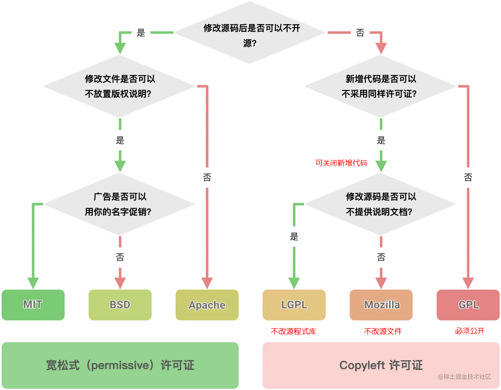

# Copyright (版权)

## 常见许可证说明

 - **MIT** 许可证，来源于麻省理工大学，MIT 许可证是史上最为简洁和宽松（permissive）的开源协议之一

    - 使用限制：没有，可以使用代码做任何的事情
    - 没有担保：不保证代码质量，用户自担风险
    - 披露要求：用户必须披露原始作者
    - 软件分发：必须保留原始的许可证声明

 - **BSD** 许可证，许可与 MIT 差不多，也非常简单、慷慨，只是不能用于促销

    - 使用限制：没有，可以使用代码做任何的事情
    - 没有担保：不保证代码质量，用户自担风险
    - 披露要求：用户必须披露原始作者
    - 软件分发：不能使用作者的名义促销

 - **apache** 许可证，类似 MIT ，但它重视专利权

    - 使用限制：没有，可以使用代码做任何的事情
    - 没有担保：不保证代码质量，用户自担风险
    - 披露要求：用户必须披露原始作者
    - 软件分发
       - 修改过的文件 -- 必须注明新许可证
       - 没修改过文件 -- 必须保持许可证不变

 - **LGPL** 许可证，来源自由软件联盟 GNU，可以翻译为更宽松的 GPL 协议，属于 传染性开源 (有限制不提供源码)

    - 软件分发 (**程式庫为基础**)
       - 二进制格式，必须提供源码
       - 修改后的源码，必须与修改前保持许可证一致
       - 不得在原始许可证以外，附加其他限制
       - 如果项目只是调用该 LGPL 许可证的库，则该项目可以不用开源 (**只可以是外引用部程式庫的方法使用才不需要提供源码**)

 - **Mozila** 许可证，Mozilla 公共许可证（英语：Mozilla Public License，简称 MPL）是个自由、开源、详细的软件许可证，由 Mozilla 基金会开发并维护 (有限制不提供源码)

    - 软件分发 (**文件为基础**)
        - 二进制格式，必须提供源码
        - 修改后的源码，必须与修改前保持许可证一致
        - 不得在原始许可证以外，附加其他限制
        - 只要该许可证的代码在单独的文件，**新增的独立文件可以不用提供源码**

 - **GPL** 许可证，来源自由软件联盟 GNU，也属于 传染性开源 (必须提供源码)

    - 软件分发 (**必须提供源码**)
       - 分发二进制格式，必须提供源码
       - 修改后的源码，必须与修改前保持许可证一致
       - 不得在原始许可证以外，附加其他限制
       - 如果项目包含了 GPL 许可证的代码，那么整个项目都必须使用 GPL 许可证