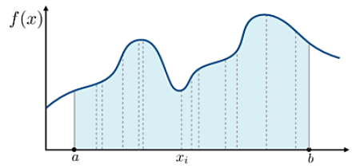

<style>
  table {
    width: 100%
    }
  td {
    vertical-align: center;
    text-align: center;
  }
  table.inputT{
    margin: 10px;
    width: auto;
    margin-left: auto;
    margin-right: auto;
    border: none;
  }
  input{
    text-align: center;
    padding: 0px 10px;
  }
  iframe{
    width: 100%;
    display: block;
    border-style:none;
  }
</style>

# Monte Carlo Algorithm (蒙地卡罗算法)


蒙特卡洛算法的核心原理是利用随机数和概率统计方法来模拟问题，通过大量随机样本的采样，得到问题的概率分布或期望值。这种方法特别适用于那些无法用精确数学公式求解的问题，或者公式求解非常困难的问题。它非常强大和灵活，很容易实现。对于许多问题来说，它往往是最简单的计算方法，有时甚至是唯一可行的方法。

蒙地卡罗实际上是一种很广泛的称呼，只要**透过大量取样来逼近某真实状况的方式**，精神是「随机抽样，统计逼近」。都可以称作蒙地卡罗算法。

在解决实际问题的时候应用蒙地卡罗方法主要有两部分工作：

 - 用蒙地卡罗方法类比某一过程时，需要产生各种机率分布的随机变数
 - 用统计方法把模型的数字特征估计出来，从而得到实际问题的数值解


蒙特卡洛算法的具体实现步骤如下：

 1. **定义问题**：首先需要明确问题的数学模型和目标函数，以及待求解的变量或参数。
 2. **随机采样**：生成随机样本，一般是均匀分布或正态分布的随机数，根据采样规则，将随机数映射到问题的定义域内，得到一组采样点。
 3. **模拟计算**：将采样点代入目标函数中，得到目标函数的函数值，根据函数值的大小关系，统计满足条件的样本数目，得到目标函数在采样区域内的估计值。
 4. **统计分析**：根据大数定律和中心极限定理，利用采样得到的数据，计算问题的期望值、方差、置信区间等统计量，并根据结果进行进一步的分析和推断。

## 蒙特卡洛算法的优点
 - 是简单易懂
 - 不需要对问题的具体结构做出太多的假设
 - 可直接利用计算机生成大量随机数进行计算

解决了许多传统方法难以解决的问题。

## 蒙特卡洛算法的缺点
 - 收敛速度较慢
 - 计算量较大
 - 精度不高等问题

需要根据具体问题的特点来选择合适的方法和技巧。

需要注意的是，蒙特卡洛算法的计算结果可能存在一定的误差，因为估计值是通过随机样本计算得到的。因此，在实际应用中需要考虑样本数量、采样方式、计算精度等因素，以得到可靠的计算结果。


例子如下：

工作原理就是两件事：
 - 不断抽样
 - 逐渐逼近

用两个例子来理解一下这个方法的思想

**圆周率** 值求解

有一个半径为 $r=1$ 的圆和边长为 1 的正方形，圆的面积为，则正方形内部的相切圆的面积为整个圆的 1/4，也就是 ，正方形的面积为 1。然后向正方形中随机打点，就会有一定的概率落在圆中：


这样就可以得到

$$
落在圆中的概率就是 = \frac {圆的面积}{正方形面积} = \frac {\pi}{4} 
$$
，那么就可以推出圆周率的计算公式：

$$
\pi = 4 \times 落在圆中的概率  = 4 \times \frac {红色点数}{总点数}
$$

随机点数的增加，近似度逐渐增大。


## 蒙特卡罗采样方法

根据中央极限定理(Central Limit Theorem，CLT)，无论总体分布如何，只要随机独立样本量够多，这些相互独立的随机变数会依照分布收敛成**常态分布**。


若随机变量X服从一个位置参数为 $\mu$ 、变异数 (尺度参数) 为 $\sigma$ 的机率分布，

$$ X \sim N(\mu,\sigma^2) $$


如下需要计算 $a$ 到 $b$ 的面积


$$
F = \int ^b _a f(x)dx
$$




蒙地卡罗积分方法，换算成数学的概念写成：

$$
F = \int ^b _a f(x)dx \approx \frac {1}{N} \sum ^N _{i=1} \frac {f(x_i)}{pdf(x_i)}
$$

$pdf$ 为函数的机率密度函数，当然先以<font color="#FF1000">均匀分布</font>为主，也就是 


$$
pdf(x_i) = \frac {1}{(b-a)}
$$


$$
F \approx \frac {1}{N} \sum ^N _{i=1} \frac {f(x_i)}{\frac {1}{(b-a)}} \approx
\frac {(b-a)}{N} \sum ^N _{i=1} f(x_i)
$$


$$
常态分布下的常数 = C = \frac {(b-a)}{N}
$$

$$
函数积分总和 = X= \sum ^N _{i=1} f(x_i)
$$

## 应用例子

以下例子是透过蒙地卡罗积分来估计一下指数分布在闭区间 0~5 的积分值是多少。


$$
\lambda \cdot e^{-\lambda \cdot x}
$$

```py
### 估計指數分布 (lambda = 1) 於閉區間 0 ~ 5 積分
### 指數分布公式 : lambda * e^(-lambda*x)
### 積分公式解  1-e^(-lambda*x) | (0~5) : 0.993262053

import numpy as np
    
def target_exp_function(x, lb=1):
  return lb*np.exp(-lb*x)  

def simple_monte_carlo(a, b, N=100000):
  C = (b-a) / N
  X = np.random.uniform(low=a, high=b, size=N)
  return C * sum(target_exp_function(X))

if __name__ == "__main__":
  for m in (100, 1000, 10000, 100000):
    answer = simple_monte_carlo(0, 5, N=m)
    print('估计样本数量 : ', m)
    print('蒙特卡罗计算的答案 : ', answer)
    delta = (answer-0.993262053)/0.993262053
    print('积分相差的百分比(%) : ', delta)
```

注意：当然可以不用**常态分布**作为取样分布，而是选择认为比较合适的分布，但一般以简单原因，**常态分布**的模拟还是很常见使用。但如不使用**常态分布**， $pdf$ 函数的机率密度函数需要作出相应调整。