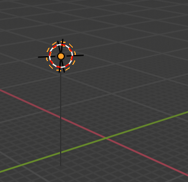
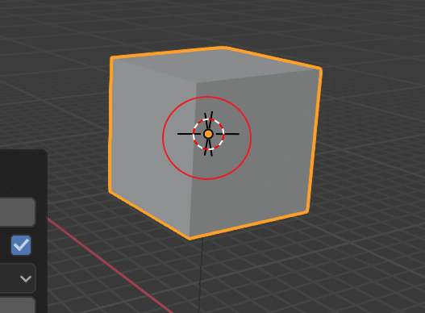
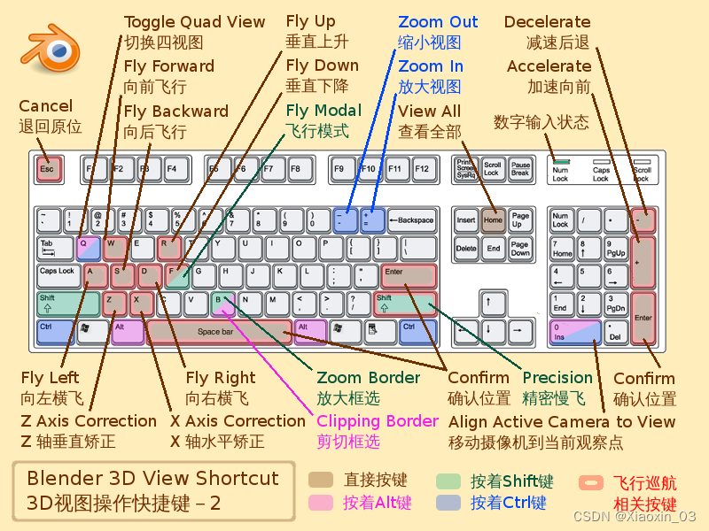
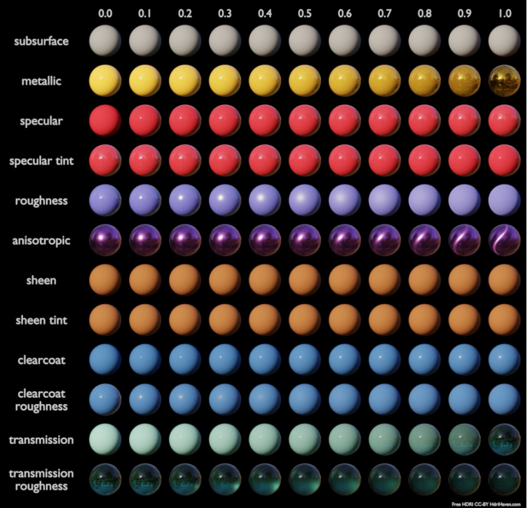

# Blender 介绍

Blender 是一款免费开源的 3D 电脑图形软体，提供从建模、动画、材质、渲染到影片剪辑的完整3D创作解决方案。它适用于个人创作者和专业工作室，可用于制作3D动画、游戏、视觉特效、产品设计，甚至建筑可视化等。 

Blender 是一个强大而复杂的 3D 建模和渲染组件。 能有效地用它来建立物件之前，但必须先要明了它是如何工作的：

 - 3D 建模和渲染的过程
 - 3D 解析几何的基础（轴与坐标）
 - 3D 物体的正视图与通视图
 - 局部坐标系与子物体
 - 用户界面的基础知识
 - 从不同的观察点查看 3D 场景

## 原点 & 3D 游标

 - **原点** 就是三维物件的心脏，每一个三维物件只要在视图中被建立出来，他一定会有一个原点 (就如图中的灯光一样)。

 - **3D** 游标代表定位点，每一个三维物件要在视图中新创立，一定要先给它一个定位点，已让他能够安全的座落在视图中。

由以上方塊可以得知：它被建立在 **3D游标** 的中间，并且它的 **原点** 也位于物件的中间。因此可以透过 **移动3D游标** 来控制物件放在相对 **原点** 的 3D 位置上。

## 编辑模式注意事项

当进入到物体的编辑模式，对于 Blender 其实是另外生成了一个 Bmesh 模型用作编辑。当编辑好了要离开编辑模式时的 Bmesh 会取代掉原本的模型，这就是 Blender 的运作方式。

所以当发生物件不能编辑的问题，解决方式是不管在哪个模式，选了什么，一律先回到物件模式，再一次确定选到要的物件进入编辑模式编辑，或是用 ctrl + shift 正确加载模型资料再进入 Bmesh。

## Shading 工作模式

|工作模式|使用解析|
|:---:|:---:|
|Solid (预设)|预设工作模式，可以自由新增和编辑物件|
|Render (渲染)|将工作区域中所有物件和光影之间的影响运算出来，让工作者知道在不同光影下物件呈现的样貌|
|Wireframe (线框模式)|修改物件的边线厚度和平滑度，也可以局部位移顶点和切割出更多边线，打造独特的几何图形|
|Material Preview (材质预览)|把灯光等外在影响去掉，只留下物件材质最原始的样貌|

## 建模

接下来可以针对每个物件进行编辑，变成书桌、树、云或任何想要的形状。一开始进入Blender，预设为「Object Mode」，点击左上角的「Object Mode」，可以切换成「Edit Mode」，进入物件编辑模式，或是先点击物件再按下快捷键 Tab 就能快速切换 2 种模式。物件是由点线面所组成，可以根据需求按下快捷键 1、2、3，点击物件的 点、线、面，并且搭配不同的指令来改变物件的形状。

## UV贴图

物件调整好后，如果想要让物件上色或改变表面的纹理、颜色， Blender 中会用现实表现的 PBR 或卡通动画的艺术渲染 NPR，帮物件上材质。 Blender 新手可以先熟练 PBR 上材质的方式，点击上方「UV Editing」以 2D 坐标的方式为 3D 模型贴图。

 - PBR（Physically-Based Rendering) 基于物理的渲染只是基于现实物理的特性而进行的渲染。 
 - NPR（Non-Photorealistic Rendering）非真实感渲染与 PBR 不同，NPR 不需要过度的在乎渲染的真实性和物理特性，主要追求最终的美术效果而非真实感。

# 基本操作快捷键

# Blender  网上资讯

## 建模技巧

 - [定参考点](https://youtu.be/9gn_1V1sCS8?si=W4bTxsdheYXdo9ok)
 - [精确尺寸](https://youtu.be/-c0Evpf8V3A?si=_qorG12vEIDqlwTz)
 - [视口模式](https://youtu.be/x6oWgtJInCQ?si=vwOAAJnKSIYIDAcH)
 - [修饰插件](https://youtu.be/ov0F3cEJWoI?si=fx9qIDKwWsvJsu3H)
 - [3D 建模](https://youtu.be/8_0RptMbhe0?si=8NImen69M4KdEl6I)
 - [2D 转 3D](https://youtu.be/j-WegUytMA8?si=_hA9t52EtvF1cpws)
 - [雕刻建模](https://youtu.be/Lxem4yMs5Dg?si=xDl1Ae_hyikIqZ_G)
 - [转变形状](https://youtu.be/2s2n_PObCnc?si=_5NRQJHwzpgRVeW8)
 - [添加骨骼](https://youtu.be/A5C6dcWDDN8?si=nd58wsAMGEpl99Dg)
 - [3D 动画](https://youtu.be/CBJp82tlR3M?si=5ymH1e06Ne8g2Viv)

## 实际製作

 - [硬物製作](https://youtu.be/Ml2t8uxPAQU?si=Av-DSCci-3AnMgQf)
 - [镜像技巧](https://youtu.be/13UN1Lju5Hs?si=82r0u90fYfp8Sd1c)
 - [技巧总会](https://youtu.be/ov0F3cEJWoI?si=7P4K34Z36e9a7fV_)

添加骨骼有点棘手，以下是一些提示：

 - 锁定
    - 用户可以“锁定”骨骼，以防止在处理其他骨骼时发生意外更改。要锁定骨骼，请在编辑模式下按 “Shift+W” 并选择 “锁定”。稍后可以通过展开锁定骨骼后弹出的 “上下文集合布尔集” 菜单，然后点击 “类型” 下的 “禁用” 来禁用锁定。
 - 复制
    - Blender 中可以复制一根骨骼或骨骼连接，如果模型包含两个相同的部分（例如手臂），此功能非常有用。无需创建和编辑骨骼两次或多次，只需在编辑模式下复制选定的骨骼即可。按 “Shift+D”，选定的骨骼将被复制，并可以移动并与模型对齐。
 - 镜像
    - 在角色建模或创建对称模型时，无需创建每一根骨骼。事实上，可以为模型的一半创建骨骼，然后简单地镜像它们。为此，需要进入编辑模式。选择要镜像的骨骼，右键单击打开骨架菜单，然后将鼠标悬停在 “镜像” 选项上。在这里，选择希望骨骼镜像的轴。

## 效果技巧

 - [贴皮枝巧](https://youtu.be/hQ8HvDuSWCQ?si=LoGX3o1kWuFcahNo)
 - [纹理映射](https://youtu.be/SGZE4a_tvR0?si=uY5oswjkbEStmPGZ)
 - [灯光技巧](https://youtu.be/ElMM3u2MO5k?si=_EfkJSbIQXAzS0uL)
 - [透明玻璃](https://youtu.be/8QhVv3Olvsw?si=JI41pdWyaXEPS8je)
 - [发光效果](https://youtu.be/OHA5rcw2qnI?si=TFvb9E93VZgeue6O)
 - [灯泡效果](https://youtu.be/rN-ocSPodDM?si=0JiL2TKaphNqR3sN)

3D 物件经过 UV mapping & UV unwrapping 后要进入贴材质的步骤。在 Blender 里面只要新增一个Material 材质球,就会自动带到预设的 Principle BSDF 的 Node。使用这个 Node 就能结合多层图层影像的效果。这个 Principle BSDF 的发明来自迪士尼团队主要是为了让设计师可以更自由的去调整材质。

下面图片左侧就是 BSDF 的主要参数，右侧展示了设置为 0~1 不同数值时材质的效果。

### 如何使用 Principled BSDF

下载材质包(图片分辨率最好2k以上)，将材质包中不同的图片连接到节点的对应参数。一般来说，图片（从文件名可以判断）对应的参数如下：

|材质名称|使用解析|
|:---:|:---:|
|Base color 基础色 | 连接到 BSDF 中的 Basecolor|
|Metallic 金属 | 数据源为 Non-color data，连接到 BSDF 中的 metallic|
|Roughness 粗糙度 | 数据源为 Non-color data，连接到 BSDF 中的 roughness|
|Normal 法线 | 数据源为 Non-color data，新建 Vector – normal map 节点，新建 *Vector-bump node 节点，连接到 normal，再连接到 BSDF 中的 normal|
|Height/displacement 等高线 | 数据源为 Non-color data，连接到 BSDF 中的 metallic|
|Ambient occlusion 环境光遮蔽| Blender已经自动处理了，不过在游戏引擎里需要用到|

## 专用技巧

 - [粒子系统](https://youtu.be/bV7RnZguToo?si=nfK8ak62qIrBfkPD)
 - [下雨效果](https://youtu.be/rTT4AE2km5I?si=5VdD443ERF7gyRVv)
 - [现实的水](https://youtu.be/sxWJqMJdL04?si=aNo0S3sCgMu09Mzb)
 - [发光河流](https://youtu.be/YwDj4bs4bSY?si=wl3V89A51OPFxi3s)
 - [现实火焰](https://youtu.be/rzATaYyCf9Q?si=A04tNVk1A3exIdKk)
 - [炸开物体](https://youtu.be/V9OfGbHkMVM?si=Tt1Q2ZJVm2CCMg2h)

## 导出技巧

 - [Blender 到 Godot](https://youtu.be/dd6G2S6MQ6U?si=7FexdrkPWFxxKQTP)

# 使用技巧

掌握视图操作快捷键
 - 如滑鼠中键旋转和 Shift+C 重置视角
 - 使用基础移动快捷键（G 搬移、R 旋转、S 缩放）
 - 熟悉编辑模式切换（Tab 键）和
 - 物件属性（如添加材质和使用修改器）
 - 善用回圈切割（Ctrl+R）和
 - 善用比例编辑（Proportional Editing）
 - 经常保存以防意外

## 基础操作与快捷键

### 视图操作

   - 旋转：按住滑鼠中键并拖曳
   - 缩放：滚动滑鼠中键
   - 平移：按住 Shift + 滑鼠中键拖曳
   - 前/右/上视角：1、3、7 (数字键盘)
   - 切换透视/正交视图：5 (数字键盘)
   - 视角重置到场景中间：Shift + C
   - 将视角对准选取物件：. (数字键盘)

### 物件操作

 - 移动：G 键
 - 旋转：R 键
 - 缩放：S 键
 - 沿轴向移动：G 后再按  X、Y 或 Z 键
 - 新增物件：Shift + A
 - 复制物件：Shift + D
 - 删除：Delete 或  X 键后确认  

## 建模技巧

### 编辑模式切换

 - Tab 键可在物件模式和编辑模式之间切换
 - shift 键加按時，是原本拖曳滑鼠时数值的 10 分之 1 用做精确调整移动数值
 - 编辑模式下，1 (顶点)、2 (边线)、3 (面) 可切换选取模式

### 进阶编辑

 - 回圈切割：Ctrl + R 可以在模型上快速加入循环的边线
 - 比例编辑：在编辑模式下启用后，移动一个顶点时周围的顶点会随之平滑移动

## 修改器应用

 - Mirror Modifier (镜像修改器)： 用于对称建模，只需制作一半即可
 - Subdivision Surface (细分曲面)： 让模型边缘变得更平滑
 - Boolean Modifier (布林运算)： 快速合并或切割出复杂形状 

## 其他实用技巧

 - 3D游标： Shift + 滑鼠右键 可控制3D游标的位置，新增物件的位置会以3D游标为基准
 - 使用参考图像： 在建模前加入参考图像，有助于准确复制目标物体
 - 材质设定： 在「材质属性」中新增并调整材质属性，如「基底色」
 - 汇出含透明度的图像： 输出时选择「RGBA」并汇出为 PNG 格式即可获得透明背景的图像
 - 操作历史纪录： Ctrl + Alt + Z 可查看和恢复之前的操作步骤
 - 经常保存： 在建模过程中养成经常保存的习惯，并为专案建立多个版本备份
 