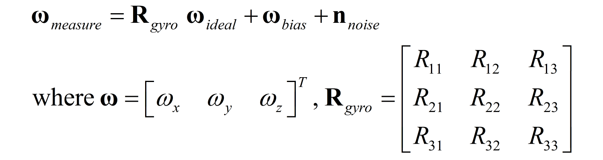
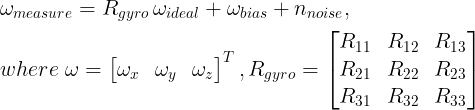
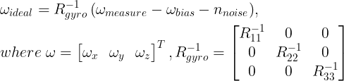
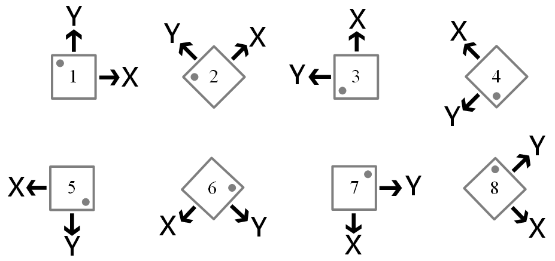
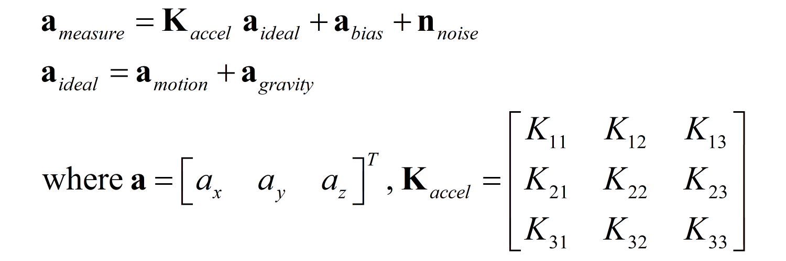
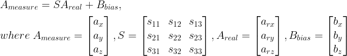
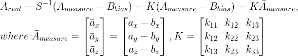
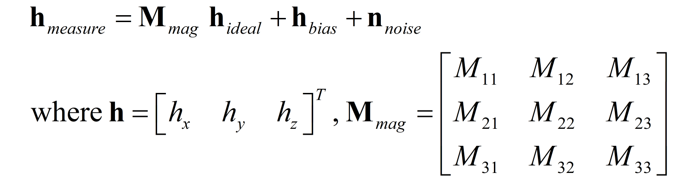

<style>
  table {
    width: 100%
    }
  td.left {
    vertical-align: center;
    text-align: left;
    width: 30%;
  }
  td {
    vertical-align: center;
    text-align: center;
  }
  table.inputT{
    margin: 10px;
    width: auto;
    margin-left: auto;
    margin-right: auto;
    border: none;
  }
  tr:nth-child(even){
    background-color:#ffffe5;
  }
  input{
    text-align: center;
    padding: 0px 10px;
  }
  iframe{
    width: 100%;
    display: block;
    border-style:none;
  }
</style>


# Mahony 滤波器

Mahony 滤波器利用加速度计、陀螺仪和磁力计的三轴数据，能够在短时间内精确计算物体的姿态。该滤波器采用四元数作为姿态表示，描述物体在三维世界中的姿态。由于四元数的特性，它可以避免欧拉角的奇异性（也称为万向节锁）。 Mahony 滤波器的原理是最小化机体坐标系传感器测量向量与从导航坐标系转换到机体坐标系的参考向量之间的误差（陀螺仪偏差）。


## 坐标轴方向

 - NED: North-East-Down（北-东-下）坐标系用于航空航天和海洋应用，其坐标轴指向北、东、下。坐标系的正 z 轴指向地心。
 - ENU: East-North-Up（东-北-上）坐标系常用于陆地机器人和大地测量学，其坐标轴指向东、北、上。右手坐标系，其正 z 轴指向远离地心的方向。


|特征|NED（北-东-下）|ENU（东-北-上）|
|:---:|:---:|:---:|
|应用|飞机、船舶、潜艇|陆地车辆、机器人|
|主轴|X轴：北，Y轴：东，Z轴：下|X轴：东，Y轴：北，Z轴：上|
|Z 轴方向|向下指向地心|向上指向远离地心|
|旋向|左旋系统 y-x-z|右旋系统 x-y-z|

### 三轴旋转

$$
yaw = y \\ pitch = p \\ roll = r
$$

## NED (航天和海洋)

### NED 方向余弦矩阵（将向量从本体坐标系转换为世界坐标系）


$$
\small 
R_{zyx}(y,p,r)=
\begin{bmatrix}
 cos(y)cos(p) & cos(y)sin(p)sin(r)-sin(y)cos(r) & cos(y)sin(p)cos(r) + sin(y)sin(r) & 0 \\
 sin(y)cos(p) & sin(y)sin(p)sin(r)+cos(y)cos(r) & sin(y)sin(p)cos(r) - cos(y)sin(r) & 0 \\
-sin(p) & cos(p)sin(r) & cos(p)cos(r) & 0 \\
 0 & 0 & 0 & 1 \\
\end{bmatrix}
$$


```py
# NED 欧拉角计算
# p 限制于 +/- 90 度万向节锁问题
# [ax (N)] = [-gsin_p      ]
# [ay (E)] = [ gcos_p*sin_r]
# [az (D)] = [ gcos_p*cos_r]
r = np.arctan2(ay, az)
p = np.arctan2(-ax, np.sqrt(ay**2 + az**2)) # or np.arcsin(-ax) 
y = - np.arctan2(my*np.cos(r) - mz*np.sin(r), 
      mx*np.cos(p) + my*np.sin(p)*np.sin(r) + mz*np.sin(p)*np.cos(r))
```


## ENU (陆地)

### ENU 方向余弦矩阵（将向量从本体坐标系转换为世界坐标系）


$$
\small 
R_{zxy}(y,p,r)=
\begin{bmatrix}
 cos(y)cos(p)-sin(y)sin(p)sin(r) & - sin(y)cos(r) & cos(y)sin(p) + sin(y)cos(p)sin(r) & 0 \\
 sin(y)cos(p)+cos(y)sin(p)sin(r) & cos(y)cos(r) & sin(y)sin(p) - cos(y)cos(p)sin(r) & 0 \\
 -sin(p)cos(r) & sin(r) & cos(p)cos(r) & 0 \\
 0 & 0 & 0 & 1 \\
\end{bmatrix}
$$


```py
# ENU 欧拉角计算
# r 限制于 +/- 90 度万向节锁问题
# [ax (E)] = [-gsin_p*cos_r]
# [ay (N)] = [gsin_r      ]
# [az (U)] = [gcos_p*cos_r]
r = np.arctan2(ay, np.sqrt(ax**2 + az**2)) # or np.arcsin(ay)
p = np.arctan2(-ax, az)
y = np.arctan2(mx*np.cos(p) + mz*np.sin(p),
    mx*np.sin(p)*np.sin(r) + my*np.cos(r) - mz*np.cos(p)*np.sin(r))
```

以上 Python 代码展示了如何根据加速度计和磁力计数据计算横滚角、俯仰角、偏航角，这可以在运行 Mahony 滤波器之前提供欧拉角和四元数的初始化。


## 实现滤波器

由于目标是最小化机体坐标系传感器测量向量与从导航坐标系转换到机体坐标系的参考向量之间的误差（陀螺仪偏差），可以定义以下方程，其中 λ 指的是 **Mahony** 滤波器的增益。

$$
\mathbf{R} \approx \mathbf{R}_y = \underset {\mathbf{R}\in SO(3)}{\operatorname{arg\,min}} \left (\lambda_1|e_3-\mathbf{Rv}_a|^2 + \lambda_2|\mathbf{v}_m^*-\mathbf{Rv}_m|^2 \right )
$$

 - **ENU** 加速度计的参考向量为 [0, 0, 1]
 - **NED** 加速度计的参考向量为 [0, 0, -1]

初始化四元数后，可以利用四元数计算方向余弦矩阵。由于方向余弦矩阵的存在，加速度计参考向量从导航坐标系转换到本体坐标系。因此，当前测量值与参考向量之间的加速度计误差可以通过叉积计算得出。磁力计也采用了类似的技术，适用于 ENU 和 NED 两种导航坐标系。

Mahony 滤波器假设与磁东方向对齐的机体坐标轴可以忽略不计，这意味着在 

 - **ENU** 坐标系中 X 轴为 0
 - **NED** 坐标系中 Y 轴为 0

磁力计矢量在机体坐标系中定义为 hx、hy、hz，在导航坐标系中定义为 bx、by、bz。需要注意由于磁偏角和磁倾角的影响，磁力计测量的是 X、Y、Z 轴分量上的磁北方向，而不是真北方向。因此需要根据磁力计测量的 X、Y 轴分量计算磁北方向。在进行误差计算之前必对加速度计和磁力计的测量矢量进行归一化处理。


**磁场分量及其与正北的关系**


**DCM** 姿态估计算法分析到导航框架
 

```py
DCM = quat2dcm(qw, qx, qy, qz)

# 加速度计部分
a = acc/a_norm # 归一化加速度矢量
a = np.squeeze(a.T)

# 将预期重力矢量从导航坐标系转换为机体坐标系
if self.nav_frame == "ENU":
  v_g = DCM.T @ np.array([0.0, 0.0, 1.0]) 
elif self.nav_frame == "NED":
  v_g = DCM.T @ np.array([0.0, 0.0, -1.0])
  
# 加速度计误差（人体坐标系中的重力矢量与加速度计矢量的叉积）    
acc_error = np.cross(a, v_g) 

# 磁力计部分
m = mag/m_norm # 归一化磁力计矢量
m = np.squeeze(m.T)
h = DCM.T @ m 

# 将磁场从机身框架转换为导航框架
if self.nav_frame == "ENU":   # 在 ENU 坐标系中，机身坐标系中的 Y 轴指向北方，X 轴为 0。
  b = np.array([[0], [np.linalg.norm([h[0], h[1]])], [h[2]]])
elif self.nav_frame == "NED": # 在 NED 坐标系中，本体坐标系中的 X 轴指向北方，Y 轴为 0。
  b = np.array([[np.linalg.norm([h[0], h[1]])], [0], [h[2]]])

# 将对准后的磁力计矢量从导航坐标系转换到机体坐标系 
v_m = DCM.T @ b 
v_m = np.squeeze(v_m.T)

# 磁力计误差（在本体坐标系中对齐的磁力计矢量与原点磁力计矢量的叉积）
mag_error = np.cross(m, v_m) 
```

注：Python 中 @ 符号主要用作矩阵乘法运算符，该运算符在并非标准 math 模块的一部分，而是一个通用运算符，可以由类重载以执行矩阵乘法。在 NumPy 这样的库大量使用此运算符来实现高效的数组和矩阵运算。

在计算并汇总加速度计和磁力计的误差后，将 PID 控制器的概念引入 Mahony 滤波器。Kp 表示加速度计和磁力计读数的置信度。Kp 越大，意味着越信任加速度计和磁力计对运动的快速响应，反之亦然。Ki 表示降低稳态误差，即减小姿态计算结果与真实姿态之间的误差。

```py
# Mahony 算法
total_error = np.expand_dims(acc_error, axis=1) + np.expand_dims(mag_error, axis=1)

# 通过加上过去的改变来估计当前的陀螺仪偏差
self.gyro_bias = self.gyro_bias + self.ki * total_error * self.imu_dt 

# 陀螺仪校正
gyr = gyr + self.gyro_bias + self.kp * total_error 
gx, gy, gz = gyr[0][0], gyr[1][0], gyr[2][0]
```

上述公式仅提供陀螺仪的无误差测量值，因此需要通过四元数微分方程计算最终的四元数。


$$
S_{\omega_t} = \begin{bmatrix}
 0 & \omega_{x,t} & \omega_{y,t} & \omega_{z,t}
\end{bmatrix}
$$


$$
q_{\omega,t} = q_{t-1} + \dot{q}_{\omega,t} \cdot \Delta t \\ \because \dot{q}_{\omega,t} = \frac{1}{2} \left (q_{t-1} \cdot S_{\omega_t} \right) 
$$


$$
\therefore q_{\omega,t} = q_{t-1} + \frac{1}{2} \left (q_{t-1} \cdot S_{\omega_t} \right) \cdot \Delta t
$$


```py
origin_q = np.array([[0],[gx],[gy],[gz]])                   # 陀螺仪的当前读数（四元数形式）
quat_diff = quat_multi(self.est_quat, origin_q)
quat_change = 0.5 * quat_diff                               # 计算四元数的变化率
self.est_quat = self.est_quat + quat_change * self.imu_dt   # 更新四元数
self.est_quat = self.est_quat/np.linalg.norm(self.est_quat) # 归一化四元数向量
```

由于计算复杂度低且控制参数易于调整，Mahony 滤波器是最常用的滤波器之一。然而，当物体持续运动时，Mahony 滤波器计算出的姿态可能不准确。这是因为加速度计的参考矢量不仅受重力影响，还受其他外力影响。


## 参考之前文档

[惯性测量传感器 IMU 检测](https://hkdickyko.github.io/mpu/calibration)

[惯性测量传感器 IMU](https://hkdickyko.github.io/mpu/imu)

[慣性空間定位 IMU](https://hkdickyko.github.io/mpu/IoT-2)

[IMU 20948 九轴传感器](https://hkdickyko.github.io/mpu/20948)

[IMU 9250 九轴传感器](https://hkdickyko.github.io/mpu/9250)

# 姿态计算的相关公式

## 基本运算公式

假设一开始没有任何的旋转，姿态是跟参考坐标系重合，θ 等于 0：

$$
q = [cos \frac{θ}{2}, -x sin \frac{θ}{2}, -y sin \frac{θ}{2}, -z sin \frac{θ}{2}] = [1, 0, 0, 0]
$$

其中 θ 是旋转过的角度，x, y, z 是旋转轴上的单位矢量的分量 。

如要求 $q_A$ 相对于 $q_B$ 的姿态，这可以通过四元数的共轭 $\bar{q}$ 来算：

$$
\bar{q} = [cos \frac{θ}{2}, x sin \frac{θ}{2}, y sin \frac{θ}{2}, z sin \frac{θ}{2}]
$$

注：共轭是有标量部分，而逆 $q^{-1}$ 是归一化後的共轭。即 

$$
q^{-1} = \frac {\bar{q}}{|q|}
$$

## 姿态的坐标变换

### 四元数转欧拉角 - XYZ

$$
q =  q_w + q_x + q_y + q_z \\  q_w = w
$$


$$
\begin{bmatrix} row_x \\ pitch_y \\ yaw_z \\ \end{bmatrix} = \begin{bmatrix} \theta \\ \phi \\ \psi \\ \end{bmatrix} = \begin{bmatrix} \operatorname{atan2}(2(q_wq_x +  q_yq_z),  q_w^2 - q_x^2 - q_y^2 + q_z^2) \\ 
\operatorname{asin}(2( q_wq_y - q_zq_x)) \\
\operatorname{atan2}(2( q_wq_z + q_xq_y),  q_w^2 + q_x^2 - q_y^2 - q_z^2)
\\ \end{bmatrix}
$$

### 四元数转余弦矩阵

$$
\begin{bmatrix}
 q_w^2 + q_x^2 - q_y^2 - q_z^2 & 2(q_xq_y + q_wq_z) & 2(q_xq_z - q_wq_y) \\
2(q_xq_y - q_wq_z) &  q_w^2 - q_x^2 + q_y^2 - q_z^2 & 2(q_yq_z + q_wq_x) \\
2(q_xq_z + q_wq_y) & 2(q_yq_z - q_wq_x) &  q_w^2 - q_x^2 - q_y^2 + q_z^2
\end{bmatrix}
$$

### 欧拉角转四元数

$$
q = \begin{bmatrix} q_w \\ q_x \\ q_y \\ q_z \\ \end{bmatrix} = \begin{bmatrix} cos(\frac {\theta}{2})cos(\frac {\phi}{2})cos(\frac {\psi}{2}) + sin(\frac {\theta}{2})sin(\frac {\phi}{2})sin(\frac {\psi}{2})\\ sin(\frac {\theta}{2})cos(\frac {\phi}{2})cos(\frac {\psi}{2}) - cos(\frac {\theta}{2})sin(\frac {\phi}{2})sin(\frac {\psi}{2}) \\ cos(\frac {\theta}{2})sin(\frac {\phi}{2})cos(\frac {\psi}{2}) + sin(\frac {\theta}{2})cos(\frac {\phi}{2})sin(\frac {\psi}{2}) \\ cos(\frac {\theta}{2})cos(\frac {\phi}{2})sin(\frac {\psi}{2}) - sin(\frac {\theta}{2})sin(\frac {\phi}{2})cos(\frac {\psi}{2}) \\ \end{bmatrix}
$$

# 惯性测量传感器介绍

## 陀螺仪

通常做为主要姿态的计算，优点是反应快，但缺点是误差容易累积。陀螺仪是测量角速度的元件，陀螺仪有短时间准确、灵敏的特性，但用来计算角度时，长时间下的误差累积会使其变的不可靠，通常以 dps（degree per second）来表示角速度，角速度与速度不同，角速度是单位时间内旋转的角度，而速度则是单位时间内移动的距离，所以若是没有旋转是没有角速度的，若只对 X 轴旋转，则 Y 轴与 Z 轴的输出为 0，X 轴的输出为旋转的角速度。

感测器都会有误差与杂讯，把误差与噪音杂讯给滤除掉可以下面的数学式表示从感测器读到的角速度 $w_{measure}$ 会等于矩阵 $R_{gyro}$ 乘上理想的角速度 $w_{ideal}$ 加上偏移 $w_{bias}$ 与杂讯 $n_{noise}$，矩阵 $R_{gyro}$ 包含未对准误差（Misalignment）以及单位转换（dps/LBS），若感测器与载具完全对准的情况（大部份安装不准等情况会造成未对准误差），矩阵 $R_{gyro}$ 会是一个对角矩阵（Diagonal Matrix），偏移 $w_{bias}$、杂讯 $n_{noise}$ 则由温度、感测器内部等干扰引起。


$$
w_{measure} = R_{gyro} w_{ideal} + w_{bias} + n_{noise}
$$


$$
w = \begin{bmatrix} w_x \\ w_y \\ w_z \end{bmatrix}，R_{gyro} = \begin{bmatrix} R{11} && R{12} && R{13} \\
R{21} && R{22} && R{23} \\
R{31} && R{32} && R{33}  
\end{bmatrix}
$$




陀螺仪校正的部分主要校正偏差（Bias）的误差，不对安装误差做校正，因为对于安装物差的校正需要一些＂绝对＂的测量数据，这些数据通常都需要外部的仪器来辅助校正与测量。例如想要找出下列方程式中的 R_gyro 矩阵，找出这一个矩阵的一个方法就是在不同的角速度下测量，外部的装置可以产生一个固定的角​​速度给予感测器，或是透过另一个可靠的感测器来做提供实际的结果，而感测器将测量到的结果与实际的结果作比较，就可以得出 $R_{gyro}$ 矩阵，$R_{gyro}$ 矩阵是一个单位矩阵或是一个对角矩阵（Diagonal Matrix）。


假设 $R_{gyro}$ 是一个对角矩阵后，问题简化许多，在 $n_{noise}$ 为高斯噪音（Gaussian Noise）下，平均值为 0，静止下对陀螺仪取样 $w_{ideal}$ = 0，所以测量到的就是 $w_{bias}$，只要在每次测量的结果减掉 $w_{bias}$，并乘上一个放大缩小的变数，就可以得出理想的陀螺仪资料，说的简单一点就是在静止下取平均值就可以得出 $w_{bias}$。





## 加速度计

可以透过重力加速度来校正陀螺仪，运动加速度部分也可以用来计算位移与速度等。加速度计是测量加速度的元件，除了运动加速度外，也包含地球质量所产生的重力加速度，也就是当感测器自由落体时，运动加速度与重力加速度会刚好抵销，有输出都会变成 0，通常以 $g$ 或是 $m/s^2$ 来表示，因为可以感测到重力加速度，所以在有重力的环境中加速度计也常用来做倾斜计，透过重力在三轴上的投影来计算角度。


加速度计常常会搭配陀螺仪来应用，因为重力加速度并不会随时间快速变化，长时间具有可靠性，所以通常透过此特性来较正陀螺仪，防止误差的累积。


下图是在静止下（仅存在 1g 的重力加速度），不同角度的加速度计，角度 1～8 的 Z 轴因为垂直于重力加速度，所以皆为 0g，





 - 角度 1（000 deg）的输出（0, +g, 0）
 - 角度 2（045 deg）的输出（+0.707g, +0.707g, 0）
 - 角度 3（090 deg）的输出（+g, 0, 0）
 - 角度 4（135 deg）的输出（+0.707g, -0.707g, 0）
 - 角度 5（180 deg）的输出（0, -g, 0）
 - 角度 6（225 deg）的输出（-0.707g, -0.707g, 0）
 - 角度 7（270 deg）的输出（-g, 0, 0）
 - 角度 8（315 deg）的输出（-0.707g, +0.707g, 0）

$$
归纳出 → X = g_{sin(\theta)}, Y = g_{cos(\theta)} → \theta = atan(\frac{X}{Y})
$$

表示在 Z 轴垂直于重力时，输出的 X, Y 值相除，并取 atan 则可以得到倾斜角度，但需要注意的，这仅限于静止下，当有运动加速度的影响，得到的角度会是不准确的。

加速度计的输出 $a_{measure}$ 会等于矩阵 $K_{accel}$ 乘上理想的加速度 $a_{ideal}$ 加上偏移 $a_{bias}$ 与杂讯 $n_{noise}$，理想的加速度 $a_{ideal}$ 包含运动加速度 $a_{motion}$ 以及重力加速度 $a_{gravity}$，矩阵 $K_{accel}$ 包含未对准的误差以及单位的转换（g/LBS），若感测器与载具完全对准的情况，矩阵 $K_{accel}$ 也是一个对角矩阵，偏移 $a_{bias}$、杂讯 $n_{noise}$ 则也会由温度、感测器内部等干扰引起。



对加速度计校正的部分除了 $B_{bias}$ 矩阵的偏差外，还会找出 $S$ 矩阵来校正比例误差与焊接、安装产生的未对准误差，而三轴间的正交误差不打算特别做校正，因为使用的感测器是三轴集成于一颗芯片的，所以直接假设三轴互相正交，则 $S$ 的反矩阵（$K$ 矩阵）会是一个对证矩阵，并且表示成无偏差的形式，为的是减少展开的复杂度，所以问题可以化简成下面式子





再透过在没有运动加速度的条件下，加速度计三轴输出平方和会等于重力加速度的关系来做校正，此种方法不需要依预先设定好的角度与位置来校正，校正的自由度较大。


$$
g^2 = a_{rx}^2 + a_{ry}^2 + a_{rz}^2
$$

## 磁力计

同样也是辅助、校正陀螺仪，解决重力加速度无法检测到水平角度旋转的问题。磁力计或电子罗盘是用来测量磁场的元件，通常以高斯（Gauss）或特斯拉（Tesla）来表示磁场大小，因为地球本身存在磁场，所以磁力计可以藉由磁场在三轴上的投影来计算出航向角度，但事实上环境中的磁场不仅仅只有地球磁场，还包含了许多的干扰源，依特性可以分成硬磁（Hard Iron）干扰与软磁（Soft Iron）干扰，硬磁干扰是像永久磁铁、电池这些指固定强度的干扰，软磁干扰则是指像电磁铁、电量变化等，当磁力来源消失时，磁力会变弱，会改变磁力线强度或方向的干扰。

磁力計的簡單數學模型，磁力的輸出 $h_{measure}$ 會等於矩陣 $M_{mag}$ 乘上理想的磁場 $h_{ideal}$ 加上偏移 $h_{bias}$ 與雜訊 $n_{noise}$，矩陣 $M_mag}$ 包含未對準的準誤、單位的轉換（gauss/LBS）、硬磁干擾、軟磁干擾，偏移 $h_{bias}$、雜訊 $n_{noise}$ 則也會由溫度、感測器內部等干擾引起




## 气压计

用作计算飞行器高度。氣壓計是用來測量氣壓的元件，通常使用帕（Pa）或百帕（hPa）來表示，一個大氣壓力大約是 1013.25 hPa，大氣壓會隨著高度的提升而下降，其關係為每上升 9 米，大氣壓力降低 100 Pa，透過此關係可以使用氣壓計計算出目前的海拔高度，以目前 MEMS 氣壓計可以做到 1 Pa RMS 的高解析度情況下，大約可以檢測到 9 米的高度變化，但這都在是比較理想的情況下，實際上還會有空氣的流動、溫度與濕度的影響，使得計算、測量的誤差產生。


这里以三轴陀螺仪、三轴加速度计、三轴磁力计和气压计做说明，首先要先了解三轴之间的关系，假设有三个向量 X、Y、Z，其方向分别为三个轴的方向，那这三个向量会互相垂直、正交（Orthogonality），也就像是 X dot product Y = 0 或 X cross product Y = Z。 可用右手定则来了解。


# Mahony 滤波器 C 代码

Mahony Filter 将加速计读值和转换后的重力向量做外积 (Cross Product)，两个向量的外积代表两个向量的差异。 这个差异，Mahony Filter 以 Kp 调整，调整过后的值用来修正陀螺仪 $ \omega $ 读值，然后四元素就用以下公式来更新。

$$
q_{\omega,t} = q_{t-1} + \frac{1}{2} \left (q_{t-1} \cdot S_{\omega_t} \right) \cdot \Delta t
$$


姿态航向参考系统（AHRS）结合陀螺仪、加速度计和磁力计的数据来计算物体的姿态。

 - 陀螺仪测量角速度，但其数值会随时间漂移，因此需要使用加速度计和磁力计来校正这种漂移。
 - 加速度计通过测量重力来提供俯仰角和横滚角
 - 磁力计则通过感知地球磁场来提供航向角。

重力矢量和磁场矢量的叉积提供了一个参考坐标，帮助系统计算航向角并校正误差。


|传感器|功能|局限性|相關角度|
|:---:|:---:|:---:|:---:|
|陀螺仪|测量旋转速率，并通过积分计算姿态|易受噪声和偏差的影响，随时间推移发生漂移，导致误差累积|$\omega_t$|
|加速度计|测量线性加速度，可通过感知重力方向（在最小加速度下）确定俯仰角和横滚角|在运动或振动过程中，难以准确确定倾斜角|Pitch, Roll|
|磁力计|测量地球磁场以确定航向|易受附近金属或电子设备产生的局部磁场干扰，导致航向读数不准确|Yaw|


协同工作

 - 陀螺仪的测量值用于预测新的姿态，但该预测值会随时间推移而发生漂移
 - 加速度计像水平仪用于校正预测值
 - 磁力计像指南针，指向北方用于校正预测值
 - 叉积(Cross Product)是一项关键的校正技术是利用测得的重力矢量和磁场矢量的叉积。可以创建一个稳定的参考，用于改进姿态估计，特别是航向角（偏航角 - Yaw）。
 - 滤波器等复杂的算法来融合来自所有三个传感器的数据，从而生成物体姿态（俯仰角、横滚角和偏航角）的稳定且精确的估计值。更可以利用重力和磁场信息进行自我校正，从而保持正确的方向。

## 头文件

```c
\\ MahonyAHRS.h
extern volatile float twoKp; // 2 * 比例增益 (Kp) 
extern volatile float twoKi; // 2 * 积分增益 (Ki)
extern volatile float q0, q1, q2, q3;

void MahonyAHRSupdateIMU(float gx, float gy, float gz, 
                         float ax, float ay, float az);
void MahonyAHRSupdate(float gx, float gy, float gz, 
                      float ax, float ay, float az, 
                      float mx, float my, float mz);
```

## C 源代码

```c
#include "MahonyAHRS.h"
#include <math.h>

#define sampleFreq  512.0f // 采样频率（单位：赫兹）
#define twoKpDef  (2.0f * 0.5f)  // 2 * 比例增益
#define twoKiDef  (2.0f * 0.0f)  // 2 * 积分增益


volatile float twoKp = twoKpDef; // 2 * 比例增益 (Kp)  
volatile float twoKi = twoKiDef; // 2 * 积分增益 (Ki)  
// 传感器坐标系相对于辅助坐标系的四元数
volatile float q0 = 1.0f, q1 = 0.0f, q2 = 0.0f, q3 = 0.0f;          
// 积分误差项按比例缩放的 Ki
volatile float integralFBx = 0.0f,  integralFBy = 0.0f, integralFBz = 0.0f;  

float invSqrt(float x);
void MahonyAHRSupdateIMU(float gx, float gy, float gz, 
                         float ax, float ay, float az);

void MahonyAHRSupdate(float gx, float gy, float gz, 
                      float ax, float ay, float az, 
                      float mx, float my, float mz) {
  float recipNorm;
  float q0q0, q0q1, q0q2, q0q3, q1q1, q1q2, q1q3, q2q2, q2q3, q3q3;  
  float hx, hy, bx, bz;
  float halfvx, halfvy, halfvz, halfwx, halfwy, halfwz;
  float halfex, halfey, halfez;
  float qa, qb, qc;

  // 如果磁力计测量值无效，则使用 IMU 算法（避免归一化中出现 NaN 值）
  if((mx == 0.0f) && (my == 0.0f) && (mz == 0.0f)) {
    MahonyAHRSupdateIMU(gx, gy, gz, ax, ay, az);
    return;
  }
  // 仅当加速度计测量值有效时才计算反馈（避免归一化中出现 NaN 值）
  if(!((ax == 0.0f) && (ay == 0.0f) && (az == 0.0f))) {
    // 对加速度计测量进行归一化
    recipNorm = invSqrt(ax * ax + ay * ay + az * az);
    ax *= recipNorm;
    ay *= recipNorm;
    az *= recipNorm;     
    // 磁力计测量标准化
    recipNorm = invSqrt(mx * mx + my * my + mz * mz);
    mx *= recipNorm;
    my *= recipNorm;
    mz *= recipNorm;   
    // 使用辅助变量避免重复运算
    q0q0 = q0 * q0;
    q0q1 = q0 * q1;
    q0q2 = q0 * q2;
    q0q3 = q0 * q3;
    q1q1 = q1 * q1;
    q1q2 = q1 * q2;
    q1q3 = q1 * q3;
    q2q2 = q2 * q2;
    q2q3 = q2 * q3;
    q3q3 = q3 * q3;   
    // 地球磁场的参考方向
    hx = 2.0f * (mx * (0.5f - q2q2 - q3q3) + my * (q1q2 - q0q3) + mz * (q1q3 + q0q2));
    hy = 2.0f * (mx * (q1q2 + q0q3) + my * (0.5f - q1q1 - q3q3) + mz * (q2q3 - q0q1));
    bx = sqrt(hx * hx + hy * hy);
    bz = 2.0f * (mx * (q1q3 - q0q2) + my * (q2q3 + q0q1) + mz * (0.5f - q1q1 - q2q2));
    // 重力和磁场的估计方向
    halfvx = q1q3 - q0q2;
    halfvy = q0q1 + q2q3;
    halfvz = q0q0 - 0.5f + q3q3;
    halfwx = bx * (0.5f - q2q2 - q3q3) + bz * (q1q3 - q0q2);
    halfwy = bx * (q1q2 - q0q3) + bz * (q0q1 + q2q3);
    halfwz = bx * (q0q2 + q1q3) + bz * (0.5f - q1q1 - q2q2);  
    // 误差是场矢量估计方向与测量方向的叉积之和
    halfex = (ay * halfvz - az * halfvy) + (my * halfwz - mz * halfwy);
    halfey = (az * halfvx - ax * halfvz) + (mz * halfwx - mx * halfwz);
    halfez = (ax * halfvy - ay * halfvx) + (mx * halfwy - my * halfwx);
    // 如果启用，则计算并应用积分反馈
    if(twoKi > 0.0f) {
      // Ki 为积分误差比例
      integralFBx += twoKi * halfex * (1.0f / sampleFreq);
      integralFBy += twoKi * halfey * (1.0f / sampleFreq);
      integralFBz += twoKi * halfez * (1.0f / sampleFreq);
      // 应用积分反馈
      gx += integralFBx;
      gy += integralFBy;
      gz += integralFBz;
    } else {
      // 防止积分饱和
      integralFBx = 0.0f;  
      integralFBy = 0.0f;
      integralFBz = 0.0f;
    }
    // 应用比例反馈
    gx += twoKp * halfex;
    gy += twoKp * halfey;
    gz += twoKp * halfez;
  }
  // 积分四元数的变化率
  gx *= (0.5f * (1.0f / sampleFreq));    // pre-multiply common factors
  gy *= (0.5f * (1.0f / sampleFreq));
  gz *= (0.5f * (1.0f / sampleFreq));
  qa = q0;
  qb = q1;
  qc = q2;
  q0 += (-qb * gx - qc * gy - q3 * gz);
  q1 += (qa * gx + qc * gz - q3 * gy);
  q2 += (qa * gy - qb * gz + q3 * gx);
  q3 += (qa * gz + qb * gy - qc * gx); 
  // 规范化四元数
  recipNorm = invSqrt(q0 * q0 + q1 * q1 + q2 * q2 + q3 * q3);
  q0 *= recipNorm;
  q1 *= recipNorm;
  q2 *= recipNorm;
  q3 *= recipNorm;
}

void MahonyAHRSupdateIMU(float gx, float gy, float gz, float ax, float ay, float az) {
  float recipNorm;
  float halfvx, halfvy, halfvz;
  float halfex, halfey, halfez;
  float qa, qb, qc;

  // 仅当加速度计测量值有效时才计算反馈（避免加归一化中出现 NaN 值）
  if(!((ax == 0.0f) && (ay == 0.0f) && (az == 0.0f))) {
    // 对加速度计测量进行归一化
    recipNorm = invSqrt(ax * ax + ay * ay + az * az);
    ax *= recipNorm;
    ay *= recipNorm;
    az *= recipNorm;        
    // 估计重力方向和垂直于磁通量的矢量
    halfvx = q1 * q3 - q0 * q2;
    halfvy = q0 * q1 + q2 * q3;
    halfvz = q0 * q0 - 0.5f + q3 * q3;
    // 误差是估计重力方向与测量重力方向叉积之和
    halfex = (ay * halfvz - az * halfvy);
    halfey = (az * halfvx - ax * halfvz);
    halfez = (ax * halfvy - ay * halfvx);
    // 如果启用，则计算并应用积分反馈。
    if(twoKi > 0.0f) {
      // Ki 为积分误差比例
      integralFBx += twoKi * halfex * (1.0f / sampleFreq);  
      integralFBy += twoKi * halfey * (1.0f / sampleFreq);
      integralFBz += twoKi * halfez * (1.0f / sampleFreq);
      // 应用积分反馈      
      gx += integralFBx;  
      gy += integralFBy;
      gz += integralFBz;
    } else {
      // 防止积分饱和
      integralFBx = 0.0f;
      integralFBy = 0.0f;
      integralFBz = 0.0f;
    }
    // 应用比例反馈
    gx += twoKp * halfex;
    gy += twoKp * halfey;
    gz += twoKp * halfez;
  }
  // 积分四元数的变化率，预先乘以公因数
  gx *= (0.5f * (1.0f / sampleFreq));  
  gy *= (0.5f * (1.0f / sampleFreq));
  gz *= (0.5f * (1.0f / sampleFreq));
  qa = q0;
  qb = q1;
  qc = q2;
  q0 += (-qb * gx - qc * gy - q3 * gz);
  q1 += (qa * gx + qc * gz - q3 * gy);
  q2 += (qa * gy - qb * gz + q3 * gx);
  q3 += (qa * gz + qb * gy - qc * gx); 
  // 规范化四元数
  recipNorm = invSqrt(q0 * q0 + q1 * q1 + q2 * q2 + q3 * q3);
  q0 *= recipNorm;
  q1 *= recipNorm;
  q2 *= recipNorm;
  q3 *= recipNorm;
}

float invSqrt(float x) {
  float halfx = 0.5f * x;
  float y = x;
  long i = *(long*)&y;
    i = 0x5f3759df - (i>>1);
    y = *(float*)&i;
    y = y * (1.5f - (halfx * y * y));
  return y;
}
```