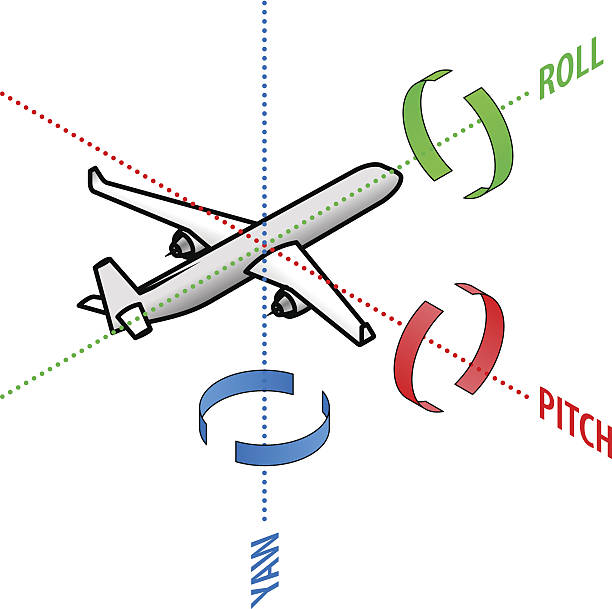
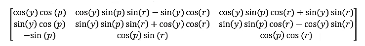
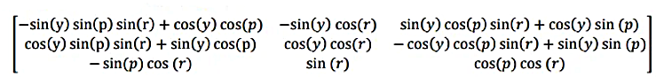
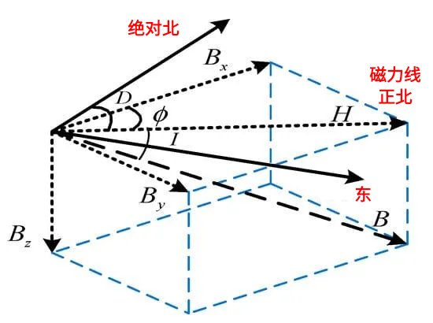
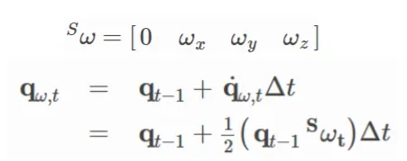

<style>
  table {
    width: 100%
    }
  td.left {
    vertical-align: center;
    text-align: left;
    width: 30%;
  }
  td {
    vertical-align: center;
    text-align: center;
  }
  table.inputT{
    margin: 10px;
    width: auto;
    margin-left: auto;
    margin-right: auto;
    border: none;
  }
  tr:nth-child(even){
    background-color:#ffffe5;
  }
  input{
    text-align: center;
    padding: 0px 10px;
  }
  iframe{
    width: 100%;
    display: block;
    border-style:none;
  }
  
</style>


# Mahony 滤波器

Mahony 滤波器利用加速度计、陀螺仪和磁力计的三轴数据，能够在短时间内精确计算物体的姿态。该滤波器采用四元数作为姿态表示，描述物体在三维世界中的姿态。由于四元数的特性，它可以避免欧拉角的奇异性（也称为万向节锁）。 Mahony 滤波器的原理是最小化机体坐标系传感器测量向量与从导航坐标系转换到机体坐标系的参考向量之间的误差（陀螺仪偏差）。


## 坐标轴方向

 - NED（北-东-下）坐标系用于航空航天和海洋应用，其坐标轴指向北、东、下。坐标系的正 z 轴指向地心。
 - ENU（东-北-上）坐标系常用于陆地机器人和大地测量学，其坐标轴指向东、北、上。右手坐标系，其正 z 轴指向远离地心的方向。


|特征|NED（北-东-下）|ENU（东-北-上）|
|:---:|:---:|:---:|
|应用|飞机、船舶、潜艇|陆地车辆、机器人|
|主轴|X轴：北，Y轴：东，Z轴：下|X轴：东，Y轴：北，Z轴：上|
|Z 轴方向|向下指向地心|向上指向远离地心|
|旋向|左旋系统 y-x-z|右旋系统 x-y-z|

### 三轴旋转



$$
yaw = y, pitch = p, roll = r
$$

$$
\small 
R_{zyx}(y,p,r)=
\begin{bmatrix}
 cos(y)cos(p) & cos(y)sin(p)sin(r)-sin(y)cos(r) & cos(y)sin(p)cos(r) + sin(y)sin(r) & 0 \\
 sin(y)cos(p)  & sin(y)sin(r)sin(p)+cos(y)cos(r) & sin(y)sin(p)cos(r) - cos(y)sin(r) & 0 \\
-sin(p) & cos(p)sin(r) & cos(p)cos(r) & 0 \\
 0 & 0 & 0 & 1 \\
\end{bmatrix}
$$




$$
\small 
R_{zyx}(y,p,r)=
\begin{bmatrix}
 cos(y)cos(r)-sin(y)sin(p)sin(r) & - sin(y)cos(r) & sin(y)cos(p)sin(r)+cos(y)sin(p) & 0 \\
 sin(y)cos(r)-cos(y)sin(p)sin(r) & cos(y)cos(r) & cos(y)sin(p)sin(r)-sin(r)cos(y) & 0 \\
-sin(p)cos(y) & sin(r)cos(p) & cos(r)cos(p) & 0 \\
 0 & 0 & 0 & 1 \\
\end{bmatrix}
$$


下面这段 Python 代码展示了如何根据加速度计和磁力计数据计算横滚角、俯仰角、偏航角，这可以在运行 Mahony 滤波器之前提供欧拉角和四元数的初始化。

```py
# NED 欧拉角计算
# pitch 限制于 +- 90 度万向节锁问题
# [ax (N)] = [cos_y*cos_p                     sin_y*cos_p                     -sin_p     ][0]
# [ay (E)] = [cos_y*sin_p*sin_r-sin_y*cos_r   sin_y*sin_p*sin_r+cos_y*cos_r   cos_p*sin_r][0]
# [az (D)] = [cos_y*sin_p*cos_r+sin_y*sin_r   sin_y*sin_p*cos_r-cos_y*sin_r   cos_p*cos_r][g]
# [ax (N)] = [-gsin_p      ]
# [ay (E)] = [ gcos_p*sin_r]
# [az (D)] = [ gcos_p*cos_r]
roll = np.arctan2(ay, az)
pitch = np.arctan2(-ax, np.sqrt(ay**2 + az**2)) # or np.arcsin(-ax) 
yaw = -np.arctan2(my*np.cos(roll) - mz*np.sin(roll), mx*np.cos(pitch) + my*np.sin(pitch)*np.sin(roll) + mz*np.sin(pitch)*np.cos(roll))

# ENU 欧拉角计算
# roll 限制于 +- 90 度万向节锁问题
# [ax (E)] = [-sin_y*sin_p*sin_r+cos_y*cos_p   cos_y*sin_p*sin_r+sin_y*cos_p    -sin_p*cos_r][0]
# [ay (N)] = [-sin_y*cos_r                     cos_y*cos_r                      sin_r       ][0]
# [az (U)] = [sin_y*cos_p*sin_r+cos_y*sin_p    -cos_y*cos_p*sin_r+sin_y*sin_p   cos_p*cos_r ][g]
# [ax (E)] = [-gsin_p*cos_r]
# [ay (N)] = [gsin_r      ]
# [az (U)] = [gcos_p*cos_r]
roll = np.arctan2(ay, np.sqrt(ax**2 + az**2)) # or np.arcsin(ay)
pitch = np.arctan2(-ax, az)
yaw = np.arctan2(mx*np.cos(pitch) + mz*np.sin(pitch), mx*np.sin(pitch)*np.sin(roll) + my*np.cos(roll) - mz*np.cos(pitch)*np.sin(roll))
```


由于目标是最小化机体坐标系传感器测量向量与从导航坐标系转换到机体坐标系的参考向量之间的误差（陀螺仪偏差），可以定义以下方程，其中 λ 指的是马奥尼滤波器的增益。

 - **ENU** 加速度计的参考向量为 [0, 0, 1]
 - **NED** 加速度计的参考向量为 [0, 0, -1]

初始化四元数后，可以利用四元数计算方向余弦矩阵。由于方向余弦矩阵的存在，加速度计参考向量从导航坐标系转换到本体坐标系。因此，当前测量值与参考向量之间的加速度计误差可以通过叉积计算得出。磁力计也采用了类似的技术，适用于 ENU 和 NED 两种导航坐标系。

Mahony 滤波器假设与磁东方向对齐的机体坐标轴可以忽略不计，这意味着在 

 - **ENU** 坐标系中 X 轴为 0
 - **NED** 坐标系中 Y 轴为 0

磁力计矢量在机体坐标系中定义为 hx、hy、hz，在导航坐标系中定义为 bx、by、bz。需要注意由于磁偏角和磁倾角的影响，磁力计测量的是 X、Y、Z 轴分量上的磁北方向，而不是真北方向。因此需要根据磁力计测量的 X、Y 轴分量计算磁北方向。在进行误差计算之前必对加速度计和磁力计的测量矢量进行归一化处理。


**磁场分量及其与正北的关系**




**DCM** 姿态估计算法分析到导航框架

```py
DCM = quat2dcm(qw, qx, qy, qz)

# 加速度计部分
a = acc/a_norm # 归一化加速度矢量
a = np.squeeze(a.T)

# 将预期重力矢量从导航坐标系转换为机体坐标系
if self.nav_frame == "ENU":
  v_g = DCM.T @ np.array([0.0, 0.0, 1.0]) 
elif self.nav_frame == "NED":
  v_g = DCM.T @ np.array([0.0, 0.0, -1.0])
  
# 加速度计误差（人体坐标系中的重力矢量与加速度计矢量的叉积）    
acc_error = np.cross(a, v_g) 

# 磁力计部分
m = mag/m_norm # 归一化磁力计矢量
m = np.squeeze(m.T)
h = DCM.T @ m 

# 将磁场从机身框架转换为导航框架
if self.nav_frame == "ENU":   # 在 ENU 坐标系中，机身坐标系中的 Y 轴指向北方，X 轴为 0。
  b = np.array([[0], [np.linalg.norm([h[0], h[1]])], [h[2]]])
elif self.nav_frame == "NED": # 在 NED 坐标系中，本体坐标系中的 X 轴指向北方，Y 轴为 0。
  b = np.array([[np.linalg.norm([h[0], h[1]])], [0], [h[2]]])

# 将对准后的磁力计矢量从导航坐标系转换到机体坐标系 
v_m = DCM.T @ b 
v_m = np.squeeze(v_m.T)

# 磁力计误差（在本体坐标系中对齐的磁力计矢量与原点磁力计矢量的叉积）
mag_error = np.cross(m, v_m) 
```

注：Python 中 @ 符号主要用作矩阵乘法运算符，该运算符在并非标准 math 模块的一部分，而是一个通用运算符，可以由类重载以执行矩阵乘法。在 NumPy 这样的库大量使用此运算符来实现高效的数组和矩阵运算。

在计算并汇总加速度计和磁力计的误差后，将 PID 控制器的概念引入 Mahony 滤波器。Kp 表示加速度计和磁力计读数的置信度。Kp 越大，意味着越信任加速度计和磁力计对运动的快速响应，反之亦然。Ki 表示降低稳态误差，即减小姿态计算结果与真实姿态之间的误差。

```py
# Mahony 算法
total_error = np.expand_dims(acc_error, axis=1) + np.expand_dims(mag_error, axis=1)

# 通过加上过去的改变来估计当前的陀螺仪偏差
self.gyro_bias = self.gyro_bias + self.ki * total_error * self.imu_dt 

# 陀螺仪校正
gyr = gyr + self.gyro_bias + self.kp * total_error 
gx, gy, gz = gyr[0][0], gyr[1][0], gyr[2][0]
```

上述公式仅提供陀螺仪的无误差测量值，因此需要通过四元数微分方程计算最终的四元数。




```py
origin_q = np.array([[0],[gx],[gy],[gz]])                   # 陀螺仪的当前读数（四元数形式）
quat_diff = quat_multi(self.est_quat, origin_q)
quat_change = 0.5 * quat_diff                               # 计算四元数的变化率
self.est_quat = self.est_quat + quat_change * self.imu_dt   # 更新四元数
self.est_quat = self.est_quat/np.linalg.norm(self.est_quat) # 归一化四元数向量
```

由于计算复杂度低且控制参数易于调整，Mahony 滤波器是最常用的滤波器之一。然而，当物体持续运动时，Mahony 滤波器计算出的姿态可能不准确。这是因为加速度计的参考矢量不仅受重力影响，还受其他外力影响。