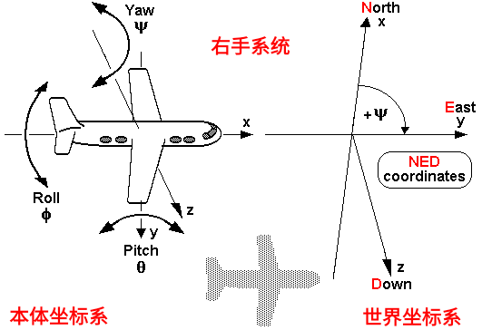
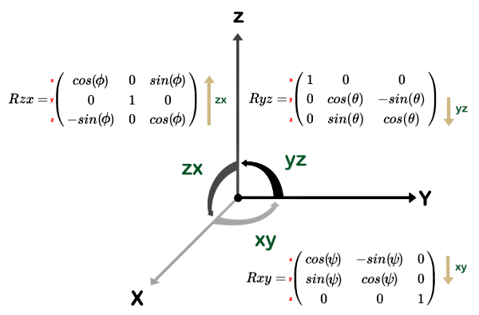
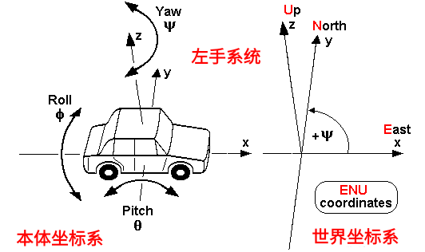
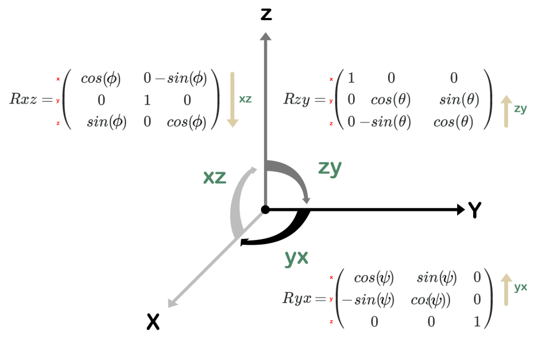
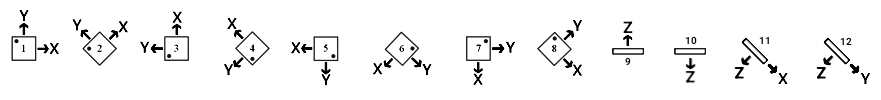
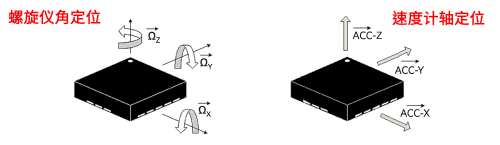
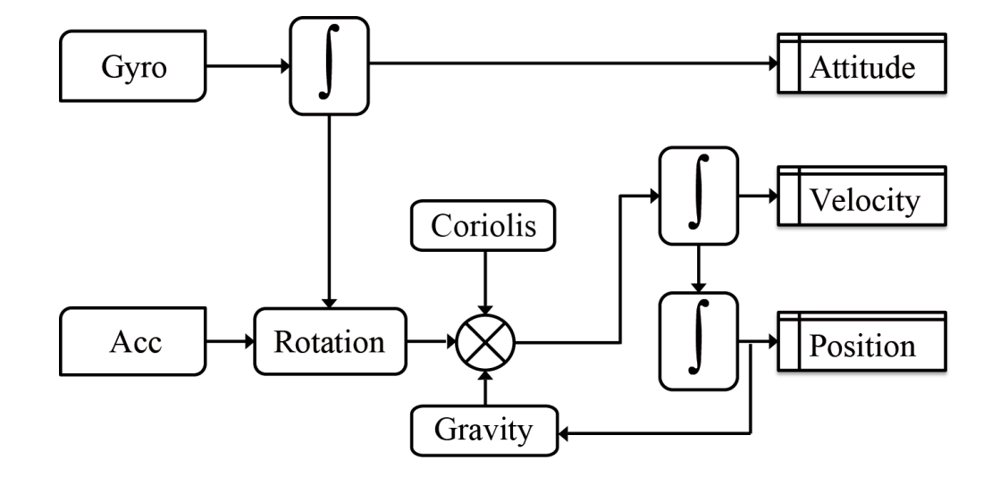
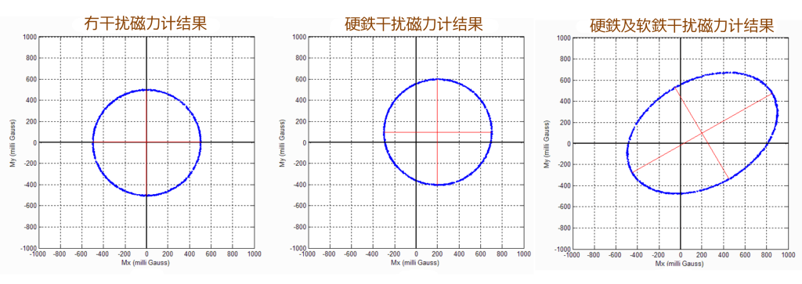
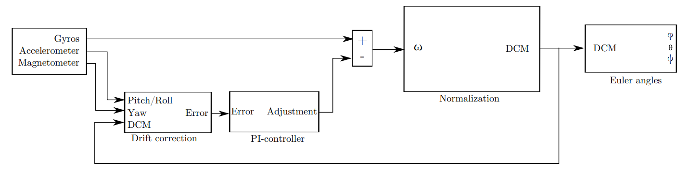

<style>
  table {
    width: 100%
    }
  td.left {
    vertical-align: center;
    text-align: left;
    width: 30%;
  }
  td {
    vertical-align: center;
    text-align: center;
  }
  table.inputT{
    margin: 10px;
    width: auto;
    margin-left: auto;
    margin-right: auto;
    border: none;
  }
  tr:nth-child(even){
    background-color:#ffffe5;
  }
  input{
    text-align: center;
    padding: 0px 10px;
  }
  iframe{
    width: 100%;
    display: block;
    border-style:none;
  }
</style>


# DCM (方向余弦矩阵)


## 什么是姿态

姿态是指物体坐标系(运动坐标系)与固定坐标系的相对旋转关系，如飞机的机体坐标系与大地坐标系的关系。

以飞机的姿态进行说明，起飞前机体坐标系与大地坐标系重合，飞向空中后，机体坐标系一般会与大地坐标系产生偏差，此刻机体坐标系到大地坐标系的变换可以分解为起飞前的机体坐标系绕不同的坐标轴连续转动3次。

这里的“绕不同的坐标轴”有两重含义。

绕固定坐标系(大地坐标系)的坐标轴或者绕运动坐标系(机体坐标系)的坐标轴，前者称为外旋，后者称为内旋。
旋转轴的顺序，先绕 X 轴再 Y 轴最后 Z 轴，或者先绕 Z 轴再 Y 轴最后 X 轴等等顺序。
通过上述两种含义，共有 24 种组合方式。但一般用的为以下两种方法

 - 绕 Z-Y-X 的顺时针內旋（右乘），即 **NED**
 - 绕 X-Y-Z 的顺时针外旋（左乘），即 **ENU**  


## 坐标轴方向

 - NED: North-East-Down（北-东-下）坐标系用于航空航天和海洋应用，其坐标轴指向北、东、下。坐标系的正 z 轴指向地心。
 - ENU: East-North-Up（东-北-上）坐标系常用于陆地机器人和大地测量学，其坐标轴指向东、北、上。右手坐标系，其正 z 轴指向远离地心的方向。


|特征|NED（北-东-下）|ENU（东-北-上）|
|:---:|:---:|:---:|
|应用|飞机、船舶、潜艇|陆地车辆、机器人|
|主轴|X轴：北，Y轴：东，Z轴：下|X轴：东，Y轴：北，Z轴：上|
|Z 轴方向|向下指向地心|向上指向远离地心|
|旋向|左旋系统 y-x-z|右旋系统 x-y-z|


### 三轴旋转

$$
\psi_{z} = yaw = y， \\ \phi_{y} = pitch = p， \\ \theta_{x} = roll = r，
$$

## NED (地心地平坐标系) - 航天和海洋

### NED 方向余弦矩阵（将向量从本体坐标系转换为世界坐标系）






### 欧拉角转余弦矩阵

$$
R_{zyx}(y,p,r)= \psi_{z}\phi_{y} \theta_{x} =  \begin{bmatrix} cos(\psi) & -sin(\psi) & 0\\ sin(\psi) & cos(\psi) & 0\\ 0 & 0 & 1 \end{bmatrix} \begin{bmatrix} cos(\phi) & 0 & sin(\phi)\\ 0 & 1 & 0 \\ -sin(\phi) & 0 & cos(\phi) \end{bmatrix}
\begin{bmatrix} 1 & 0 & 0 \\ 0 & cos(\theta) & -sin(\theta)\\ 0 & sin(\theta) & cos(\theta) \end{bmatrix}
$$


$$
\small 
R_{zyx}(y,p,r)= \psi_{z}\phi_{y} \theta_{x} =
\begin{bmatrix}cos(y)cos(p) & cos(y)sin(p)sin(r) - sin(y)cos(r) & cos(y)sin(p)cos(r) + sin(y)sin(r)\\
sin(y)cos(p) & sin(y)sin(p)sin(r) + cos(y)cos(r) & sin(y)sin(p)cos(r) - cos(y)sin(r)\\
-sin(p) & cos(p)sin(r) & cos(p)cos(r)\\
\end{bmatrix}
$$

### 余弦矩阵转欧拉角 (Gimbal lock 问题)

$$
C_{31} \neq \pm 1， \\
\theta = tan^{-1} \frac {C_{32}} {C_{33}} \\
\phi = sin^{-1} -C_{31} \\
\psi = tan^{-1} \frac {C_{21}} {C_{11}}  
$$

### 四元数转欧拉角


$$
\begin{bmatrix} row_x \\ pitch_y \\ yaw_z \\ \end{bmatrix} = \begin{bmatrix} \theta \\ \phi \\ \psi \\ \end{bmatrix} = \begin{bmatrix} \operatorname{atan2}(2(q_wq_y +  q_xq_z),  q_w^2 - q_x^2 - q_y^2 + q_z^2) \\ 
\operatorname{asin}(2( q_wq_z - q_xq_y)) \\
\operatorname{atan2}(2( q_wq_x + q_yq_z),  q_w^2 + q_x^2 - q_y^2 - q_z^2)
\\ \end{bmatrix}
$$

### 欧拉角转四元数


$$
q = \begin{bmatrix} q_w \\ q_x \\ q_y \\ q_z \\ \end{bmatrix} = \begin{bmatrix} cos(\frac {\theta}{2})cos(\frac {\phi}{2})cos(\frac {\psi}{2}) + sin(\frac {\theta}{2})sin(\frac {\phi}{2})sin(\frac {\psi}{2})\\ sin(\frac {\theta}{2})cos(\frac {\phi}{2})cos(\frac {\psi}{2}) - cos(\frac {\theta}{2})sin(\frac {\phi}{2})sin(\frac {\psi}{2}) \\ cos(\frac {\theta}{2})sin(\frac {\phi}{2})cos(\frac {\psi}{2}) + sin(\frac {\theta}{2})cos(\frac {\phi}{2})sin(\frac {\psi}{2}) \\ cos(\frac {\theta}{2})cos(\frac {\phi}{2})sin(\frac {\psi}{2}) - sin(\frac {\theta}{2})sin(\frac {\phi}{2})cos(\frac {\psi}{2}) \\ \end{bmatrix}
$$


## ENU (大地直角坐标系) - 陆地

### ENU 方向余弦矩阵（将向量从本体坐标系转换为世界坐标系）





### 欧拉角转余弦矩阵

$$
R_{xyz}(r,p,y) = \theta_{x}\phi_{y}\psi_{z} = 
\begin{bmatrix} 1 & 0 & 0 \\ 0 & cos(\theta) & sin(\theta)\\ 0 & -sin(\theta) & cos(\theta) \end{bmatrix}
\begin{bmatrix} cos(\phi) & 0 & -sin(\phi)\\ 0 & 1 & 0 \\ sin(\phi) & 0 & cos(\phi) \end{bmatrix}
\begin{bmatrix} cos(\psi) & sin(\psi) & 0\\ -sin(\psi) & cos(\psi) & 0\\ 0 & 0 & 1 \end{bmatrix} 
$$

$$
\small 
R_{xyz}(r,p,y) = \theta_{x}\phi_{y}\psi_{z} =
\begin{bmatrix}
 cos(p)cos(y) & cos(p)sin(y) &  -sin(p) \\
sin(r)sin(p)cos(y) - cos(r)cos(y) & sin(r)sin(p)sin(y) + cos(r)cos(y) & sin(r)cos(p)\\
cos(r)sin(p)cos(y)+sin(r)sin(y) & cos(r)sin(p)sin(y) - sin(r)cos(y) & cos(r)cos(p)
\end{bmatrix}
$$

### 余弦矩阵转欧拉角 (Gimbal lock 问题)

 
$$
C_{31} \neq \pm 1， \\
\theta = tan^{-1} \frac {C_{32}} {C_{33}} \\
\phi = sin^{-1} -C_{31} \\
\psi = tan^{-1} \frac {C_{21}} {C_{11}}  
$$

### 四元数转欧拉角


$$
\begin{bmatrix} row_x \\ pitch_y \\ yaw_z \\ \end{bmatrix} = \begin{bmatrix} \theta \\ \phi \\ \psi \\ \end{bmatrix} = \begin{bmatrix} \operatorname{atan2}(2(q_wq_x +  q_yq_z),  q_w^2 - q_x^2 - q_y^2 + q_z^2) \\ 
\operatorname{asin}(2( q_wq_y - q_zq_x)) \\
\operatorname{atan2}(2( q_wq_z + q_xq_y),  q_w^2 + q_x^2 - q_y^2 - q_z^2)
\\ \end{bmatrix}
$$


### 欧拉角转四元数

$$
q = \begin{bmatrix} q_w \\ q_x \\ q_y \\ q_z \\ \end{bmatrix} = \begin{bmatrix} cos(\frac {\theta}{2})cos(\frac {\phi}{2})cos(\frac {\psi}{2}) - sin(\frac {\theta}{2})sin(\frac {\phi}{2})sin(\frac {\psi}{2})\\ sin(\frac {\theta}{2})cos(\frac {\phi}{2})cos(\frac {\psi}{2}) + cos(\frac {\theta}{2})sin(\frac {\phi}{2})sin(\frac {\psi}{2}) \\ cos(\frac {\theta}{2})sin(\frac {\phi}{2})cos(\frac {\psi}{2}) - sin(\frac {\theta}{2})cos(\frac {\phi}{2})sin(\frac {\psi}{2}) \\ cos(\frac {\theta}{2})cos(\frac {\phi}{2})sin(\frac {\psi}{2}) + sin(\frac {\theta}{2})sin(\frac {\phi}{2})cos(\frac {\psi}{2}) \\ \end{bmatrix}
$$

# 姿态计算的相关公式

## 基本运算公式

假设一开始没有任何的旋转，姿态是跟参考坐标系重合，θ 等于 0：

$$
q = [cos \frac{θ}{2}, -x sin \frac{θ}{2}, -y sin \frac{θ}{2}, -z sin \frac{θ}{2}] = [1, 0, 0, 0]
$$

其中 θ 是旋转过的角度，x, y, z 是旋转轴上的单位矢量的分量 。

如要求 $q_A$ 相对于 $q_B$ 的姿态，这可以通过四元数的共轭 $\bar{q}$ 来算：

$$
\bar{q} = [cos \frac{θ}{2}, x sin \frac{θ}{2}, y sin \frac{θ}{2}, z sin \frac{θ}{2}]
$$

注：共轭是有标量部分，而逆 $q^{-1}$ 是归一化後的共轭。即 

$$
q^{-1} = \frac {\bar{q}}{|q|}
$$

## 姿态的坐标变换 (不受 X，Y，Z 顺序影响)

### 四元数

$$
q =  q_w + q_x + q_y + q_z \\  q_w = w
$$


### 余弦矩阵

$$
C =  \begin{bmatrix}
C_{11} & C_{12} & C_{13} \\
C_{21} & C_{22} & C_{23} \\
C_{31} & C_{32} & C_{33} 
\end{bmatrix}
$$


### 四元数转余弦矩阵

$$
C = \begin{bmatrix}
 q_w^2 + q_x^2 - q_y^2 - q_z^2 & 2(q_xq_y + q_wq_z) & 2(q_xq_z - q_wq_y) \\
2(q_xq_y - q_wq_z) &  q_w^2 - q_x^2 + q_y^2 - q_z^2 & 2(q_yq_z + q_wq_x) \\
2(q_xq_z + q_wq_y) & 2(q_yq_z - q_wq_x) &  q_w^2 - q_x^2 - q_y^2 + q_z^2
\end{bmatrix}
$$


### 余弦矩阵转四元数

$$
T = C_{11} + C_{22} + C_{33}
$$


|条件|最大|$q_w$|$q_x$|$q_y$|$q_z$|
|:---:|:---:|:---:|:---:|:---:|
|$T>0$| - |$\frac {1}{2} \sqrt {1 + T}$|$\frac {C_{32} - C_{23}}{4 q_w}$|$\frac {C_{13} - C_{31}}{4 q_w}$|$\frac {C_{21} - C_{12}}{4 q_w}$|
|$T≤0$|$C_{11}$|$\frac {C_{32} - C_{23}}{4 q_x}$|$\frac {1}{2} \sqrt {1 + C_{11} - C_{22} - C_{33}}$|$\frac {C_{12} - C_{21}}{4 q_x}$|$\frac {C_{13} - C_{31}}{4 q_x}$|
|$T≤0$|$C_{22}$|$\frac {C_{13} - C_{31}}{4 q_y}$|$\frac {C_{12} - C_{21}}{4 q_y}$|$\frac {1}{2} \sqrt {1 - C_{11} + C_{22} - C_{33}}$|$\frac {C_{23} - C_{32}}{4 q_y}$|
|$T≤0$|$C_{33}$|$\frac {C_{21} - C_{12}}{4 q_z}$|$\frac {C_{13} - C_{31}}{4 q_z}$|$\frac {C_{23} - C_{32}}{4 q_z}$|$\frac {1}{2} \sqrt {1 - C_{11} - C_{22} + C_{33}}$|


# 惯性测量传感器介绍

## 陀螺仪

通常做为主要姿态的计算，优点是反应快，但缺点是误差容易累积。陀螺仪是测量角速度的元件，陀螺仪有短时间准确、灵敏的特性，但用来计算角度时，长时间下的误差累积会使其变的不可靠，通常以 dps（degree per second）来表示角速度，角速度与速度不同，角速度是单位时间内旋转的角度，而速度则是单位时间内移动的距离，所以若是没有旋转是没有角速度的，若只对 X 轴旋转，则 Y 轴与 Z 轴的输出为 0，X 轴的输出为旋转的角速度。

感测器都会有误差与杂讯，把误差与噪音杂讯给滤除掉可以下面的数学式表示从感测器读到的角速度 $w_{measure}$ 会等于矩阵 $R_{gyro}$ 乘上理想的角速度 $w_{real}$ 加上偏移 $w_{bias}$ 与杂讯 $n_{noise}$，矩阵 $R_{gyro}$ 包含未对准误差（Misalignment）以及单位转换（dps/LBS），若感测器与载具完全对准的情况（大部份安装不准等情况会造成未对准误差），矩阵 $R_{gyro}$ 会是一个对角矩阵（Diagonal Matrix），偏移 $w_{bias}$、杂讯 $n_{noise}$ 则由温度、感测器内部等干扰引起。


$$
w_{measure} = R_{gyro} w_{real} + w_{bias} + n_{noise}
$$


$$
w_{measure} = \begin{bmatrix} w_x \\ w_y \\ w_z \end{bmatrix} = \begin{bmatrix} R_{11} && R_{12} && R_{13} \\ R_{21} && R_{22} && R_{23} \\ R_{31} && R_{32} && R_{33}  
\end{bmatrix} \begin{bmatrix} w_{rx} \\ w_{ry} \\ w_{rz} \end{bmatrix} + \begin{bmatrix} b_{wx} \\ b_{wy} \\ b_{wz} \end{bmatrix} + \begin{bmatrix} 0 \\ 0 \\ 0 \end{bmatrix}
$$


陀螺仪校正的部分主要校正偏差（Bias）的误差，不对安装误差做校正，因为对于安装物差的校正需要一些＂绝对＂的测量数据，这些数据通常都需要外部的仪器来辅助校正与测量。例如想要找出下列方程式中的 $R_{gyro}$ 矩阵，找出这一个矩阵的一个方法就是在不同的角速度下测量，外部的装置可以产生一个固定的角​​速度给予感测器，或是透过另一个可靠的感测器来做提供实际的结果，而感测器将测量到的结果与实际的结果作比较，就可以得出 $R_{gyro}$ 矩阵，$R_{gyro}$ 矩阵是一个单位矩阵或是一个对角矩阵（Diagonal Matrix）。

$$
w_{real} = {R_{gyro}}^{-1}(w_{measure} - w_{bias} - n_{noise})
$$


**高斯噪音（Gaussian Noise）下，平均值为 $n_{noise}=0$**

$$
w_{real} = \begin{bmatrix} w_{rx} \\ w_{ry} \\ w_{rz} \end{bmatrix} = \begin{bmatrix} R_{11} && 0 && 0 \\ 0 && R_{22} && 0 \\ 0 && 0 && R_{33} \end{bmatrix}^{-1} \begin{bmatrix} w_x - b_{wx} - 0\\ w_y - b_{wy} - 0\\\ w_z - b_{wz} - 0 \end{bmatrix}
$$

假设 $R_{gyro}$ 是一个对角矩阵后，问题简化许多，在 $n_{noise}$ 为高斯噪音（Gaussian Noise）下，平均值为 0，静止下对陀螺仪取样 $w_{real}$ = 0，所以测量到的就是 $w_{bias}$，只要在每次测量的结果减掉 $w_{bias}$，并乘上一个放大缩小的变数，就可以得出理想的陀螺仪资料，说的简单一点就是在静止下取平均值就可以得出 $w_{bias}$。


**静止下对陀螺仪 $w_{real}=0$**

$$
\because \begin{bmatrix} w_{rx} \\ w_{ry} \\ w_{rz} \end{bmatrix} = \begin{bmatrix} 0 \\ 0 \\ 0 \end{bmatrix} = \begin{bmatrix} w_x - b_{wx} - 0\\ w_y - b_{wy} - 0\\\ w_z - b_{wz} - 0 \end{bmatrix}
$$

$$
\therefore w_x = b_{wx}，w_y = b_{wy}，w_z = b_{wz}
$$

通过在已知旋转角度下对一系列角速度值进行时间积分，来进一步测试陀螺仪的校准情况。例如，可以将模块旋转180°，并对陀螺仪进行时间积分，以验证陀螺仪是否正常工作。

通过对陀螺仪的角速度进行积分，可以近似计算角位移：

$$
\theta = \int_{t_0}^{t_1} w_i dt 
$$

对于离散点，需要采用数值积分技术，我们采用梯形数值积分法：

$$
\theta_i = \int_{t_0}^{t_N} w_i dt \simeq  \sum_{j=1}^{N} \left(\frac{f_{i}(t_{j-1}) - f_{i}(t_{j})}{2} \Delta t \right)
$$

以上计算为灵敏度矩阵的对角元素，非对角元素是因未对准误差还会对每个轴产生横向影响。量化这些影响需要将每个轴的未对准角度分解为两个分量，这两个分量分别与另外两个轴相关。例如，$\theta_x$ 具有 $y$ 轴分量 $\delta_{xy}$ 和 $z$ 轴分量 $\delta_{xz}$，这导致 $x$ 轴陀螺仪对绕全局坐标系中所有三个轴 $w_x，w_y，w_z$ 旋转的响应展开如下：


$$
g_x = w_x cos(\theta_{x}) + w_y sin(\delta_{xy}) + w_z sin(\delta_{xz})，\\
g_y = w_x sin(\delta_{yx}) + w_y cos(\phi_{y}) + w_z sin(\delta_{yz})，\\
g_z = w_x sin(\delta_{zx}) + w_y sin(\delta_{zy}) + w_z cos(\psi_{z})，
$$


## 加速度计

可以透过重力加速度来校正陀螺仪，运动加速度部分也可以用来计算位移与速度等。加速度计是测量加速度的元件，除了运动加速度外，也包含地球质量所产生的重力加速度，也就是当感测器自由落体时，运动加速度与重力加速度会刚好抵销，有输出都会变成 0，通常以 $g$ 或是 $m/s^2$ 来表示，因为可以感测到重力加速度，所以在有重力的环境中加速度计也常用来做倾斜计，透过重力在三轴上的投影来计算角度。


加速度计常常会搭配陀螺仪来应用，因为重力加速度并不会随时间快速变化，长时间具有可靠性，所以通常透过此特性来较正陀螺仪，防止误差的累积。


加速度计的输出 $a_{measure}$ 会等于矩阵 $K_{accel}$ 乘上理想的加速度 $a_{real}$ 加上偏移 $a_{bias}$ 与杂讯 $n_{noise}$，理想的加速度 $a_{real}$ 包含运动加速度 $a_{motion}$ 以及重力加速度 $a_{gravity}$，矩阵 $K_{accel}$ 包含未对准的误差以及单位的转换（g/LBS），若感测器与载具完全对准的情况，矩阵 $K_{accel}$ 也是一个对角矩阵，偏移 $a_{bias}$、杂讯 $n_{noise}$ 则也会由温度、感测器内部等干扰引起。


$$
a_{measure} = K_{accel} a_{real} + a_{bias} + n_{noise} 
$$

$$
a_{real} = a_{motion} + a_{gravity}
$$

**高斯噪音（Gaussian Noise）下，平均值为 $n_{noise}=0$**

$$
a_{measure} = \begin{bmatrix} a_x \\ a_y \\ a_z \end{bmatrix} = \begin{bmatrix} K_{11} && K_{12} && K_{13} \\ K_{21} && K_{22} && K_{23} \\ K_{31} && K_{32} && K_{33} \end{bmatrix} \begin{bmatrix} a_{rx} \\ a_{ry} \\ a_{rz} \end{bmatrix} + \begin{bmatrix} b_{ax} \\ b_{ay} \\ b_{az} \end{bmatrix} + \begin{bmatrix} 0 \\ 0 \\ 0 \end{bmatrix}
$$


对加速度计校正的部分除了 $B_{bias}$ 矩阵的偏差外，还会找出 $S$ 矩阵来校正比例误差与焊接、安装产生的未对准误差，而三轴间的正交误差不打算特别做校正，因为使用的感测器是三轴集成于一颗芯片的，所以直接假设三轴互相正交，则 $S$ 的反矩阵（$K$ 矩阵）会是一个对证矩阵，并且表示成无偏差的形式，为的是减少展开的复杂度，所以问题可以化简成下面式子


$$
a_{real} = {K_{accel}}^{-1}(a_{measure} - a_{bias} - n_{noise})
$$

$$
a_{real} = \begin{bmatrix} a_{rx}  \\ a_{ry} \\ a_{rz} \end{bmatrix} = {\begin{bmatrix} K_{11} && K_{12} && K_{13} \\ K_{21} && K_{22} && K_{23} \\ K_{31} && K_{32} && K_{33} \end{bmatrix}}^{-1} \begin{bmatrix} a_{x} - b_{ax} - 0 \\ a_{y} - b_{ay} - 0 \\ a_{z} - b_{az} - 0 \end{bmatrix}
$$


再透过在没有运动加速度的条件下，加速度计三轴输出平方和会等于重力加速度的关系来做校正，此种方法不需要依预先设定好的角度与位置来校正，校正的自由度较大。


$$
g^2 = a_{rx}^2 + a_{ry}^2 + a_{rz}^2
$$

在 $z$ 轴加速度计与重力方向平行且向下以及向上时测量值。这两种情况下的值已知，向下为 $+9.8$，向上为 $-9.8$。


$$
+9.81 = S_z (a_{z0} - b_{az}) \\ -9.81  = S_z (a_{z1} - b_{az})
$$

$$
\frac {9.81 + b_{az}} {a_{z0}} = S_z =  \frac {-9.81 + b_{az}} {a_{z1}}，\\
a_{z1}(9.81 + b_{az}) = a_{z0} (-9.81 + b_{az})， \\
9.81 \cdot a_{z1} + b_{az} a_{z1} = -9.81 \cdot a_{z0} + b_{az} a_{z0}， \\
9.81(a_{z1} + a_{z0}) = b_{az} (a_{z0} - a_{z1}) $$


$$
b_{az} = 9.81 \left ( \frac {a_{z0} + a_{z1}} {a_{z0} - a_{z1}} \right )
$$


$$
S_z a_{z0} - 9.81 = S_z \cdot b_{ax} = 
S_z a_{z01} + 9.81， \\
S_z a_{z0} - 9.81 = S_z a_{z1} + 9.81， \\
S_z (a_{z0} - a_{z1}) = 2 \cdot 9.81
$$


$$
K_{33} = S_z  = \frac {2 \cdot 9.81} {a_{z0} - a_{z1}}
$$

**其他轴的计算方法类似**。

$$
b_{ax} = 9.81 \left ( \frac {a_{x0} + a_{x1}} {a_{x0} - a_{x1}} \right )，K_{11} = S_x  = \frac {2 \cdot 9.81} {a_{x0} - a_{x1}}\\ b_{ay} = 9.81 \left ( \frac {a_{y0} + a_{y1}} {a_{y0} - a_{y1}} \right )，K_{22} = S_y  = \frac {2 \cdot 9.81} {a_{y0} - a_{y1}} \\ b_{az} = 9.81 \left ( \frac {a_{z0} + a_{z1}} {a_{z0} - a_{z1}} \right )，K_{33} = S_z  = \frac {2 \cdot 9.81} {a_{z0} - a_{z1}}
$$

以上计算为灵敏度矩阵的对角元素，详细介绍如下

 - 对角元素 ($K_{11}，K_{22}，K_{33}$): 这些元素表示每个轴（$x、y$ 和 $z$）对沿该轴加速度的主要灵敏度，单位为 $mV/g$ 或 $LSB/g$。
 - 非对角元素 ($K_{12}，K_{13}，K_{21}，K_{23}，K_{31}，K_{32}$): 这些元素表示交叉灵敏度，即一个轴上的加速度会在另一个轴上产生响应。例如 $$K_{12}$ 表示 y 轴上的加速度引起的 x 轴上的响应。因为 $x=1，y=2，z=3$，一般数值会少于对角元素的 **5**%。
 - 校准至关重要：灵敏度矩阵中的参数并非固有属性，而是必须通过校准测试确定，以校正特定设备的缺陷和安装方向。
 - 校正实际应用中的缺陷：灵敏度矩阵有助于补偿诸如安装错位和制造缺陷等因素，这些因素会导致传感器响应不理想。
 - 精度：通过使用灵敏度矩阵，可以更精确地将三轴加速度计的原始输出转换为特定坐标系中真实加速度矢量的精确测量值。

如何利用重力计算灵敏度矩阵：

 - 重力投影：当加速度计静止时，它测量的是局部重力矢量近似为 1g。当加速度计倾斜时，其读数是该重力矢量在其敏感轴上的投影。
 - 灵敏度公式：沿该轴感应到的加速度大小由以下公式给出 $a=g⋅cos(\theta)$。
 - 当倾斜 45°：敏感轴倾斜角度为 45° 与垂直方向成一定角度时，灵敏度为
$cos(45°)≈0.707$ 这意味着加速度计的输出约为 0.707g。可参考以下 **关节的合成 g 分量** 表
 - 三轴加速度计：三轴加速度计的灵敏度矩阵考虑了三个轴。如果加速度计的轴与重力矢量对齐，且倾斜角度为 45°，则矩阵如下所示：

$$
\begin{bmatrix} 
cos(\theta_x) && 0 && 0 \\ 
0 && cos(\phi_y) && 0 \\ 
0 && 0 && cos(\psi_z) \end{bmatrix} = \begin{bmatrix} g_x \\ g_y \\ g_z \end{bmatrix}
$$

其中 $\theta_x，\phi_y，\psi_z$ 分别表示坐标轴与重力矢量之间的夹角，并且 $g_x,g_y,g_z$ 分别表示重力矢量的分量。

下图是在静止下（仅存在 1g 的重力加速度），不同角度的加速度计，角度 1～8 的 Z 轴因为垂直于重力加速度，所以皆为 0g，





 - 角度 1（000 deg）的输出（0, +g, 0）
 - 角度 2（045 deg）的输出（+0.707g, +0.707g, 0）
 - 角度 3（090 deg）的输出（+g, 0, 0）
 - 角度 4（135 deg）的输出（+0.707g, -0.707g, 0）
 - 角度 5（180 deg）的输出（0, -g, 0）
 - 角度 6（225 deg）的输出（-0.707g, -0.707g, 0）
 - 角度 7（270 deg）的输出（-g, 0, 0）
 - 角度 8（315 deg）的输出（-0.707g, +0.707g, 0）

$$
归纳出 → X = g_{sin(\theta)}, Y = g_{cos(\theta)} → \theta = atan(\frac{X}{Y})
$$

表示在 Z 轴垂直于重力时，输出的 X, Y 值相除，并取 atan 则可以得到倾斜角度，但需要注意的，这仅限于静止下，当有运动加速度的影响，得到的角度会是不准确的。




### 静止下的合成 g 分量

|$\phi_y$|–45|–45|–45|–45|45|45|45| 45|0|0|0|0|90|-90|
|:---:|:---:|:---:|:---:|:---:|:---:|:---:|:---:|:---:|
|$\theta_x$|–45|45|135|225|-45|45|135|225|0|90|180|-90|0|0|
|$g_x$|$\frac{-1}{\sqrt{2}}$|$\frac{-1}{\sqrt{2}}$|$\frac{-1}{\sqrt{2}}$|$\frac{-1}{\sqrt{2}}$|$\frac{1}{\sqrt{2}}$|$\frac{1}{\sqrt{2}}$|$\frac{1}{\sqrt{2}}$|$\frac{1}{\sqrt{2}}$|0|0|0|0|-1|1|
|$g_y$|$\frac{-1}{2}$|$\frac{1}{2}$|$\frac{1}{2}$|$\frac{-1}{2}$|$\frac{-1}{2}$|$\frac{1}{2}$|$\frac{1}{2}$|$\frac{-1}{2}$|0|-1|0|1|0|0|
|$g_z$|$\frac{1}{2}$|$\frac{1}{2}$|$\frac{-1}{2}$|$\frac{-1}{2}$|$\frac{1}{2}$|$\frac{1}{2}$|$\frac{-1}{2}$|$\frac{-1}{2}$|-1|0|1|0|0|0|





一种校准低重力（~3g）三轴MEMS加速度计的方法。该方法包括在六个不同方向上进行测量，然后使用最小二乘法求解12个校准参数。此校准方法可消除传感器的零重力偏差、轴间相互作用、灵敏度变化和封装错位等问题。

假设原始测量值（rx、ry、rz）可以通过乘以一个 4×4 矩阵转换为校准值（cx、cy、cz）：

$$
\begin{bmatrix} C_x  \\ C_y \\ C_z \\ 1 \end{bmatrix} = 
\begin{bmatrix} a & b & c & j \\ d & e & f & k \\ g & h & i & l \\ 0 & 0 & 0 & 1 \end{bmatrix} \begin{bmatrix} r_x  \\ r_y \\ r_z \\ 1 \end{bmatrix}
$$

这是一个 3D 仿射变换，这意味着它进行线性变换（旋转、剪切、缩放）和平移（偏移）。

校准参数 $a$ 至 $l$ 由最小二乘法确定：

$$
A x = b
$$

$$
x = (A^TA)^{-1} A^T b
$$

$A$：（$n×4$ 矩阵）在预定义方向上采集的原始测量数据

$$
A = \begin{bmatrix} 
A1_x & A1_y & A1_z & 1 \\
A2_x & A2_y & A2_z & 1 \\
A3_x & A3_y & A3_z & 1 \\
A4_x & A4_y & A4_z & 1 \\
. & . & . & 1 \\
. & . & . & 1 \\
. & . & . & 1 \\
An_x & An_y & An_z & 1 \\
\end{bmatrix}
\begin{matrix} 
 方向 1 \\
 方向 2 \\
 方向 3 \\
 方向 4 \\
 ... \\ 
 ... \\ 
 ... \\ 
 方向 n \\
\end{matrix}
$$

$x$：（$4x3$ 矩阵）校准参数（未知数）

$$
x = \begin{bmatrix} a & e & i \\ b & f & j \\ c & g & k \\ d & h & l \end{bmatrix}
$$

$b$：（$n×3$ 矩阵）$A$ 中每个方向所需的校准值

$$
b = \begin{bmatrix} 
b1_x & b1_y & b1_z \\
b2_x & b2_y & b2_z \\
b3_x & b3_y & b3_z \\
b4_x & b4_y & b4_z \\
. & . & . \\
. & . & . \\
. & . & . \\
bn_x & bn_y & bn_z \\
\end{bmatrix}
\begin{matrix} 
 方向 1 \\
 方向 2 \\
 方向 3 \\
 方向 4 \\
 ... \\ 
 ... \\ 
 ... \\ 
 方向 n \\
\end{matrix}
$$

线性变换有 9 个自由度，平移有 3 个自由度，因此总共有 12 个自由度（12 个参数：a 到 l）。因此，至少需要 12 个方程来求解这 12 个未知数。每个方向对应 3 个测量值（x、y 和 z），所以设备至少需要处于 4 个不同的方向才能求解方程。

以下描述了六点校准方法：

- 在传感器 +Z 轴向上时，采集 5 至 10 秒的原始数据。
- 对其他 5 个面重复此操作，并将结果记录在 A 矩阵的每一行中。
- 利用公式 (eq2) 求解 x，其中 b 的定义如下：

$$
b = \begin{bmatrix} 
1 & 0 & 0 \\
-1 & 0 & 0 \\
0 & 1 & 0 \\
0 & -1 & 0 \\
0 & 0 & 1 \\
0 & 0 & -1 \\
\end{bmatrix}
\begin{matrix} 
 X上 \\
 X下 \\
 Y上 \\
 Y下 \\
 Z上 \\ 
 Z下 \\ 
\end{matrix}
$$  

一旦确定了校准参数 $x$，就可以使用以上公式将原始测量值转换为校准参数。

$$
\begin{bmatrix} b_x \\ b_y \\ b_z \end{bmatrix} = \begin{bmatrix} A_x \\ A_y \\ A_z \end{bmatrix} x 
$$

其中 $\begin{bmatrix}A_x \\ A_y \\ A_z \end{bmatrix}$ 为原始测量值，$\begin{bmatrix}b_x \\ b_y \\ b_z\end{bmatrix}$ 为校准值。校准值的单位为 G。

## 校准方法的局限性

- 仅适用于低重力加速度计
    - 本方法以重力为参考，因此适用于低重力加速度计（约 3g），但不适用于高重力加速度计（约 200g）。校准高重力加速度计需要更大的受控加速度。
- 位置相关
    - 由于地球自转、海拔高度以及地球并非完美球体，地球表面重力变化约为 0.7%。例如：
      - 北极海平面：9.832 m/s²
      - 赤道附近乞力马扎罗山 5895 米峰顶：9.763 m/s²

    - 此处描述的校准方法会消除重力场的影响，并假设校准点的重力加速度为“1g”。但是，如果需要以 m/s² 为单位的绝对估计值，则必须记录校准点的重力场。然后，可以将该值乘以其他系数，从而将“1g”转换为m/s/s。
 - 温度依赖性
    - MEMS元件对温度变化非常敏感。实际应用中，每种可能出现的温度都需要校准参数。惯性测量单元（IMU）通常包含温度传感器，因此可以通过在两个或多个温度下进行校准，并将拟合的校准参数插值到实际温度，来扩展此技术以考虑温度依赖性。另请注意，同一产品的两个加速度计可能具有不同的温度特性。
  - 其他注意事项
    - 数值不稳定性
      - 求解最小二乘法涉及计算矩阵的逆。请检查行列式是否接近于零。
    - 异常值
      - 最小二乘法容易受到异常值的影响。请检测异常值并重新进行校准。
    - 振动
      - 加速度计是弹簧阻尼系统（欠阻尼二阶系统），具有固有频率和阻尼比。如果在共振附近存在持续振动（例如在无人机中），加速度计测量值可能会饱和。
    - 漂移
      - 这也被称为偏置不稳定性。即使设备处于静止状态且温度保持恒定，加速度计的值也会缓慢变化。这与积分漂移不同。漂移可以通过使用其他传感器（例如 GNSS）进行在线估计来校正。
    - IMU 位置
      - 如果加速度计的位置远离设备的重心，则其所感受到的加速度将与位于重心时不同。
    - 电路板上的力 
      - MEMS 元件对作用在电路板上的力非常敏感，例如悬空的连接器。
    - 有些 IMU 会在一段时间后停止响应，需要重置。这对于无人机等设备至关重要。


### 根据加速度计值估算 横滚角 $\theta_x$ 和 俯仰角 $\phi_y$


$$
\begin{bmatrix} a_{rx}  \\ a_{ry} \\ a_{rz}  \end{bmatrix} = \begin{bmatrix} -sin(\theta)  \\ cos(\theta) sin(\phi) \\ cos(\theta) cos(\phi)  \end{bmatrix}
$$


$$
\theta_x = tan^{-1} \left ( \frac {a_{ry}} {a_{rz}} \right )
$$


$$
\phi_y= tan^{-1} \left ( \frac {-a_{rx}}{\sqrt{a_{ry}^2+a_{rz}^2}} \right )
$$

## 磁力计

同样也是辅助、校正陀螺仪，解决重力加速度无法检测到水平角度旋转的问题。磁力计或电子罗盘是用来测量磁场的元件，通常以高斯（Gauss）或特斯拉（Tesla）来表示磁场大小，因为地球本身存在磁场，所以磁力计可以藉由磁场在三轴上的投影来计算出航向角度，但事实上环境中的磁场不仅仅只有地球磁场，还包含了许多的干扰源，依特性可以分成硬磁（Hard Iron）干扰与软磁（Soft Iron）干扰，硬磁干扰是像永久磁铁、电池这些指固定强度的干扰，软磁干扰则是指像电磁铁、电量变化等，当磁力来源消失时，磁力会变弱，会改变磁力线强度或方向的干扰。

磁力計的簡單數學模型，磁力的輸出 $h_{measure}$ 會等於矩陣 $M_{mag}$ 乘上理想的磁場 $h_{real}$ 加上偏移 $h_{bias}$ 與雜訊 $n_{noise}$，矩陣 $M_{mag}$ 包含未對準的準誤、單位的轉換（gauss/LBS）、硬磁干擾、軟磁干擾，偏移 $h_{bias}$、雜訊 $n_{noise}$ 則也會由溫度、感測器內部等干擾引起

$$
h_{measure} = M_{mag} h_{real} + h_{bias} + n_{noise} 
$$

**高斯噪音（Gaussian Noise）下，平均值为 $n_{noise}=0$**

$$
h_{measure} = \begin{bmatrix} h_{x} \\ h_{y} \\ h_{z} \end{bmatrix} = \begin{bmatrix} M_{11} && M_{12} && M_{13} \\ M_{21} && M_{22} && M_{23} \\ M_{31} && M_{32} && M_{33} \end{bmatrix} \begin{bmatrix} h_{rx} \\ h_{ry} \\ h_{rz} \end{bmatrix} + \begin{bmatrix} b_{hx} \\ b_{hy} \\ b_{hz} \end{bmatrix} + \begin{bmatrix} 0 \\ 0 \\ 0 \end{bmatrix}
$$

$$
h_{real} = {M_{mag}}^{-1}(h_{measure} - h_{bias} - n_{noise})
$$

$$
h_{real} = \begin{bmatrix} h_{rx}  \\ h_{ry} \\ h_{rz} \end{bmatrix} = {\begin{bmatrix} M_{11} && M_{12} && M_{13} \\ M_{21} && M_{22} && M_{23} \\ M_{31} && M_{32} && M_{33} \end{bmatrix}}^{-1} \begin{bmatrix} h_{x} - b_{hx} - 0 \\ h_{y} - b_{hy} - 0 \\ h_{z} - b_{hz} - 0 \end{bmatrix}
$$



### 硬磁干扰

**硬磁干扰**指的是来自永久磁化物体的静止磁噪声问题，这种噪声会导致磁力计读数与真实原点存在偏差。这种效应会改变数据球的中心位置，是一种可以通过校准进行补偿的磁干扰，从而提高传感器读数的准确性。

 - 对数据的影响：在理想的、未经校准的情况下，旋转磁力计会产生以原点为中心的完美圆即一个三维球体。数据点：(0,0,0)。硬铁效应会使中心点偏离原点，但圆/球的形状保持不变。
 - 校准：为了校正硬铁失真，必须对传感器数据进行校准，使数据球的中心 **推回** 其原始位置。
 - 方法：通常的做法是将传感器旋转一周（360°），然后应用数学补偿来消除偏移。

一周（360°）后，在每個轴上取平均最大值，平均最少值。用以下公式计算出各轴的硬偏移量。


数学补偿来消除偏移的二维校准方法是將传感器旋转几个 360° 圆周来完成的，如果传感器在俯仰角和横滚角方向上的水平度保持在 5° 到 10° 之间，则通常足够。超出此范围，强烈建议进行完整的三维校准，这需要尽可能绕所有轴旋转传感器，以覆盖一个测量球面。

$$
各轴的硬偏移量校准 = \frac {各轴的平均最大值 + 各轴的平均最少值}{2}
$$


$$
灵敏度调整 = \frac {平均最大值-平均最少值}{IMU 分辨率}
$$

计算出的硬磁向量如下

$$
\begin{bmatrix} b_{hx}\\ b_{hy}\\ b_{hz}\end{bmatrix}
$$


### 软磁干扰

**软磁干扰**校正是指对软铁畸变进行校正或校准的过程。软铁畸变是由附近材料引起的磁场误差，这些材料会弯曲或扭曲局部磁场。这种畸变发生在磁导率高的材料中，例如铁和钢，需要复杂的校准才能校正，因为它们会将理想磁场测量形状从球形变为椭球形。软铁校正使用变换矩阵来补偿这些影响，从而恢复精确的磁场测量结果。

软磁干扰的成因：

 - 磁场弯曲：软铁材料会使周围的磁力线弯曲。
 - 灵敏度不均匀：这种弯曲会导致磁力计沿不同轴向的灵敏度不同。
 - 椭球形输出：综合来看，磁力计应该测量的理想球形磁场会畸变为椭球形。


软磁干扰校正的工作原理：

 - 数据采集：设备旋转至所有可能的方向，以采集各种磁场读数。
 - 数学变换：然后使用采集到的数据计算变换矩阵（“软铁矩阵”）。
 - 补偿：将该矩阵应用于磁力计的输出，以校正失真读数，将椭球体恢复为球体，从而提高精度。
 - 动态过程：如果设备环境发生变化，软铁矩阵也会发生变化，因此当设备移动或放置在新的磁源附近时，需要重新校准。

由于软铁矩阵是对称的，因此可得出计算出的软铁矩阵如下：

$$
{\begin{bmatrix} 
M_{11} && M_{12} && M_{13} \\ M_{21} && M_{22} && M_{23} \\ M_{31} && M_{32} && M_{33} \end{bmatrix}} = {\begin{bmatrix} 
M_{11} && M_{a} && M_{b} \\ M_{a} && M_{22} && M_{c} \\ M_{b} && M_{c} && M_{33} \end{bmatrix}}\\
\because M_{12} = M_{21}，M_{13} = M_{31}，M_{23} = M_{32}
$$

请参考：[最小平方法(伪逆)](https://hkdickyko.github.io/%E6%95%B0%E5%AD%A6/lsqsphere) 用作计算软铁矩阵参数值。


### 利用磁力计估算 偏航角 $\psi_z$


根据加速度计的 横滚角 $\theta_x$ 及 俯仰角 $\phi_y$ 用以下公式计算出 


$$
\begin{bmatrix} h_{rx} \\ h_{ry} \\ h_{rz}  \end{bmatrix} = \begin{bmatrix} h_{rx}cos(\phi_y) + h_{ry}sin(\phi_y)sin(\theta_x) \cdot h_{rz}sin(\phi_y)cos(\theta_x) \\ h_{rx} cos(\theta_x) - h_{rz} sin(\theta_x) \\ -h_{rx}sin(\phi_y) + h_{ry}cos(\phi_y)sin(\theta_x) + h_{rz}cos(\phi_y)cos(\theta_x)  \end{bmatrix}
$$

$$
\psi_z = tan^{-1} \left ( \frac {h_{rx} cos(\theta_x) - h_{rz} sin(\theta_x)}{h_{rx}cos(\phi_y) + h_{ry}sin(\phi_y)sin(\theta_x) \cdot h_{rz}sin(\phi_y)cos(\theta_x)} \right )
$$

## 气压计

用作计算飞行器高度。氣壓計是用來測量氣壓的元件，通常使用帕（Pa）或百帕（hPa）來表示，一個大氣壓力大約是 $ P_r = 1013.25 hPa， \rho_0 = 1.293 kgm^{-3}，g = 9.81$，大氣壓會隨著高度的提升而下降，其關係為每上升 9 米，大氣壓力降低 100 Pa，透過此關係可以使用氣壓計計算出目前的海拔高度，以目前 MEMS 氣壓計可以做到 1 Pa RMS 的高解析度情況下，大約可以檢測到 9 米的高度變化，但這都在是比較理想的情況下，實際上還會有空氣的流動、溫度與濕度的影響，使得計算、測量的誤差產生。


$$
\rho = \rho_0 \cdot \frac{P_i}{P_r} \cdot \frac {273.15 K}{T_i}
$$

$$
\Delta h = \frac {\Delta P}{-\rho g}
$$

这里以三轴陀螺仪、三轴加速度计、三轴磁力计和气压计做说明，首先要先了解三轴之间的关系，假设有三个向量 X、Y、Z，其方向分别为三个轴的方向，那这三个向量会互相垂直、正交（Orthogonality），也就像是 X dot product Y = 0 或 X cross product Y = Z。 可用右手定则来了解。




### 姿态变化计算原理

DCM 算法通过连纹更新加速度计、陀螺仪和磁力计等传感器的数据，实时计算出机体的姿态变化。陀螺仪测量角速度，用于短时的姿态更新；而磁力计和加速度计则通过融合算法（如互补滤波或卡尔曼滤波）来校正长期漂移并确定绝对姿态。

现在倾向于使用四元数作为主要的姿态表示方式，因为四元数在处理连续旋转时具有更优的数值稳定性，并且能够避免 DCM 可能出现的奇异性问题。但对于理解 DCM 的工作原理对于理解姿态解算的基础仍然十分重要。

 - 读取陀螺仪测得的角速度数据，并将其积分得到瞬时姿态变化的角度。
 - 使 DCM 更新陀螺仪数据通过欧拉角或旋转向量的形式更新方向余弦矩阵（DCM），反映机体在三维空间中的旋转情况。
 - 磁力计和加速度计数据融合。使用磁力计数据更新航向 (yaw) - $\psi_z$，并通过加速度计结合重力矢量估算俯仰 (pitch) - $\phi_y$ 和横滚角 (roll) - $\theta_x$。
 - 使用互补滤波或其他卡尔曼滤波等算法融合这些数据以减少传感器噪声和漂移影响
 - DCM 正交化和归一化。由于累积误差可能导致 DCM 不再代表正交旋转矩阵，需要定期进行正交化和单位化操作确保其有效性。
 - 转换至四元数。尽管 DCM 可以表示姿态，但因数值稳定性和方便后续运算的原因，一般会把更新后的 DCM 转换成四元数用作计算。


# Mahony 滤波器 C 代码

Mahony Filter 将加速计读值和转换后的重力向量做外积 (Cross Product)，两个向量的外积代表两个向量的差异。 这个差异，Mahony Filter 以 Kp 调整，调整过后的值用来修正陀螺仪 $ \omega $ 读值，然后四元素就用以下公式来更新。

$$
q_{\omega,t} = q_{t-1} + \frac{1}{2} \left (q_{t-1} \cdot S_{\omega_t} \right) \cdot \Delta t
$$


姿态航向参考系统（AHRS）结合陀螺仪、加速度计和磁力计的数据来计算物体的姿态。

 - 陀螺仪测量角速度，但其数值会随时间漂移，因此需要使用加速度计和磁力计来校正这种漂移。
 - 加速度计通过测量重力来提供俯仰角和横滚角
 - 磁力计则通过感知地球磁场来提供航向角。

重力矢量和磁场矢量的叉积提供了一个参考坐标，帮助系统计算航向角并校正误差。


|传感器|功能|局限性|相關角度|
|:---:|:---:|:---:|:---:|
|陀螺仪|测量旋转速率，并通过积分计算姿态|易受噪声和偏差的影响，随时间推移发生漂移，导致误差累积|$\omega_t$|
|加速度计|测量线性加速度，可通过感知重力方向（在最小加速度下）确定俯仰角和横滚角|在运动或振动过程中，难以准确确定倾斜角|Pitch, Roll|
|磁力计|测量地球磁场以确定航向|易受附近金属或电子设备产生的局部磁场干扰，导致航向读数不准确|Yaw|


协同工作

 - 陀螺仪的测量值用于预测新的姿态，但该预测值会随时间推移而发生漂移
 - 加速度计像水平仪用于校正预测值
 - 磁力计像指南针，指向北方用于校正预测值
 - 叉积(Cross Product)是一项关键的校正技术是利用测得的重力矢量和磁场矢量的叉积。可以创建一个稳定的参考，用于改进姿态估计，特别是航向角（偏航角 - Yaw）。
 - 滤波器等复杂的算法来融合来自所有三个传感器的数据，从而生成物体姿态（俯仰角、横滚角和偏航角）的稳定且精确的估计值。更可以利用重力和磁场信息进行自我校正，从而保持正确的方向。

## 头文件

```c
\\ MahonyAHRS.h
extern volatile float twoKp; // 2 * 比例增益 (Kp) 
extern volatile float twoKi; // 2 * 积分增益 (Ki)
extern volatile float q0, q1, q2, q3;

void MahonyAHRSupdateIMU(float gx, float gy, float gz, 
                         float ax, float ay, float az);
void MahonyAHRSupdate(float gx, float gy, float gz, 
                      float ax, float ay, float az, 
                      float mx, float my, float mz);
```

## C 源代码

```c
#include "MahonyAHRS.h"
#include <math.h>

#define sampleFreq  512.0f // 采样频率（单位：赫兹）
#define twoKpDef  (2.0f * 0.5f)  // 2 * 比例增益
#define twoKiDef  (2.0f * 0.0f)  // 2 * 积分增益


volatile float twoKp = twoKpDef; // 2 * 比例增益 (Kp)  
volatile float twoKi = twoKiDef; // 2 * 积分增益 (Ki)  
// 传感器坐标系相对于辅助坐标系的四元数
volatile float q0 = 1.0f, q1 = 0.0f, q2 = 0.0f, q3 = 0.0f;          
// 积分误差项按比例缩放的 Ki
volatile float integralFBx = 0.0f,  integralFBy = 0.0f, integralFBz = 0.0f;  

float invSqrt(float x);
void MahonyAHRSupdateIMU(float gx, float gy, float gz, 
                         float ax, float ay, float az);

void MahonyAHRSupdate(float gx, float gy, float gz, 
                      float ax, float ay, float az, 
                      float mx, float my, float mz) {
  float recipNorm;
  float q0q0, q0q1, q0q2, q0q3, q1q1, q1q2, q1q3, q2q2, q2q3, q3q3;  
  float hx, hy, bx, bz;
  float halfvx, halfvy, halfvz, halfwx, halfwy, halfwz;
  float halfex, halfey, halfez;
  float qa, qb, qc;

  // 如果磁力计测量值无效，则使用 IMU 算法（避免归一化中出现 NaN 值）
  if((mx == 0.0f) && (my == 0.0f) && (mz == 0.0f)) {
    MahonyAHRSupdateIMU(gx, gy, gz, ax, ay, az);
    return;
  }
  // 仅当加速度计测量值有效时才计算反馈（避免归一化中出现 NaN 值）
  if(!((ax == 0.0f) && (ay == 0.0f) && (az == 0.0f))) {
    // 对加速度计测量进行归一化
    recipNorm = invSqrt(ax * ax + ay * ay + az * az);
    ax *= recipNorm;
    ay *= recipNorm;
    az *= recipNorm;     
    // 磁力计测量标准化
    recipNorm = invSqrt(mx * mx + my * my + mz * mz);
    mx *= recipNorm;
    my *= recipNorm;
    mz *= recipNorm;   
    // 使用辅助变量避免重复运算
    q0q0 = q0 * q0;
    q0q1 = q0 * q1;
    q0q2 = q0 * q2;
    q0q3 = q0 * q3;
    q1q1 = q1 * q1;
    q1q2 = q1 * q2;
    q1q3 = q1 * q3;
    q2q2 = q2 * q2;
    q2q3 = q2 * q3;
    q3q3 = q3 * q3;   
    // 地球磁场的参考方向
    hx = 2.0f * (mx * (0.5f - q2q2 - q3q3) + my * (q1q2 - q0q3) + mz * (q1q3 + q0q2));
    hy = 2.0f * (mx * (q1q2 + q0q3) + my * (0.5f - q1q1 - q3q3) + mz * (q2q3 - q0q1));
    bx = sqrt(hx * hx + hy * hy);
    bz = 2.0f * (mx * (q1q3 - q0q2) + my * (q2q3 + q0q1) + mz * (0.5f - q1q1 - q2q2));
    // 重力和磁场的估计方向
    halfvx = q1q3 - q0q2;
    halfvy = q0q1 + q2q3;
    halfvz = q0q0 - 0.5f + q3q3;
    halfwx = bx * (0.5f - q2q2 - q3q3) + bz * (q1q3 - q0q2);
    halfwy = bx * (q1q2 - q0q3) + bz * (q0q1 + q2q3);
    halfwz = bx * (q0q2 + q1q3) + bz * (0.5f - q1q1 - q2q2);  
    // 误差是场矢量估计方向与测量方向的叉积之和
    halfex = (ay * halfvz - az * halfvy) + (my * halfwz - mz * halfwy);
    halfey = (az * halfvx - ax * halfvz) + (mz * halfwx - mx * halfwz);
    halfez = (ax * halfvy - ay * halfvx) + (mx * halfwy - my * halfwx);
    // 如果启用，则计算并应用积分反馈
    if(twoKi > 0.0f) {
      // Ki 为积分误差比例
      integralFBx += twoKi * halfex * (1.0f / sampleFreq);
      integralFBy += twoKi * halfey * (1.0f / sampleFreq);
      integralFBz += twoKi * halfez * (1.0f / sampleFreq);
      // 应用积分反馈
      gx += integralFBx;
      gy += integralFBy;
      gz += integralFBz;
    } else {
      // 防止积分饱和
      integralFBx = 0.0f;  
      integralFBy = 0.0f;
      integralFBz = 0.0f;
    }
    // 应用比例反馈
    gx += twoKp * halfex;
    gy += twoKp * halfey;
    gz += twoKp * halfez;
  }
  // 积分四元数的变化率
  gx *= (0.5f * (1.0f / sampleFreq));    // pre-multiply common factors
  gy *= (0.5f * (1.0f / sampleFreq));
  gz *= (0.5f * (1.0f / sampleFreq));
  qa = q0;
  qb = q1;
  qc = q2;
  q0 += (-qb * gx - qc * gy - q3 * gz);
  q1 += (qa * gx + qc * gz - q3 * gy);
  q2 += (qa * gy - qb * gz + q3 * gx);
  q3 += (qa * gz + qb * gy - qc * gx); 
  // 规范化四元数
  recipNorm = invSqrt(q0 * q0 + q1 * q1 + q2 * q2 + q3 * q3);
  q0 *= recipNorm;
  q1 *= recipNorm;
  q2 *= recipNorm;
  q3 *= recipNorm;
}

void MahonyAHRSupdateIMU(float gx, float gy, float gz, float ax, float ay, float az) {
  float recipNorm;
  float halfvx, halfvy, halfvz;
  float halfex, halfey, halfez;
  float qa, qb, qc;

  // 仅当加速度计测量值有效时才计算反馈（避免加归一化中出现 NaN 值）
  if(!((ax == 0.0f) && (ay == 0.0f) && (az == 0.0f))) {
    // 对加速度计测量进行归一化
    recipNorm = invSqrt(ax * ax + ay * ay + az * az);
    ax *= recipNorm;
    ay *= recipNorm;
    az *= recipNorm;        
    // 估计重力方向和垂直于磁通量的矢量
    halfvx = q1 * q3 - q0 * q2;
    halfvy = q0 * q1 + q2 * q3;
    halfvz = q0 * q0 - 0.5f + q3 * q3;
    // 误差是估计重力方向与测量重力方向叉积之和
    halfex = (ay * halfvz - az * halfvy);
    halfey = (az * halfvx - ax * halfvz);
    halfez = (ax * halfvy - ay * halfvx);
    // 如果启用，则计算并应用积分反馈。
    if(twoKi > 0.0f) {
      // Ki 为积分误差比例
      integralFBx += twoKi * halfex * (1.0f / sampleFreq);  
      integralFBy += twoKi * halfey * (1.0f / sampleFreq);
      integralFBz += twoKi * halfez * (1.0f / sampleFreq);
      // 应用积分反馈      
      gx += integralFBx;  
      gy += integralFBy;
      gz += integralFBz;
    } else {
      // 防止积分饱和
      integralFBx = 0.0f;
      integralFBy = 0.0f;
      integralFBz = 0.0f;
    }
    // 应用比例反馈
    gx += twoKp * halfex;
    gy += twoKp * halfey;
    gz += twoKp * halfez;
  }
  // 积分四元数的变化率，预先乘以公因数
  gx *= (0.5f * (1.0f / sampleFreq));  
  gy *= (0.5f * (1.0f / sampleFreq));
  gz *= (0.5f * (1.0f / sampleFreq));
  qa = q0;
  qb = q1;
  qc = q2;
  q0 += (-qb * gx - qc * gy - q3 * gz);
  q1 += (qa * gx + qc * gz - q3 * gy);
  q2 += (qa * gy - qb * gz + q3 * gx);
  q3 += (qa * gz + qb * gy - qc * gx); 
  // 规范化四元数
  recipNorm = invSqrt(q0 * q0 + q1 * q1 + q2 * q2 + q3 * q3);
  q0 *= recipNorm;
  q1 *= recipNorm;
  q2 *= recipNorm;
  q3 *= recipNorm;
}

float invSqrt(float x) {
  float halfx = 0.5f * x;
  float y = x;
  long i = *(long*)&y;
    i = 0x5f3759df - (i>>1);
    y = *(float*)&i;
    y = y * (1.5f - (halfx * y * y));
  return y;
}
```