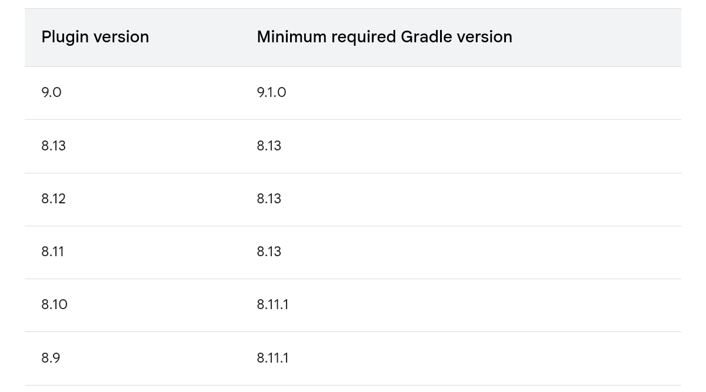
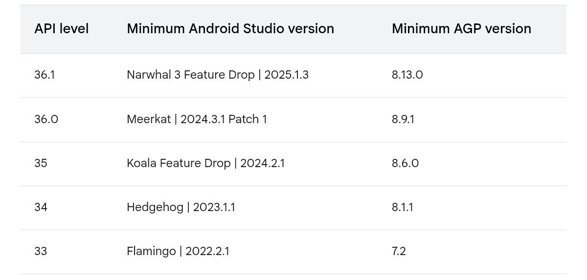

<style>
  table {
    width: 100%
    }
  td {
    vertical-align: center;
    text-align: center;
  }
  td.left {
    vertical-align: center;
    text-align: left;
  }  
  table.inputT{
    margin: 10px;
    width: auto;
    margin-left: auto;
    margin-right: auto;
    border: none;
  }
  input{
    text-align: center;
    padding: 0px 10px;
  }
  iframe{
    width: 100%;
    display: block;
    border-style:none;
  }
</style>

# Android 模板 (termux)

## 编译设定

在创建一个新项目或者下载一个项目时，Gradle 会根据 gradle/wrapper/gradle-wrapper.properties 文件中的 distributionUrl 属性来下载对应的 Gradle 版本。

**Gradle** 文件示例如下：

```
distributionBase=GRADLE_USER_HOME
distributionPath=wrapper/dists
distributionUrl=https\://services.gradle.org/distributions/gradle-8.13-bin.zip
networkTimeout=10000
zipStoreBase=GRADLE_USER_HOME
zipStorePath=wrapper/dists
```

以上文件是使用 <font color="#FF0010">gradle-8.13-bin.zip</font> 的 Gradle 版本。


### 版本兼容问题

在开发 Android 项目时，需要确保 **Android studio** 版本、**AGP** 版本、**Gradle** 版本符合要求。如果不符合要求，则会导致兼容问题的错误。

### AGP (Android Gradle plugin) 和 Gradle版本兼容问题

**AGP** 会根据主程序目录下的 build.gradle 文件中的 id 'com.android.application' version 属性来使用对应的版本，例子如下：


```
plugins {
  id 'com.android.application' version '8.13.0' apply false
  id 'com.android.library' version '8.13.0' apply false
}
```

以上例子为例，**AGP** 插件版本及 **Gradle** 版本分为 <font color="#FF1000">8.13</font> 如下图所示。




Android Studio 和 AGP 的最低版本要求如下：




[网上相关版本兼容资料](https://developer.android.com/build/releases/about-agp#groovy)


### Java 执行工具

Gradle 运行在 Java 虚拟机 (JVM) 上，JVM 通常由 JDK 或 JRE 提供。运行 Gradle 需要 JVM 版本 <font color="#FF1000">17</font> 到 <font color="#FF1000">25</font> 之间。JVM 26 及更高版本尚不支持。

Gradle Wrapper、Gradle 客户端、Tooling API 客户端和 TestKit 客户端均兼容 JVM 8。

JDK <font color="#FF1000">6</font> 及更高版本可++用于编译++。JVM <font color="#FF1000">8</font> 及更高版本可++用于执行测试++。

任何完全受支持的 Java 版本均可用于编译或测试。但是，最新的 Java 版本可能仅支持编译或测试，不支持运行 Gradle。支持通过工具链实现，并适用于所有支持工具链的任务。


### Android build.gradle 设置

在主程序目录下的 app/build.gradle 设定相关程序参数。如下：

```
android {
  namespace 'com.dicky.???'
  compileSdk 33
  
  defaultConfig {
    applicationId "com.dicky.???"
    minSdk 26
    targetSdk 35
    versionCode 1
    versionName "1.0"
        
    vectorDrawables { 
      useSupportLibrary true
    }
  }

  buildTypes {
    release {
    minifyEnabled true
    zipAlignEnabled true
    proguardFiles getDefaultProguardFile('proguard-optimize.txt'), 'proguard-rules.pro'
    }
  }

  compileOptions {
    sourceCompatibility JavaVersion.VERSION_17
    targetCompatibility JavaVersion.VERSION_17
  }

  buildFeatures {
    viewBinding true   
  }
}
```

以上程序名称为 <font color="#FF1000">???</font>。使用 Java 版本 <font color="#FF1000">17</font>。相关参数请参考以上介绍。

## 读写错误处理

```java
import java.io.Closeable;
import java.io.IOException;

public class IOUtil {
  public static void forceClose(Closeable closeable) {
    if (closeable == null)
      return;
    try {
      closeable.close();
    } catch (IOException e) {
      // ignore
    }
  }
}
```

## 由 URI 中读取档案名称

```java
private String getFileName(Uri uri) {
  String displayName = "";
  if (uri != null) {
    Cursor cursor = getContentResolver().query(uri, null, null, null, null, null);
    try {
      cursor.moveToFirst();
      String[] columnNames = cursor.getColumnNames();
      for (String columnName : columnNames) {
        Log.d("EditorActivity", columnName);
      }
      displayName = cursor.getString(cursor.getColumnIndex(OpenableColumns.DISPLAY_NAME));
    } finally {
      IOUtil.forceClose(cursor);
    }
  }
  return displayName;
}
```

## 读写处理代码

用 <font color="#FF1000">ACTION_OPEN_DOCUMENT</font> 及 <font color="#FF1000">ACTION_CREATE_DOCUMENT</font> 函数在 Android 中呼叫内在函数读写处理文件

```java
private StringBuilder strBuffer = new StringBuilder();
private boolean completedFlag = false;

private void openFile(){
  completedFlag = false;
  Intent intent = new Intent(Intent.ACTION_OPEN_DOCUMENT);
  intent.setType(fileType);
  startActivityForResult(intent, OPEN_DOCUMENT_REQUEST);
}

private void saveFile(){
  completedFlag = false;
  Intent intent = new Intent(Intent.ACTION_CREATE_DOCUMENT);
  intent.setType(fileType);
  intent.putExtra(Intent.EXTRA_TITLE, fileName);
  startActivityForResult(intent, CREATE_DOCUMENT_REQUEST);
}

private boolean readText(Uri uri, StringBuilder stringBuilder){
  if (uri != null) {
    InputStream inputStream = null;
    try {
      inputStream = getContentResolver().openInputStream(uri);
      BufferedReader reader = new BufferedReader(new InputStreamReader(inputStream));
      String line;
      while ((line = reader.readLine()) != null) {
        stringBuilder.append(line);
      }
      completedFlag = true;
      return true;
    } catch (FileNotFoundException e) {
      throw new RuntimeException(e);
    } catch (IOException e) {
      throw new RuntimeException(e);
    } finally {
      IOUtil.forceClose(inputStream);
    }
  }
  return false;
}

private void saveText(Uri uri) throws FileNotFoundException, IOException {
  OutputStream outputStream = null;
  try {
    outputStream = getContentResolver().openOutputStream(uri);
    BufferedWriter writer = new BufferedWriter(new OutputStreamWriter(outputStream));
    writer.write(strBuffer.toString());
    writer.flush();
      completedFlag = true;
  } finally {
    IOUtil.forceClose(outputStream);
  }
}

@Override
protected void onActivityResult(int requestCode, int resultCode, Intent data){

  if (requestCode == OPEN_DOCUMENT_REQUEST){
    if (resultCode != RESULT_OK)
       return;
    Uri uri = data.getData();
    fileName = getFileName(uri);
    readText(uri, strBuffer);
    String result = "(" + fileName + ")" + getString(R.string.read_complete);
    Toast.makeText(this, result, Toast.LENGTH_SHORT).show();
  }
  
  if (requestCode == CREATE_DOCUMENT_REQUEST){
    if (resultCode != RESULT_OK)
      return;
    try {
      Uri uri = data.getData();
      saveText(uri);
    } catch (FileNotFoundException e){
      throw new RuntimeException(e);
    } catch (IOException e) {
      throw new RuntimeException(e);
    }
  } 
  
  super.onActivityResult(requestCode, resultCode, data);
}
```

## 列印至 PDF 文件

```
private void setWebViewScale(WebView WV, final int dpi) {
  DisplayMetrics dm = new DisplayMetrics();
  this.getWindowManager().getDefaultDisplay().getRealMetrics(dm);
  int scaling = 100 * dm.widthPixels / dpi;
  WV.setInitialScale(scaling);
}

private String getFingerPrint() {
  return DateFormat.format("yyMMdd-hhmm", new java.util.Date()).toString();
}
    
private void createPDFtoPrinter(WebView webView, final String fileName) {
  PrintManager printManager = (PrintManager) this.getSystemService(PRINT_SERVICE);
  PrintAttributes printAttributes = new PrintAttributes.Builder()
    .setMediaSize(PrintAttributes.MediaSize.ISO_A4)
    .setResolution(new PrintAttributes.Resolution("pdf", "pdf", 600, 600))
    .setMinMargins(PrintAttributes.Margins.NO_MARGINS).build();
  final PrintDocumentAdapter printAdapter = webView.createPrintDocumentAdapter(fileName);
  printManager.print(fileName, printAdapter, printAttributes);
}

private void printFile(WebView wv){
  String fName = getFingerPrint() + ".pdf";
  setWebViewScale(wv, 715);
  createPDFtoPrinter(wv, fName);
  contentView = this.findViewById(R.id.MainWebPage);
}
```