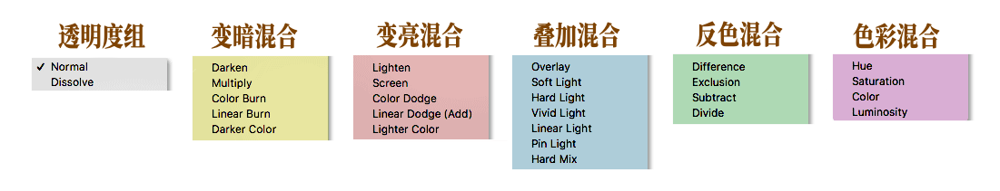
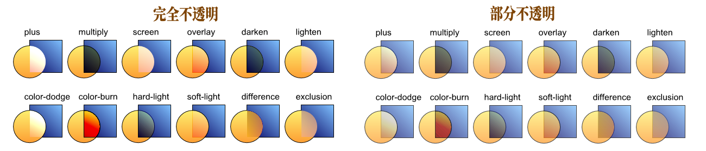
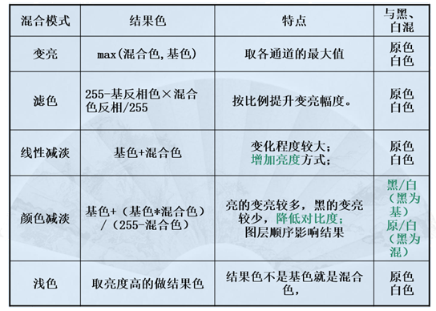
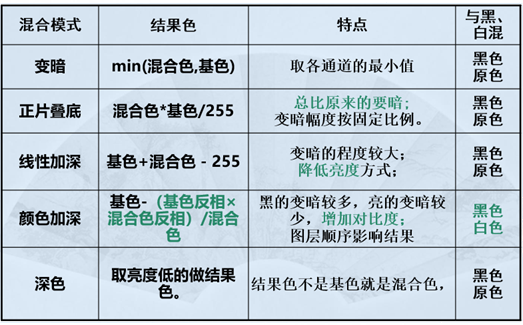
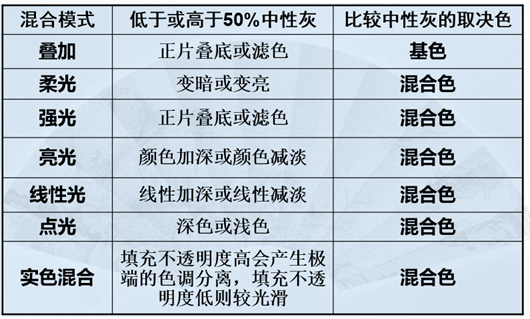
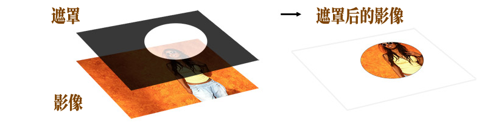
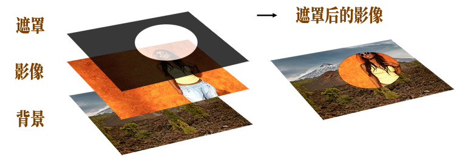
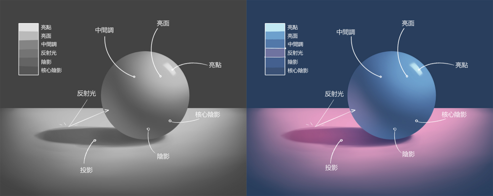
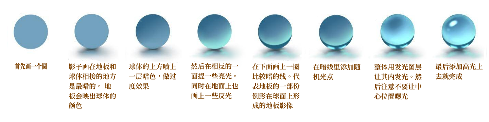

# 图层混合模式

图层混合模式（Blend Modes）是图像处理软件中，用于决定上方图层（混合色）与下方图层（基色）像素如何相互作用从而产生新效果的算法。它能根据亮度、色彩等数值进行计算，实现变暗、变亮、色彩叠加等效果，是数字绘图和合成的关键技术。 

## 图层混合模式名称

## 图层混合模式效果

由不同透明度组，可以组合出不同效果

图层混合模式就是 **RGB** 颜色模式一共有红绿蓝三个颜色通道，数值设置范围为 0-255，每个颜色通道的数值越大，表现的颜色就越亮，数值越小颜色越暗，

将基色与混合色相乘然后除于最大的 **255**，结果肯定是图像整体变暗。

注意：当任何颜色与黑色进行正片叠底模式操作时，得到的颜色仍为黑色，因为黑色的像素值为0；当任何颜色与白色进行正片叠底模式操作时，颜色保持不变，因为白色的像素值为255。

## 变亮混合 vs 变暗混合

变亮混合模式与变暗混合模式的结果相反。通过比较基色与混合色，把比混合色暗的像素替换，比混合色亮的像素不改变，从而使整个图像产生变亮的效果。

### 变亮混合 - 计算方法

### 变暗混合 - 计算方法

## 叠加混合

叠加混合模式实际上是正片叠底模式和滤色模式的一种混合模式。该模式是将混合色与基色相互叠加，也就是说底层图像控制着上面的图层，可以使之变亮或变暗。比 **50**% 暗的区域将采用正片叠底模式变暗，比 **50**% 亮的区域则采用滤色模式变亮。

## 遮罩功能

本质上，遮罩功能允许你显示或隐藏影像中的细节。为了理解遮罩，可以想象一张黑纸。如果在纸上剪一个洞，然后把它放在影像上，所产生的影像只能看到被洞遮住的那部分影像。

同样的例子，但这次是两张影像（上边为影像。下边为背景）上下叠加。要遮盖上面的那张影像。想象一下一张黑纸，上面有一个白孔。你只能透过白孔看到影像，而黑纸会遮住被遮盖影像的其他部分，从而显示背景影像。

## 光与影

### 球体

当光源偏离相机的主轴，五样东西会出现，包括Highlight、 Incident Hightlight、 Core、 Shadow 和 Cast Shadow。 

 - Highlight **亮面**是亮部
 - Incident Angle **亮点**是光源照射的角度
 - Core **核心阴影**是亮部与暗部的过渡
 - Shadow **阴影**是过渡完毕后的暗部
 - Cast Shadow **投影**则是投影下来的阴影

当布光时，这五样东西一定会出现，而能做的就是将这五样东西摆放在有利的位置。 当善用这些光影时就能营造出物体的立体感。

如反射光带有颜色。照射到桌面后反射的光线会改变方向，映射到球体上。

### 玻璃球

玻璃球的质感主要由以下五个要素构成：

 - 高光 (Highlights)：这是玻璃球最亮的部分，通常是光源的直接反射。边缘锐利，位置随光源移动
 - 聚光点 (Focus Point)：光线穿过透明球体后，会在球体背面底部或投影处形成一个明亮的聚光区域
 - 暗部与反光：玻璃球的暗部往往不在底部，而是在边缘或中部，这是因为光线折射所致。球体边缘通常会有来自环境的反光
 - 投影 (Shadow)：玻璃球的投影中心通常是亮的（聚光点），而投影的边缘较深且清晰
 - 背景折射：如果背景有直线，透过玻璃球看会产生弯曲或上下颠倒的现象

## 人像面部画法

[网上面部加色教程](https://youtube.com/shorts/6SRBIpho750?si=mps88Ez4HfMXnYLJ)

[网上面部教程](https://youtube.com/shorts/RwHQlAr6BGQ?si=0XCGSujHk8J_Eq_i)

[网上眼部教程](https://youtube.com/shorts/x86cgLcejQc?si=7ujkPTUR2W9SpxhM)