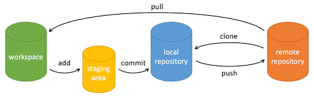

# GitCode 开新专案

## 开一个专案

上传档案到 GitCode ，要先在 GitCode 上面开一个专案。

## 在 HiSH 安装 **Git**

HiSH 这是一款专为鸿蒙系统（HarmonyOS）设计的 Linux 模拟器与Shell 工具。在鸿蒙设备上运行完整的 Linux 环境，让手机或平板变成一个轻量、便携的 Linux 开发终端。

```
apk add git
```

# 基本操作命令




# 初始化 Git 项目

在 HiSH 空间初始化一个空的 Git 项目

```
cd \mnt\share
mkdir git
cd git
git init
```

这指令主要是跟远端有关的操作。在这里的 origin 是一个「代名词」，指的是后面那 GitCode 伺服器的位置。设定好远端节点后，接下来就可以把文件从 GitCode 伺服器，下载或上传至本地电脑。

```
git remote add origin https://gitcode.com/hkdickyko
```

## 设置时提交的用户信息

 - 这指令主要是设置用户名称

```
git config --global user.name hkdickyko
```
 - 这指令主要是设置用户电子邮件地址

```
git config --global user.email hkdickyko@gmail.com
```

 - 通过命令行创建 /推送 **main** 分支

```
git checkout -b hkdickyko/gitcode
```

 - 下载文档

```
git pull
```

 - 上传文档

```
git add .
git commit -m 'tmp'
git push
```

>> 输入: 用户名称
>> 输入密码: PAT

GitCode 要求使用个人访问令牌 (PAT) 而非帐户密码，才能通过 HTTPS 执行 Git 操作（推送/拉取）。要创建 PAT，请转到“个人设置”>“访问令牌”>“创建新访问令牌”，设置权限并保存，因为 PAT 仅创建一次。在终端提示输入密码时，请使用此令牌。令牌可以设置时间段的长度。

 - 克隆項目至本地设备

```
git clone https://gitcode.com/hkdickyko/gitcode.git
```
