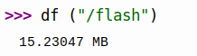

# 存儲設備

定義了一個 RAMBlockDev 類，提供三個基本方法，分別是 readblocks, writeblocks, ioctl

[官方文檔，文件系統](https://docs.micropython.org/en/latest/reference/filesystem.html#)

[w25qxx.py 互聯網資源](https://www.programmersought.com/article/36588111905/)


MISO (Master Out Slave In) 是 DO , MOSI (Master In Slave Out) 是 DI

```shell
from machine import  Pin, SPI
import w25qxx
import uos
 
spi = SPI(baudrate=10000000, polarity=1, phase=1, sck=Pin(21), mosi=Pin(4), miso=Pin(22))
cs = Pin(23, Pin.OUT)
flash = w25qxx.W25QXX_BlockDev(SPI = spi, CS_PIN = cs)
uos.VfsFat.mkfs(flash)
uos.mount(flash, '/flash')

```

可以使用之前創建的命令來檢查 *W25Q128* 的大小為如下所示



